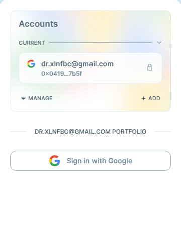
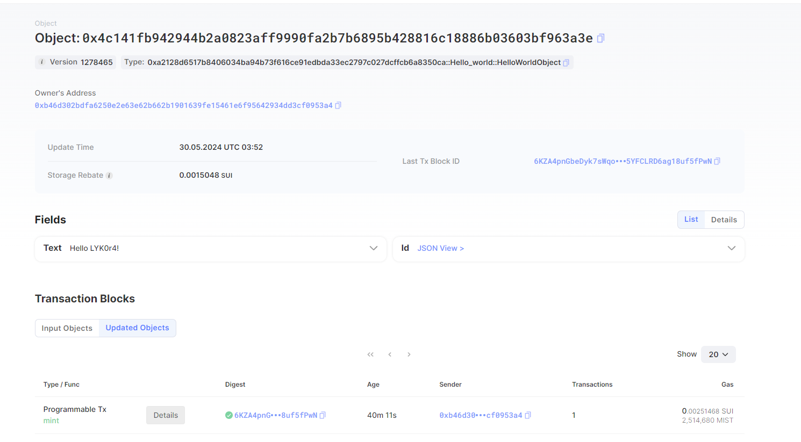

## 基本信息
- Sui钱包地址: `0x04197b770a0a10db7a10f07347be7885b8d25907029cfe827a145adb82677b5f`
> 首次参与需要完成第一个任务注册好钱包地址才被合并，并且后续学习奖励会打入这个地址
- github: `LYKore`

## 个人简介
- 工作经验: 0年
- 技术栈: `php` `python`
> 重要提示 请认真写自己的简介
- 对区块链安全感兴趣、对Move特别感兴趣，想通过Move入门区块链
- 联系方式: tg: `https://t.me/LYK0r4` 

## 任务

##   01 hello move  
- [√] Sui cli version:1.26.0-d709c305ebf3
- [√] Sui钱包截图: 
- [√] package id: 0x4c141fb942944b2a0823aff9990fa2b7b6895b428816c18886b03603bf963a3e
- [√] package id 在 scan上的查看截图:

##   02 move coin
- [] My Coin package id : 
- [] Faucet package id : 
- [] 转账 `My Coin` hash:
- [] `Faucet Coin` address1 mint hash:
- [] `Faucet Coin` address2 mint hash:

##   03 move NFT
- [] nft package id :
- [] nft object id : 
- [] 转账 nft  hash:
- [] scan上的NFT截图:

##   04 Move Game
- [] game package id :
- [] deposit Coin hash:
- [] withdraw `Coin` hash:
- [] play game hash:

##   05 Move Swap
- [] swap package id :
- [] call swap CoinA-> CoinB  hash :
- [] call swap CoinB-> CoinA  hash :

##   06 Dapp-kit SDK PTB
- [] save hash :
