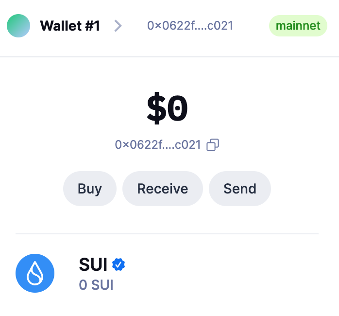
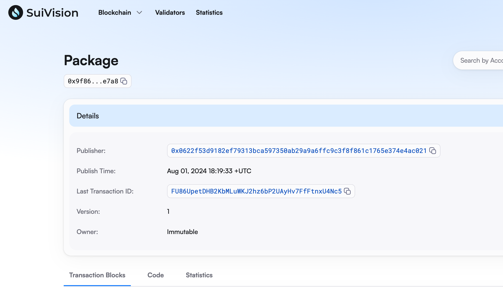
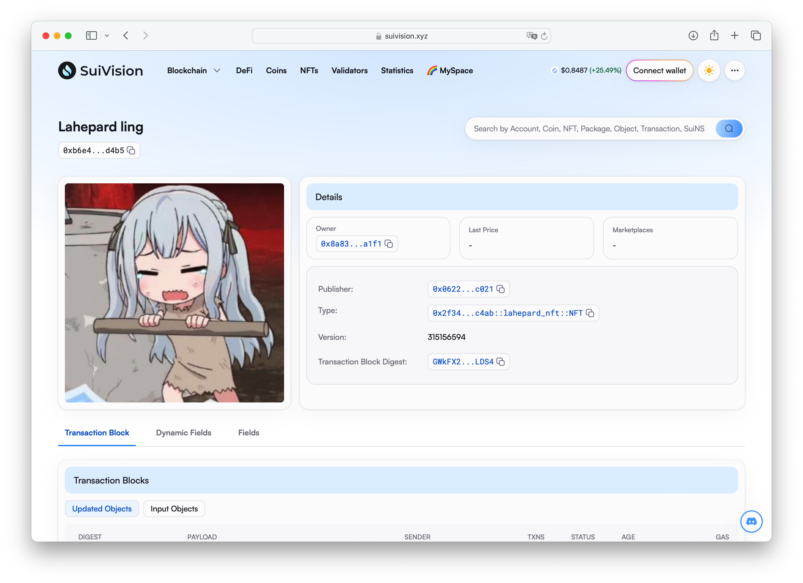
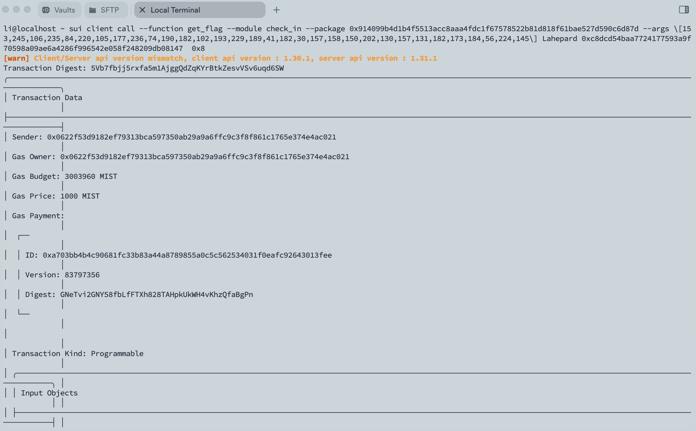

## 基本信息
- Sui钱包地址: `0x0622f53d9182ef79313bca597350ab29a9a6ffc9c3f8f861c1765e374e4ac021`
> 首次参与需要完成第一个任务注册好钱包地址才被合并，并且后续学习奖励会打入这个地址
- github: `Lahepard`

## 个人简介
- 工作经验: 1年
- 技术栈:  `C++`
> 重要提示 请认真写自己的简介
- 对Move特别感兴趣，想通过Move入门区块链
- 联系方式: tg: `LiPP` 

## 任务

##   01 hello move  
- [x] Sui cli version: 1.30.1
- [x] Sui钱包截图: 
- [x] package id: 0x9f86e2ad244c0d971e4d0c8e2968162476237cd62c49cabd8f445fc2a1afe7a8
- [x] package id 在 scan上的查看截图:

##   02 move coin
- [x] My Coin package id : 0x67e51e32e0c1436af544e4367ca732e857055fcc19be19c63322450b7ce85808
- [x] Faucet package id : 0x67e51e32e0c1436af544e4367ca732e857055fcc19be19c63322450b7ce85808
- [x] 转账 `My Coin` hash: Ak5EGaj1TMX7BESXPmN6sECFTwyEYN4bQ3JSQ2mYJPiB
- [x] `Faucet Coin` address1 mint hash: E9NUJN3PySHMLrYMW886gRZxbV9xQ3KAi8WWMKxE3qLo
- [x] `Faucet Coin` address2 mint hash: EuJ4rQBsLqp5AFg7FzX157ces553Z1VEPvZWrPP8jmDa

##   03 move NFT
- [x] nft package id :  0x2f34fb4832696e400eb15b097843cdeeebc68a9742be2199c9016a68ba85c4ab
- [x] nft object id :  GWkFX21E6gZz4kY4bUzS4X5sTgzDnszyYAvXTmRRLDS4
- [x] 转账 nft  hash:  CAeHgJgdhd4PuDgTPkoowg8Cs9rDG2Vm2R7sYqaQUkpy
- [x] scan上的NFT截图:

##   04 Move Game
- [x] game package id :  主网0xa3faa2c055bb0f8abe03a0b6473ab4d98ac6d37d8101026cd6c10e5bd25d8924
- [x] deposit Coin hash: 主网 BFy8jUEXK8maYXtZ2CVZfPCwL2vywcF2bXfvSkZosijV
- [x] withdraw `Coin` hash: 主网 2z1sHGSq6fyyoapFaRCBryy4GyffTLbvHndEYwUzZRbE
- [x] play game hash:  测试网 [GDbPskoVuqiyNgX84isnYEBXrevHpaAfUCt13THj4iBt](https://testnet.suivision.xyz/txblock/GDbPskoVuqiyNgX84isnYEBXrevHpaAfUCt13THj4iBt?tab=Events)

完成存取才发现主网没0x8，所以play在测试网

##   05 Move Swap
- [x] swap package id :  0x3083348e7e7deafc1fed15fc591663f834213fc661870e7b27183f95ba601214
- [x] call swap CoinA-> CoinB  hash swap rmb2usd  :  7hmCZSuMDBvEdd3vsf9uEhdUwfwg9DBE7KVfUmN8RvnT
- [x] call swap CoinB-> CoinA  hash swap usd2rmb: 9N78DtHrkehsy7DtTxLcSmNrVrDAqnSb4wz7etzQBuCL

##   06 Dapp-kit SDK PTB
- [x] save hash : 9vxffeBPKhtvyrLfMvoRN8psEfLhtohK4x88z3U45i7K

##   07 Move CTF Check In
- [x] CLI call 截图 : 
- [x] flag hash : 5Vb7fbjj5rxfa5m1AjggQdZqKYrBtkZesvVSv6uqd6SW

##   08 Move CTF Lets Move
- [x] proof : 2feea301dacee75b71a3
- [x] flag hash : 5tZfwKaMKmqDDedx5GNdMgLYUiPZRxcwHrZUA6wzYZx1
