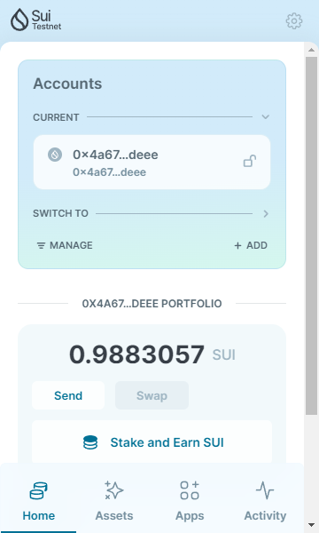
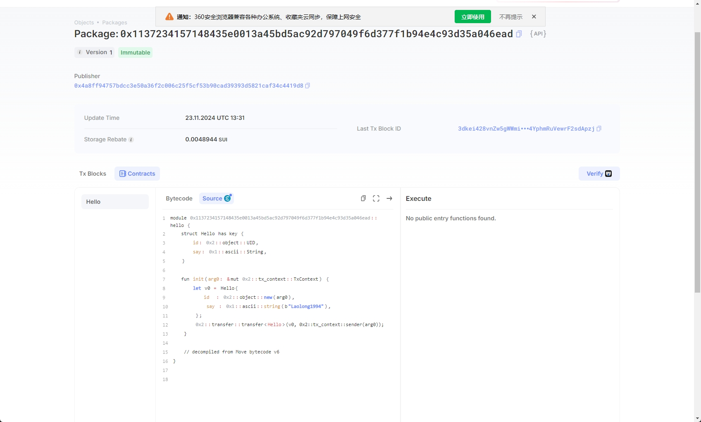
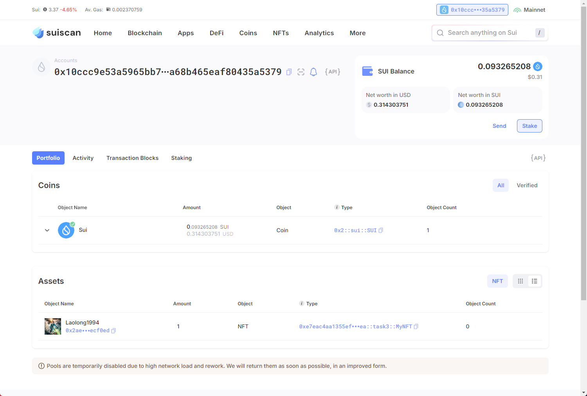

## 基本信息
- Sui钱包地址: `0x4a675ea6d63decde819ed8ed7e0a48cb42bc93aeec756154ea0a0a2625eadeee`
> 首次参与需要完成第一个任务注册好钱包地址才被合并，并且后续学习奖励会打入这个地址
- github: `Laolong1994`

## 个人简介
- 工作经验: 7年
- 技术栈: `Python` `Javascript`,'html'
> 重要提示 请认真写自己的简介
- 多年web2爬虫开发经验，十八线撸毛圈B站up，十八线推特kol前来报道
- 联系方式: tg: `@kongming1234` 

## 任务

##   01 hello move  
- [x] Sui cli version:sui 1.37.4-a139ef255ae7
<<<<<<< HEAD
- [x] Sui钱包截图: 
- [x] package id: 0x4a8ff94757bdcc3e50a36f2c006c25f5cf53b90cad39393d5821caf34c4419d8
- [x] package id 在 scan上的查看截图:

##   02 move coin
- [x] My Coin package id : 0x55b64b01d4bd8b9538f79a68e8bc2e2a3537bb5cb408a4b469187cf89cd8ed17
- [x] Faucet package id : 0xc34c6e356a01cc6c2cb8c6aa1e87c0c8cb2969bbbb88c93db91552dfa6d06c8c
- [x] 转账 `My Coin` hash: 4XdvbRwQASiDQWwdw9XTxwJeyZxhwjcN5JLHKfAQ3JNH
- [x] `Faucet Coin` address1 mint hash:4ueuUPu8uJJEfW5X8LaetpiyJuJQDEB2Ug4QjHb5fcKG
- [x] `Faucet Coin` address2 mint hash:AJRAxhcGHX8eHhgwUfdXyJrht8ZBbJJ1QkjntvqxAPUd

##   03 move NFT
- [x] nft package id : 0xe7eac4aa1355ef5102bd7cc928d7d8e9bd6a4ebff57ea8ee7c2dd459c0098dea
- [x] nft object id : 0xe7eac4aa1355ef5102bd7cc928d7d8e9bd6a4ebff57ea8ee7c2dd459c0098dea::task3::MyNFT
- [x] 转账 nft  hash: 62Fw4n2cgEiEKowQyBJXWEGmx7czTwMoKdkoys8xrVej
- [x] scan上的NFT截图:

##   04 Move Game
- [x] game package id :0xee25a9c7e62c60df6d043d1c49749e0886959a18952787fe45a5fd944715b275
- [x] deposit Coin hash:9RAuVswVf1M5aS9s1ydABs7wHQ6kJshnKZfcPzWKjuat
- [x] withdraw `Coin` hash:HffXdSyTqeR3DZ2nej5s7qxf5aGWvEPguDDTtkXzExZX
- [x] play game hash:HYQMgsRBvchG1S7CKswVYCEnKkUG8oiVNCoFrAkxktXT

##   05 Move Swap
- [x] swap package id :0xe506fec551083f07b74512f8c71df25909803401130a82561c6477bb9b158672
- [x] call swap CoinA-> CoinB  hash :8eDbJUAeofJXdHAdyPrMHWg9vs8Xx76L4jmeJza1euwV
- [x] call swap CoinB-> CoinA  hash :6SMV4vf17dnVs22bTS1WK7UQWPJLQ8AjrKGGQerAzbQN

##   06 Dapp-kit SDK PTB
- [x] save hash :5jn1M9zHGXtVAo8UYuTm1aoNzHUfPUhU5mxrhKEXVqEZ

##   07 Move CTF Check In
- [] CLI call 截图 : 
- [] flag hash :

##   08 Move CTF Lets Move
- [] proof : 
- [] flag hash :

=======
- [] Sui钱包截图: 
- [] package id: 0x4a8ff94757bdcc3e50a36f2c006c25f5cf53b90cad39393d5821caf34c4419d8
- [] package id 在 scan上的查看截图:
>>>>>>> 7840fa7b71a95307e1a783c7c0aa9a92a7cdc65c
