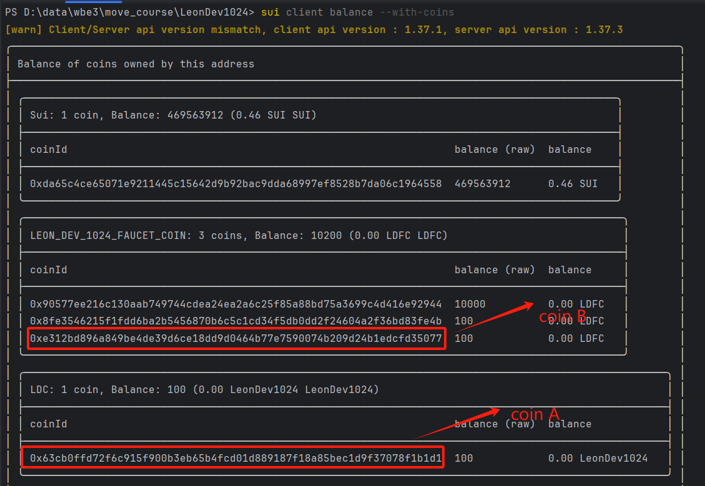
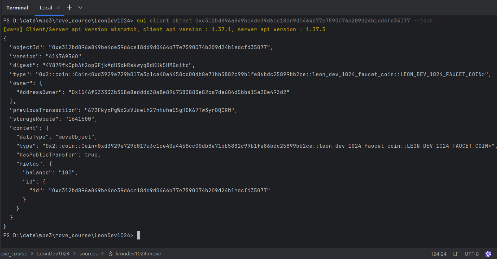
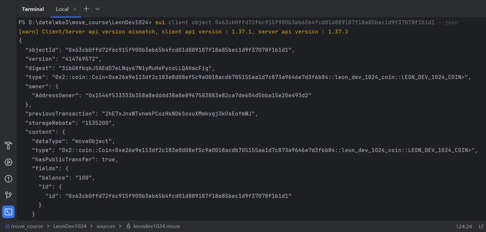
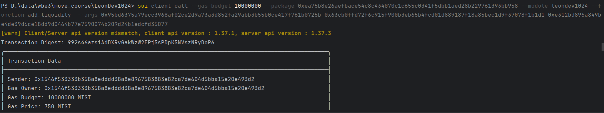
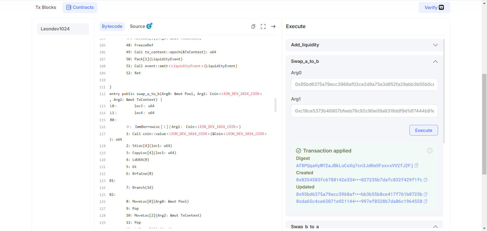
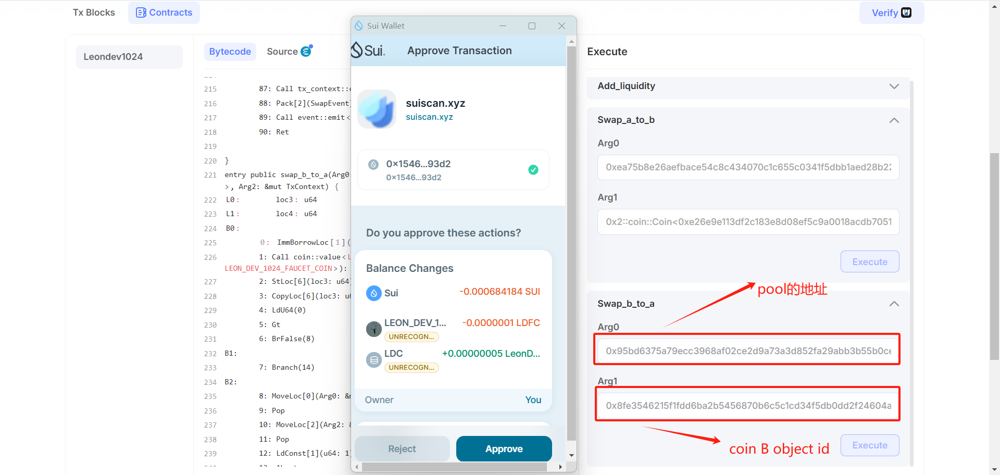

# 05. move_swap

# **实现一个最简单的swap**

- 上链网络: 主网(mainnet)

## **需求**

- 完成 Swap相关知识的学习
- 完成第一个Swap合约的上链部署
- swap 必须是 swap 自己发行的 task2 两个 Coin的互换，包名必须是自己的`github id`

## **一、Swap合约基本概念**

Swap合约通常用于实现两种或多种代币之间的交换。以下是Swap合约的一些基本概念：

### **1.1. 交易池（Liquidity Pools）**

- 交易池是 Swap 操作的核心基础设施。它通常包含两种不同类型的资产（比如两种不同的加密货币或数字资产），这些资产由用户提供流动性而汇聚在池中。
- 例如，一个常见的交易池可能包含资产 A 和资产 B，用户可以将自己持有的一定数量的资产 A 和资产 B 存入池中，增加池的流动性，以便后续其他用户进行交换操作。

### **1.2. 流动性提供者（Liquidity Providers）**

- 流动性提供者是向交易池注入资产的用户或合约。他们通过存入两种相关资产到交易池，使得池中有足够的资产可供其他用户进行交换。
- 作为回报，流动性提供者通常会获得交易手续费的一部分或者其他形式的激励，具体取决于 Swap 机制的设计。

### **1.3. 交换比率（Swap Ratio）**

- 在 Swap 操作中，交换比率决定了一种资产可以换取另一种资产的数量。它不是固定不变的，而是根据交易池中两种资产的储备量动态变化。
- 例如，如果交易池中资产 A 的储备量相对较多，资产 B 的储备量相对较少，那么用资产 A 换取资产 B 时，可能需要付出相对较多的资产 A 才能换取到一定量的资产 B，反之亦然。这个比率的计算通常基于数学公式，比如恒定乘积公式（Constant Product Formula）等，以确保交易池的总价值在每次交换后保持相对稳定。

## **二、Sui Move 中实现 Swap 的关键要素**

### **2.1. 资产类型定义**

在 Sui Move 代码中，首先需要明确定义参与 Swap 的资产类型。这通常涉及到创建自定义的资源类型来代表不同的数字资产。

```rust
    // 导入自定义的代币模块
    use my_coin::leon_dev_1024_coin::LEON_DEV_1024_COIN;
    use faucet_coin::leon_dev_1024_faucet_coin::LEON_DEV_1024_FAUCET_COIN;
```

### **2.2. 交易池结构体定义**

```rust
    // 流动性池结构体
    public struct Pool has key {
        id: UID,
        // 代币A的余额
        coin_a: Balance<LEON_DEV_1024_COIN>,
        // 代币B的余额
        coin_b: Balance<LEON_DEV_1024_FAUCET_COIN>,
    }
```

### **2.3. 交换函数实现**

实现 Swap 操作的核心是编写交换函数。以从资产 A 交换到资产 B 为例

## **三、Swap 操作的流程**

### 3.1 **定义模块和导入必要的库**

```rust
module leondev1024::swap {
    use sui::object::{Self, UID};
    use sui::transfer;
    use sui::tx_context::{Self, TxContext};
    use sui::coin::{Self, Coin};
    use sui::balance::{Self, Balance};
    use sui::event;
    use std::string::{Self, String};

    // 导入自定义的代币模块
    use my_coin::leon_dev_1024_coin::LEON_DEV_1024_COIN;
    use faucet_coin::leon_dev_1024_faucet_coin::LEON_DEV_1024_FAUCET_COIN;
}
```

### 3.1. **定义错误码**

定义一些常量来表示可能的错误情况，例如流动性不足或金额为零。

```rust
const E_INSUFFICIENT_LIQUIDITY: u64 = 0;
const E_ZERO_AMOUNT: u64 = 1;
```

### **3.3. 定义结构体**

定义一个结构体来表示流动性池，并定义事件结构体来记录添加流动性和交换代币的操作。

```rust
// 流动性池结构体
public struct Pool has key {
    id: UID, // 流动性池的唯一标识符
    coin_a: Balance<LEON_DEV_1024_COIN>, // 代币A的余额
    coin_b: Balance<LEON_DEV_1024_FAUCET_COIN>, // 代币B的余额
}

// 添加流动性事件结构体
public struct LiquidityEvent has copy, drop {
    provider: address, // 提供流动性的地址
    coin_a_amount: u64, // 代币A的数量
    coin_b_amount: u64, // 代币B的数量
    coin_a_type: String, // 代币A的类型
    coin_b_type: String, // 代币B的类型
    timestamp: u64, // 时间戳
}

// 交换事件结构体
public struct SwapEvent has copy, drop {
    sender: address, // 发起交换的地址
    coin_in_amount: u64, // 输入代币的数量
    coin_out_amount: u64, // 输出代币的数量
    coin_in_type: String, // 输入代币的类型
    coin_out_type: String, // 输出代币的类型
    timestamp: u64, // 时间戳
}
```

### 3.4. **初始化函数**

定义一个初始化函数来创建一个新的流动性池。

```rust
// 初始化函数，创建一个新的流动性池
fun init(ctx: &mut TxContext) {
    let pool = Pool {
        id: object::new(ctx), // 生成新的唯一标识符
        coin_a: balance::zero(), // 初始代币A的余额为零
        coin_b: balance::zero(), // 初始代币B的余额为零
    };
    transfer::share_object(pool); // 将流动性池共享
}
```

### 3.5  **添加流动性函数**

定义一个函数来允许用户向流动性池中添加两种代币。

```rust
// 添加流动性函数
public entry fun add_liquidity(
    pool: &mut Pool,
    coin_a: Coin<LEON_DEV_1024_COIN>,
    coin_b: Coin<LEON_DEV_1024_FAUCET_COIN>,
    ctx: &mut TxContext
) {
    let a_amount = coin::value(&coin_a); // 获取代币A的数量
    let b_amount = coin::value(&coin_b); // 获取代币B的数量

    assert!(a_amount > 0 && b_amount > 0, E_ZERO_AMOUNT); // 确保提供的代币数量大于零

    balance::join(&mut pool.coin_a, coin::into_balance(coin_a)); // 将代币A加入流动性池
    balance::join(&mut pool.coin_b, coin::into_balance(coin_b)); // 将代币B加入流动性池

    // 记录添加流动性的事件
    event::emit(LiquidityEvent {
        provider: tx_context::sender(ctx), // 提供流动性的地址
        coin_a_amount: a_amount, // 代币A的数量
        coin_b_amount: b_amount, // 代币B的数量
        coin_a_type: string::utf8(b"LEON_DEV_1024_COIN"), // 代币A的类型
        coin_b_type: string::utf8(b"LEON_DEV_1024_FAUCET_COIN"), // 代币B的类型
        timestamp: tx_context::epoch(ctx), // 当前时间戳
    });
}
```

### 3.6 **代币交换函数**

定义两个函数来实现代币A换代币B和代币B换代币A的功能。

```rust
// 代币A换代币B的函数
public entry fun swap_a_to_b(
    pool: &mut Pool,
    coin_a_in: Coin<LEON_DEV_1024_COIN>,
    ctx: &mut TxContext
) {
    let a_amount = coin::value(&coin_a_in); // 获取输入的代币A的数量
    assert!(a_amount > 0, E_ZERO_AMOUNT); // 确保输入的代币数量大于零

    let b_reserve = balance::value(&pool.coin_b); // 获取代币B的储备量
    assert!(b_reserve > 0, E_INSUFFICIENT_LIQUIDITY); // 确保代币B的储备量大于零

    let a_reserve = balance::value(&pool.coin_a); // 获取代币A的储备量
    let b_out = (a_amount * b_reserve) / (a_reserve + a_amount); // 计算可以换取的代币B的数量

    assert!(b_out > 0 && b_out <= b_reserve, E_INSUFFICIENT_LIQUIDITY); // 确保可以换取的代币B数量有效

    // 更新流动性池的余额
    balance::join(&mut pool.coin_a, coin::into_balance(coin_a_in)); // 将输入的代币A加入流动性池
    let coin_b_out = coin::take(&mut pool.coin_b, b_out, ctx); // 从流动性池中取出代币B
    transfer::public_transfer(coin_b_out, tx_context::sender(ctx)); // 将代币B转给发起者

    // 记录交换事件
    event::emit(SwapEvent {
        sender: tx_context::sender(ctx), // 发起交换的地址
        coin_in_amount: a_amount, // 输入的代币A的数量
        coin_out_amount: b_out, // 输出的代币B的数量
        coin_in_type: string::utf8(b"LEON_DEV_1024_COIN"), // 输入的代币A的类型
        coin_out_type: string::utf8(b"LEON_DEV_1024_FAUCET_COIN"), // 输出的代币B的类型
        timestamp: tx_context::epoch(ctx), // 当前时间戳
    });
}

// 代币B换代币A的函数
public entry fun swap_b_to_a(
    pool: &mut Pool,
    coin_b_in: Coin<LEON_DEV_1024_FAUCET_COIN>,
    ctx: &mut TxContext
) {
    // 流程同上省略
    ……
}
```

## **四、任务指南**

1. build发布到主网

```rust
sui client envs
sui client switch --env mainnet
sui move build --skip-fetch-latest-git-deps
sui client publish --gas-budget 100000000 --skip-fetch-latest-git-deps --skip-dependency-verification
```

发布成功后交易摘要

Skipping dependency verification
Transaction Digest: 3mKvRG1T5mRyVeEmh7pV12dWnFKfwCvxSjMJimUBkejv

packageId: 0xea75b8e26aefbace54c8c434070c1c655c0341f5dbb1aed28b229761393bb958

pool:  0x95bd6375a79ecc3968af02ce2d9a73a3d852fa29abb3b55b0ce417f761b0725b

1. 查看余额详细信息 sui client balance --with-coins 
    
    
    
2. 查看coin A 和coin B的详细信息
    
    
    
    
    
3. 加入流通池
    
    coin A: 0x63cb0ffd72f6c915f900b3eb65b4fcd01d889187f18a85bec1d9f37078f1b1d1
    
    coin B: 0xe312bd896a849be4de39d6ce18dd9d0464b77e7590074b209d24b1edcfd35077
    
    ```rust
    sui client call --gas-budget 10000000 --package <packageid> --module swap --function add_liquidity  --args <pool> <coin a> <coin b>  
    ```
   
    
4. swap A to B

5. swap B to A

