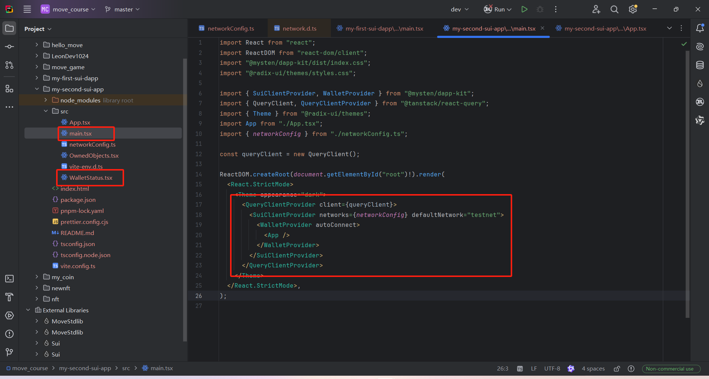
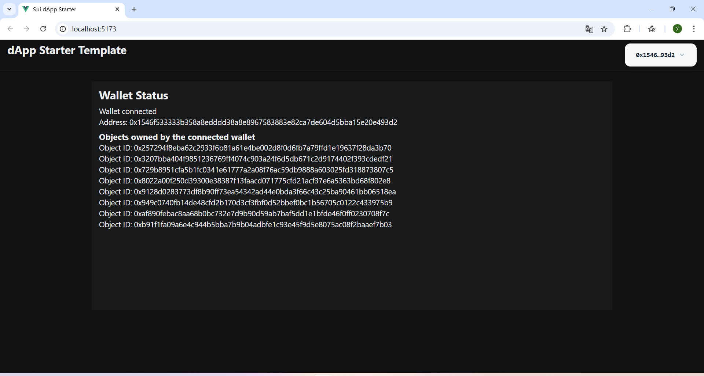

# 用 Sui SDK 和 Navi SDK 在Navi Protocol 存入 1 SUI

- 上链网络: 主网(mainnet)

## 需求

- 完成 dapp-kit 学习
- 完成 Sui SDK 学习
- 完成 PTB的概念学习
- 完成 Navi Protocol 学习
- 在 dapp-kit里面用chrome钱包签名提交
- 完成 必须在同一个PTB完成 Navi SDK 1.[存入Navi Protocol 1 SUI]  2.[借出当前日期的USDC 0.[月][天][小时] 的 USDC ]
  3.[然后在存入等额的USDC]

> 当前时间是2024年4月25日15点 借出的金额就是 `0.042515`   月 天 小时 必须是两位数 2024年5月1日2点  `0.050102`

## 2. 基本概念

### **2.1 Sui dApp Kit**

Sui dApp Kit 是一套 React 组件、钩子和工具集，帮助你为 Sui 生态系统构建去中心化应用（dApp）。它的钩子和组件提供了与 Sui 区块链进行数据查询和连接 Sui 钱包的接口。

### 2.2 PTB 概念介绍

在 Sui 区块链中，Programmable Transaction Block (PTB) 是一种允许用户创建和执行自定义交易逻辑的机制。这种机制使得开发者能够在单个交易中组合多个操作，从而实现更复杂的业务逻辑。PTB 为去中心化应用（dApps）提供了灵活性和强大的功能，特别是在 DeFi 领域，如借贷、流动性挖矿等。

**Programmable Transaction Block (PTB) 的特点**

1. **原子性**：在一个 PTB 中的所有操作要么全部成功，要么全部失败，确保了交易的一致性和完整性。
2. **可编程性**：开发者可以编写自定义的智能合约代码，来实现特定的业务逻辑。
3. **高效性**：Sui 区块链的高吞吐量和低延迟特性使得 PTB 能够快速执行复杂的交易逻辑。
4. **模块化**：PTB 可以包含多个子操作，每个子操作可以独立开发和测试，然后组合在一起形成一个完整的交易。

### 2.3 Navi Protocol

> Sui Navi Protocol 是一个与 Sui 区块链相关的金融协议。Sui 是由 Mysten Labs 开发的一种高性能的 Layer 1 区块链，它采用了先进的技术来提高交易速度和降低交易成本。Navi Protocol 则是构建在 Sui 上的一个去中心化金融（DeFi）应用，专注于提供借贷、流动性挖矿等金融服务。

**Sui Navi Protocol 的主要特点**

- **借贷服务**：用户可以存入支持的加密资产作为抵押品，并借出其他资产。
- **流动性挖矿**：通过为特定的流动性池提供流动性，用户可以获得奖励。
- **高效交易**：得益于 Sui 区块链的高吞吐量和低延迟特性，Navi Protocol 能够提供快速且低成本的交易体验。
- **安全性和透明度**：所有操作都在区块链上进行，确保了透明度和安全性。

## 3. 任务指南

**Programmable Transaction Block (PTB)** 是 Sui 区块链中的一种机制，允许用户创建和执行自定义的交易逻辑。我们自定义一个组件比如 `NaviPTB` 组件中，PTB 用于实现一个复杂的金融操作流程，包括存入 SUI、借出 wUSDC 和再存入 wUSDC。

### 3.1  初始化项目

dapp脚手架 `npm create @mysten/dapp`项目名称my-first-sui-dapp, 选择react-client-dapp 模板

```jsx
$ npm create @mysten/dapp
$ pnpm install
$ pnpm dev
```





脚手架代码提供了基础的钱包的操作，连接钱包，展示钱包里面的objectId

### 3.2 引入`navi-sdk`

```bash
pnpm install navi-sdk
```


### 3.3 如何封装一个PTB自定义的交易模块

主要的步骤

1. **初始化**：

- 使用 `useCurrentAccount` 获取当前连接的钱包账户。
- 使用 `useSignAndExecuteTransaction` 获取签名并执行交易的函数。

2. **处理存款和借款**：

- 检查是否已连接钱包。
- 根据当前日期计算要借出的 wUSDC 数量。
- 创建一个新的 `Transaction` 对象，并设置发送者为当前账户。
- 检查池配置是否有效。
- 分割 SUI 代币并存入指定的池中。
- 从 wUSDC 池中借出计算好的金额。
- 将借来的 wUSDC 存入指定的池中。

3. **签名并执行交易**：

- 清除之前的消息。
- 签名并执行交易，根据结果显示交易摘要或错误信息。

源码仅供参考：

```jsx
import { Button, Container, Flex, Text, Box, Heading } from "@radix-ui/themes"; // 导入 Radix UI 组件
import { useCurrentAccount, useSignAndExecuteTransaction } from "@mysten/dapp-kit"; // 导入 Mysten DApp Kit 钩子
import { Transaction } from "@mysten/sui/transactions"; // 导入 Sui 交易类
import { Pool, PoolConfig } from "navi-sdk/dist/types"; // 导入 Navi SDK 中的池和池配置类型
import { pool, Sui, wUSDC } from "navi-sdk/dist/address"; // 导入 Navi SDK 中的池地址和代币信息
import { borrowCoin, depositCoin } from "navi-sdk/dist/libs/PTB"; // 导入 Navi SDK 中的借币和存币函数
import { useState } from "react";

// 计算借款金额
const calculateBorrowAmount = (month: number, day: number, hour: number): number => {
  const borrowAmountStr = `0.${month.toString().padStart(2, "0")}${day.toString().padStart(2, "0")}${hour.toString().padStart(2, "0")}`;
  return parseFloat(borrowAmountStr) * 10 ** wUSDC.decimal;
};

// 处理存款和借款的异步函数
const depositAndBorrowSui = async (account: any, signAndExecuteTransaction: any, setMessage: any, setDigest: any) => {
  if (!account) {
    setMessage("Please connect your wallet first");
    return;
  }

  try {
    const date = new Date(); // 获取当前日期
    const borrowAmount = calculateBorrowAmount(date.getMonth() + 1, date.getDate(), date.getHours());

    // 创建新的交易对象
    const tx = new Transaction();
    tx.setSender(account.address);

    // 获取池配置
    const suiPool: PoolConfig = pool[Sui.symbol as keyof Pool];
    const wusdcPool: PoolConfig = pool[wUSDC.symbol as keyof Pool];

    if (!suiPool || !wusdcPool) {
      throw new Error("Invalid pool configuration");
    }

    // 存款 SUI
    const [suiCoin] = tx.splitCoins(tx.gas, [1_000_000_000]); // 分割 SUI 代币
    if (!suiCoin) throw new Error("Failed to split SUI coins");

    await depositCoin(tx, suiPool, suiCoin, 1_000_000_000); // 存款 SUI

    // 借款 USDC
    const [toBorrowCoin] = await borrowCoin(tx, wusdcPool, borrowAmount);
    if (!toBorrowCoin) throw new Error("Failed to borrow USDC");

    // 存款借出的 USDC
    await depositCoin(tx, wusdcPool, toBorrowCoin, borrowAmount);

    // 清除之前的消息
    setMessage("");
    setDigest("");

    // 签名并执行交易
    signAndExecuteTransaction(
        { transaction: tx, chain: "sui:mainnet" },
        {
          // onSuccess: (result: any) => { // 移除或注释掉
          //   console.log("Transaction successful:", result);
          //   setDigest(result.digest);
          // },
          onError: (error: any) => { // 为 error 参数指定类型
            console.error("Transaction failed:", error);
            setMessage(error.message || "Transaction failed");
          },
        }
    );
  } catch (error) {
    console.error("Error in depositAndBorrowSui:", error);
    setMessage(error instanceof Error ? error.message : "An unknown error occurred");
  }
};

export function NaviPTB() {
  const account = useCurrentAccount();
  const { mutate: signAndExecuteTransaction } = useSignAndExecuteTransaction();
  const [digest, setDigest] = useState<string>("");
  const [message, setMessage] = useState<string>("");

  return (
      <Container>
        <Box>
          <Heading as="h2">Navi Protocol 任务</Heading>
          <Text>
            任务将会把 1 SUI 存入 Navi 协议，根据当前日期借出相应数量的 USDC，然后存入等额的 USDC。
          </Text>
          <Flex gap="3" direction={"column"}>
            <Button onClick={() => depositAndBorrowSui(account, signAndExecuteTransaction, setMessage, setDigest)} variant="solid">
              开始交易
            </Button>
            {digest && <Text>Transaction submitted: {digest}</Text>} {/* 显示交易摘要 */}
            {message && <Text>Error: {message}</Text>} {/* 显示错误消息 */}
          </Flex>
        </Box>
      </Container>
  );
}

export default NaviPTB;

```

## FAQ

Q1.  点击进行PTB交易的时候报错，Error: Transaction validator signing failed due to issues with transaction inputs, please review the errors and try again: - Could not find the referenced object 0x834a86970ae93a73faf4fff16ae40bdb72b91c47be585fff19a2af60a19ddca3 at version None - Could not find the referenced object 0xbb4e2f4b6205c2e2a2db47aeb4f830796ec7c005f88537ee775986639bc442fe at version None

A:  问题导致的原因很简单，是因为脚手架创建的默认的环境是testnet，


## 参考文档

- [sui sdk](https://sdk.mystenlabs.com/typescript)
- [ptb sdk](https://sdk.mystenlabs.com/typescript/transaction-building/basics)
- [ptb concepts](https://docs.sui.io/concepts/transactions/prog-txn-blocks)
- [navi-sdk](https://github.com/naviprotocol/navi-sdk)
- [navi-docs](https://naviprotocol.gitbook.io/navi-protocol-developer-docs/how-to-interact-with-the-contract/navi-sdk/api-interface)
