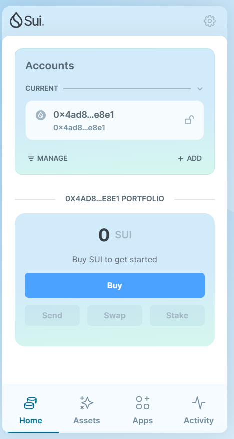
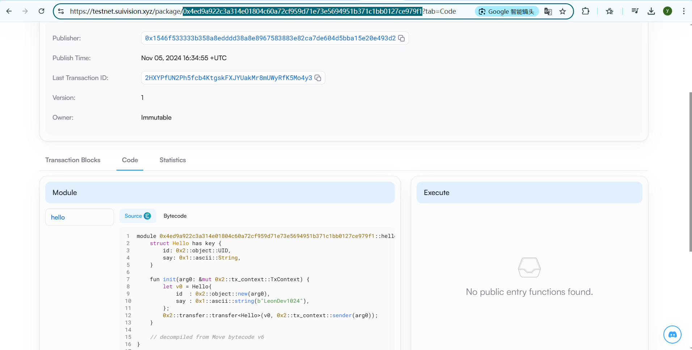
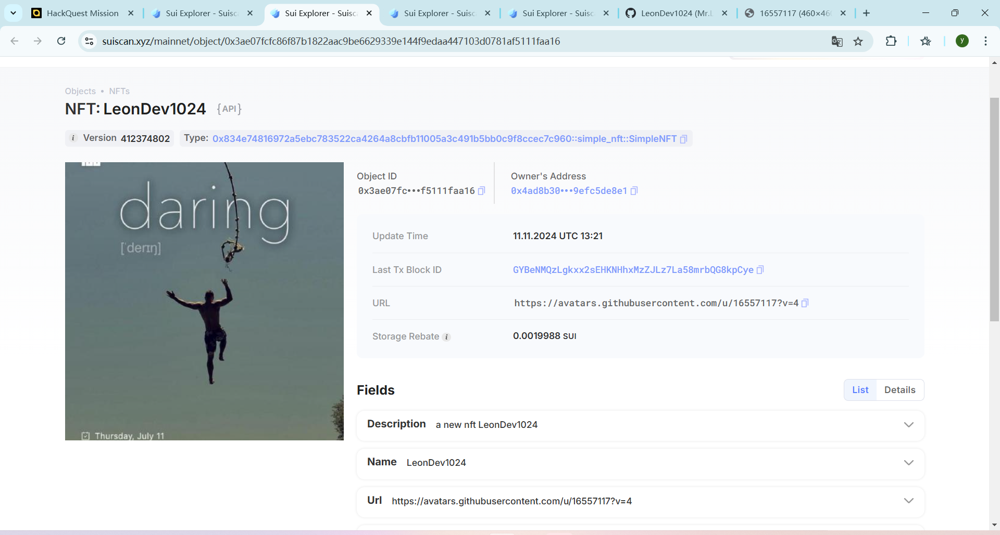
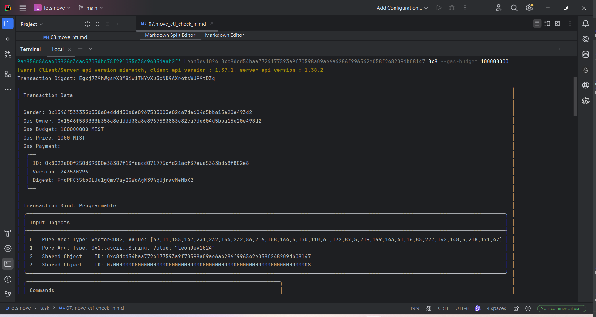

## 基本信息
- Sui钱包地址: `0x4ad8b30e3fc2785183d96e4fe9ef180527a502335c38599c015cc39efc5de8e1`
- github: `LeonDev1024`

## 个人简介
- 工作经验: 10年+
- 技术栈: `Java` `C++` `Python` `Vue`
- 多年web2开发经验，想通过Move入门WEB3区块链
- 联系方式: email: `liu_yichun@163.com` 

## 任务

##   01 hello move  
- [x] Sui cli version: sui 1.37.1-7839b9501066
- [x] Sui钱包截图: 
- [x] package id: 0x4ed9a922c3a314e01804c60a72cf959d71e73e5694951b371c1bb0127ce979f1
- [x] package id 在 scan上的查看截图:

##   02 move coin
- [x] My Coin package id : 0xe26e9e113df2c183e8d08ef5c9a0018acdb705155aa1d7c873a9646e7d3f6b84
- [x] Faucet package id : 0xd3929e729b017a3c1ce40a4458cc00db8e71bb5882c99b1fe86bdc25899bb2ce
- [x] 转账 `My Coin` hash: C6r7ZQ7EXtaTGG9DowZ4HSF3tMw7TQhgmCUr4niQqcwx
- [x] `Faucet Coin` address1 mint hash: 6JZZG6QrBzvuvX5epXyRvwceiijdVEPJZKuc79rQJGWz
- [x] `Faucet Coin` address2 mint hash: 5Sf2jqsEauVWddUFFuGwxi1A68ZHUNwHBV5jxApKeHtM

##   03 move NFT
- [x] nft package id : 0x834e74816972a5ebc783522ca4264a8cbfb11005a3c491b5bb0c9f8ccec7c960
- [x] nft object id : 0x3ae07fcfc86f87b1822aac9be6629339e144f9edaa447103d0781af5111faa16
- [x] 转账 nft  hash: 3Die5pCaVgzqJ1Rpbup7iXhSiyggA5PR1erYPknbUxGh
- [x] scan上的NFT截图:

##   04 Move Game
- [x] game package id : 0x1bd47788320409d493dacf5c55fccca592b4cbde9012e3cdcd4ace2b3489a48e
- [x] deposit Coin hash: BbDzt6eftcdqK72Z1yoicVTfbgkASCiCm9ggPee1TsKo
- [x] withdraw `Coin` hash: 8XsJFj9U2so3vnnyqdbgjrskXHZkEEMSo41iqD6pmvFe
- [x] play game hash: FD42jvTYqq59CUrMyDC4dLYBc8WvXdC5tjdjQ6XqFryE

##   05 Move Swap
- [x] swap package id : 0xea75b8e26aefbace54c8c434070c1c655c0341f5dbb1aed28b229761393bb958
- [x] call swap CoinA-> CoinB  hash : Af8PQqaHyWY2aJBkLoCoXq7cn3JdKm5FssvxVV2fJ2Fj
- [x] call swap CoinB-> CoinA  hash : 69hyPuAkgFth66EGZ6AC7agkZEwdcr8XjZTaawo6Mbrm

##   06 Dapp-kit SDK PTB
- [x] save hash : 2P5ERiSZysmGSnPA8AfdS4nhQna6R4ShnfsYWnrYxRru

##   07 Move CTF Check In
- [x] CLI call 截图 : 
- [x] flag hash : Egxj7Z9hWgsrX8M8iw1TNYvXu3cND9AXretsWJ99tDZq

##   08 Move CTF Lets Move
- [x] proof : [56, 171, 212, 27, 54, 49, 33, 217]
- [x] flag hash : 2y7NhUaRJ3mJDenJSJPBTQWVfFkawsTBo6AdHLGPWAf4
