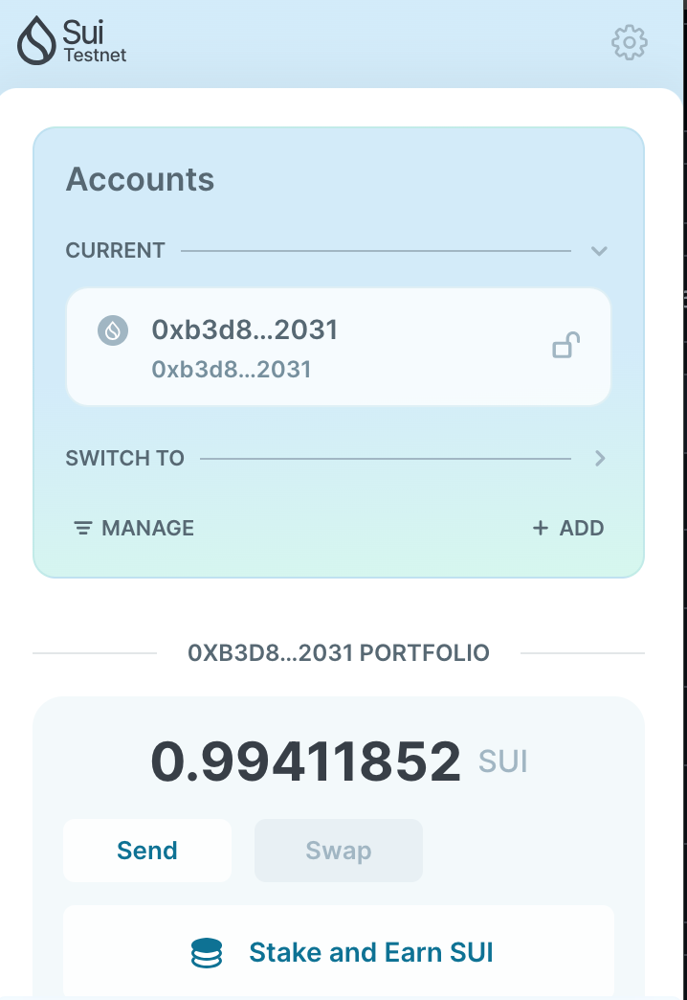
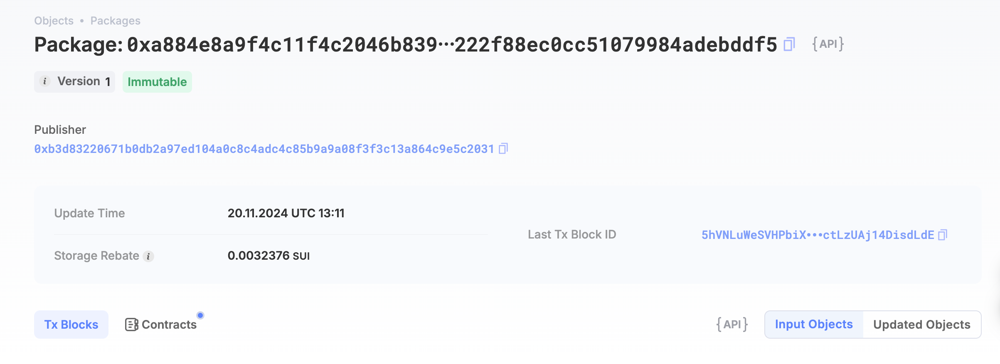

## 基本信息
- Sui钱包地址: `0xb6feba62c42d4b8f2ff123f6a203a02e26fd7891b9ed34b173f42cc0c9a7dc8d`
> 首次参与需要完成第一个任务注册好钱包地址才被合并，并且后续学习奖励会打入这个地址
- github: `LeonTing1010`

## 个人简介
- 工作经验: 10年
- 技术栈: `Rust` `Typescript` `Go`
> 重要提示 请认真写自己的简介
- 10+年互联网行业技术研发经验，具备全栈开发能力; 
- 0-1创业经历，乐于接受挑战，拥有强大的内驱力和责任心; 
- 精通分布式系统、金融科技和区块链，关注关键技术发展趋势，拥有多篇技术专利;
- 联系方式: tg: `xx` 

## 任务

##   01 hello move  
- [] Sui cli version: sui 1.37.1-homebrew
- [] Sui钱包截图: 
- [] package id:  0xa884e8a9f4c11f4c2046b8392090f40935a2b222f88ec0cc51079984adebddf5
- [] package id 在 scan上的查看截图:

##   02 move coin
- [] My Coin package id : 
- [] Faucet package id : 
- [] 转账 `My Coin` hash:
- [] `Faucet Coin` address1 mint hash:
- [] `Faucet Coin` address2 mint hash:

##   03 move NFT
- [] nft package id :
- [] nft object id : 
- [] 转账 nft  hash:
- [] scan上的NFT截图:

##   04 Move Game
- [] game package id :
- [] deposit Coin hash:
- [] withdraw `Coin` hash:
- [] play game hash:

##   05 Move Swap
- [] swap package id :
- [] call swap CoinA-> CoinB  hash :
- [] call swap CoinB-> CoinA  hash :

##   06 Dapp-kit SDK PTB
- [] save hash :

##   07 Move CTF Check In
- [] CLI call 截图 : 
- [] flag hash :

##   08 Move CTF Lets Move
- [] proof : 
- [] flag hash :
