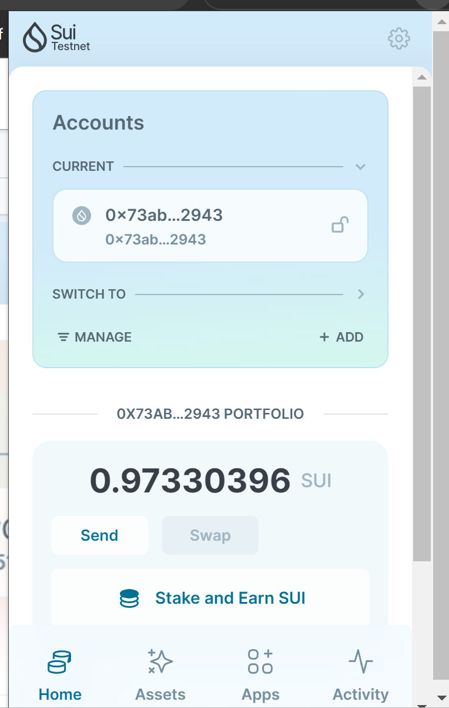
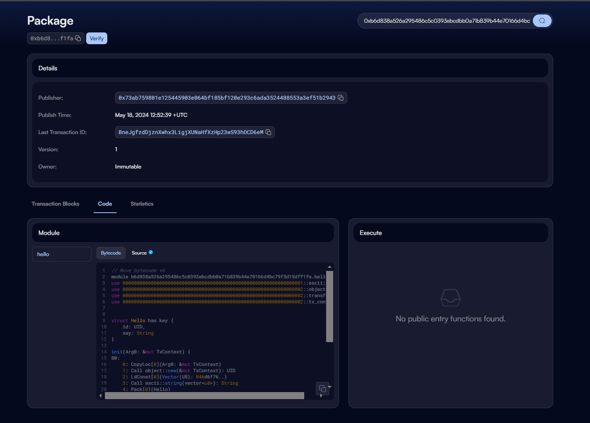

## 基本信息
- Sui钱包地址: `0xcb22f58b90ee1ba90da174b20e599a6865349574dfae422486374b122cd449bb`
> 首次参与需要完成第一个任务注册好钱包地址才被合并，并且后续学习奖励会打入这个地址
- github: `LiDaoZang`

## 个人简介
- 工作经验: 5年
- 技术栈: `渗透测试` `java开发`
- 多年网络安全工作经验，对Move特别感兴趣，想通过Move入门区块链
- 联系方式: email: `lic199905@gmail`.com` 

## 任务

##   01 hello move  
- [x] Sui cli version:sui 1.25.0-b10ea7331e1c-dirty
- [x] Sui钱包截图: 
- [x] package id: 0xb6d838a526a295486c5c0393ebcdbb0a71b839b44e70166d4bc79f5d19dff1fa
- [x] package id 在 scan上的查看截图:

##   02 move coin
- [] My Coin package id : 
- [] Faucet package id : 
- [] 转账 `My Coin` hash:
- [] `Faucet Coin` address1 mint hash:
- [] `Faucet Coin` address2 mint hash:

##   03 move NFT
- [] nft package id :
- [] nft object id : 
- [] 转账 nft  hash:
- [] scan上的NFT截图:

##   04 Move Game
- [] game package id :
- [] deposit Coin hash:
- [] withdraw `Coin` hash:
- [] play game hash:

##   05 Move Swap
- [] swap package id :
- [] call swap CoinA-> CoinB  hash :
- [] call swap CoinB-> CoinA  hash :

##   06 Dapp-kit SDK PTB
- [] save hash :