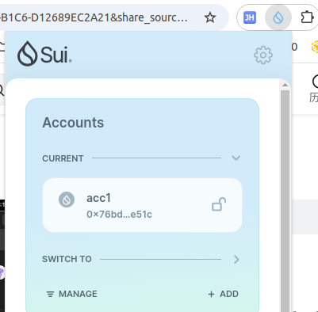
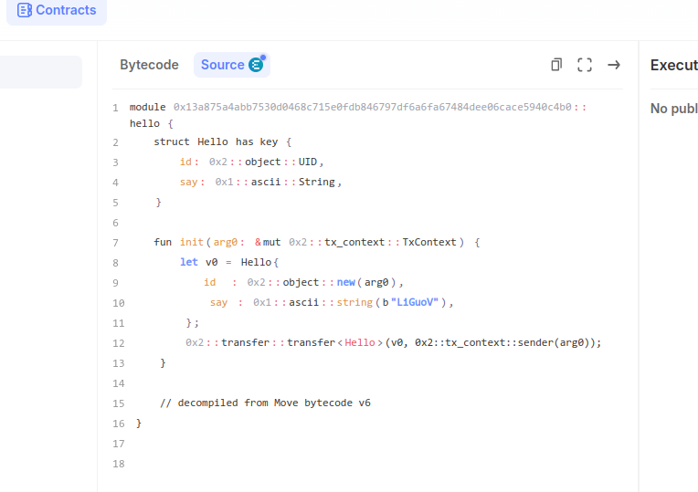
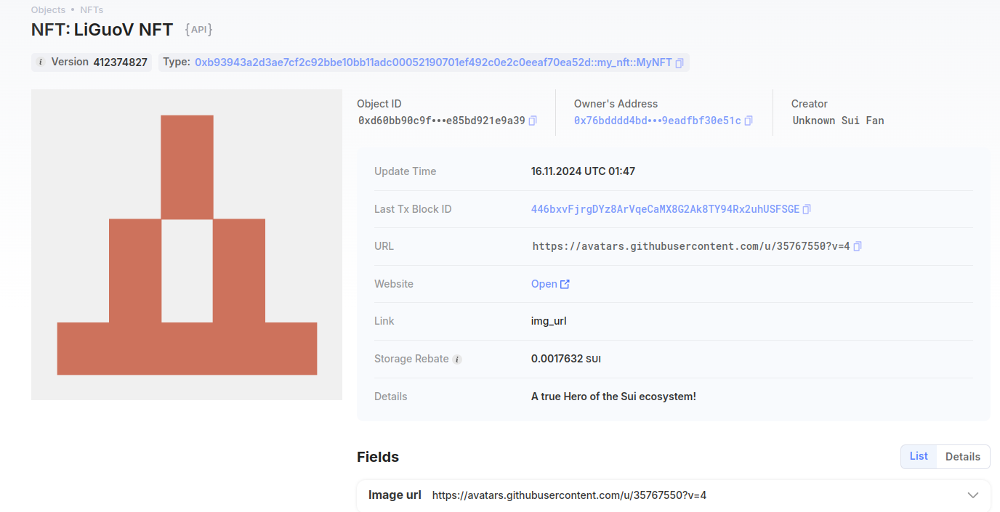

## 基本信息
- Sui钱包地址: `0x76bdddd4bd85d4a8b62f3b2b6eb2f4826e3eb2929fc902f99dc9eadfbf30e51c`
- github: `LiGuoV`

## 个人简介
- 工作经验: 8年
- 技术栈: `Python web开发 数据分析 量化交易 机器学习（强化学习）` 
- 想了解sui上的智能合约开发,交互
- 联系方式: tg: `mmywl` 

## 任务

##   01 hello move  
- [x] Sui cli version: sui 1.37.1-homebrew
- [x] Sui钱包截图: )
- [x] package id: `devnet` 0x13a875a4abb7530d0468c715e0fdb846797df6a6fa67484dee06cace5940c4b0
- [x] package id 在 scan上的查看截图:

##   02 move coin
- [] My Coin package id : 
- [] Faucet package id : 
- [] 转账 `My Coin` hash:
- [] `Faucet Coin` address1 mint hash:
- [] `Faucet Coin` address2 mint hash:

##   03 move NFT
- [x] nft package id : `0xb93943a2d3ae7cf2c92bbe10bb11adc00052190701ef492c0e2c0eeaf70ea52d`
- [x] nft object id : `0xd60bb90c9fd477699ee54f4c9ab8e9c6bdce9a4d745c560e257e85bd921e9a39`
- [x] 转账 nft  hash: `HD4PPBxYBXQrz9VFvgeBNoTKEWKJDvSai9URULdu2sFj`
- [x] scan上的NFT截图:

##   04 Move Game
- [] game package id :
- [] deposit Coin hash:
- [] withdraw `Coin` hash:
- [] play game hash:

##   05 Move Swap
- [] swap package id :
- [] call swap CoinA-> CoinB  hash :
- [] call swap CoinB-> CoinA  hash :

##   06 Dapp-kit SDK PTB
- [] save hash :

##   07 Move CTF Check In
- [] CLI call 截图 : 
- [] flag hash :

##   08 Move CTF Lets Move
- [] proof : 
- [] flag hash :
