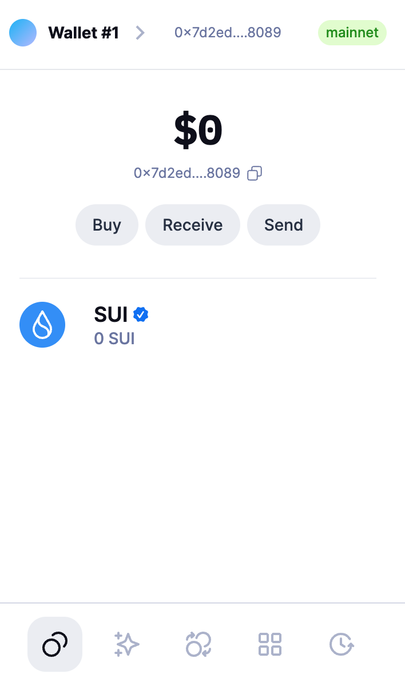
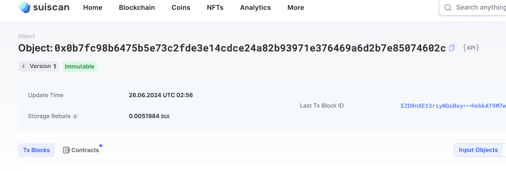
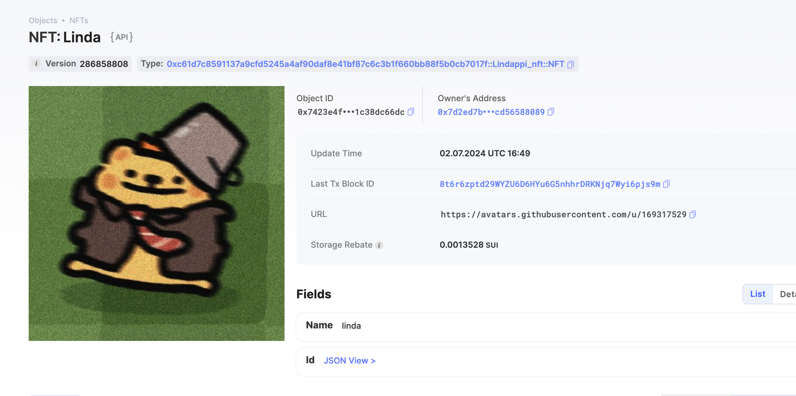

## 基本信息
- Sui钱包地址: `0x7d2ed7bea7b4e7651532e4af48d9213e8ad914953edc159262b686cd56588089`
> 首次参与需要完成第一个任务注册好钱包地址才被合并，并且后续学习奖励会打入这个地址
- github: `Lindappi`

## 个人简介
- 工作经验: 4年
- 技术栈: `Python Golang`
> 重要提示 请认真写自己的简介
- cv从业者，对Move特别感兴趣，想通过Move入门区块链
- 联系方式: tg: `lindahaoo` 

## 任务

##   01 hello move  
- [x] Sui cli version: 1.27.2
- [x] Sui钱包截图: 
- [x] package id:  `0x0b7fc98b6475b5e73c2fde3e14cdce24a82b93971e376469a6d2b7e85074602c`
- [x] package id 在 scan上的查看截图:

##   02 move coin
- [x] My Coin package id : 0x1b6d787e6bb158468ef48f46ba486b03e4d386d7f0a5611b90edda28bc3b8c30             
- [x] Faucet package id : 0x1b6d787e6bb158468ef48f46ba486b03e4d386d7f0a5611b90edda28bc3b8c30             
- [x] 转账 `My Coin` hash: 5x7kHFtAWvRCC8vaVzv4JZGPZZ4AHUarDczj6HuTidx4
- [x] `Faucet Coin` address1 mint hash: 39NsHGG6Rb91NgWQYm2zjW1hHMfndoih91M3WieYDaer
- [x] `Faucet Coin` address2 mint hash: HBAFDcMFzFyWkNsy2zEtUq8jPC4fg5DwtUWrCwJsTfbr

##   03 move NFT
- [x] nft package id : 0xc61d7c8591137a9cfd5245a4af90daf8e41bf87c6c3b1f660bb88f5b0cb7017f                      
- [x] nft object id : 0x7423e4fd519dc2878dbee08465b3e54f104f401e053c2b58fae7211c38dc66dc            
- [x] 转账 nft  hash: BofkFAg64ihyaBRnSwaQMRjDwLriqxW1Zz8gSuSTHwW2
- [x] scan上的NFT截图:

##   04 Move Game
- [] game package id :
- [] deposit Coin hash:
- [] withdraw `Coin` hash:
- [] play game hash:

##   05 Move Swap
- [] swap package id :
- [] call swap CoinA-> CoinB  hash :
- [] call swap CoinB-> CoinA  hash :

##   06 Dapp-kit SDK PTB
- [] save hash :

##   07 Move CTF Check In
- [] CLI call 截图 : 
- [] flag hash :

##   08 Move CTF Lets Move
- [] proof : 
- [] flag hash :
