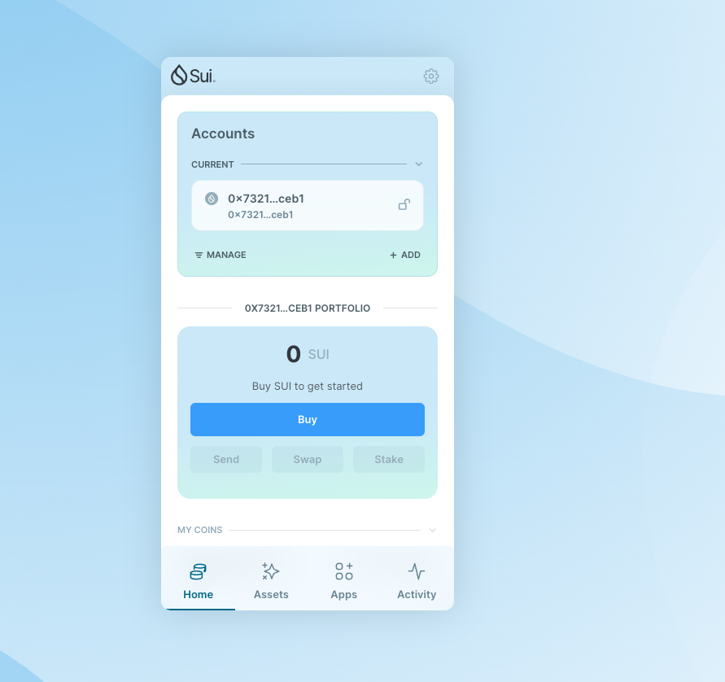
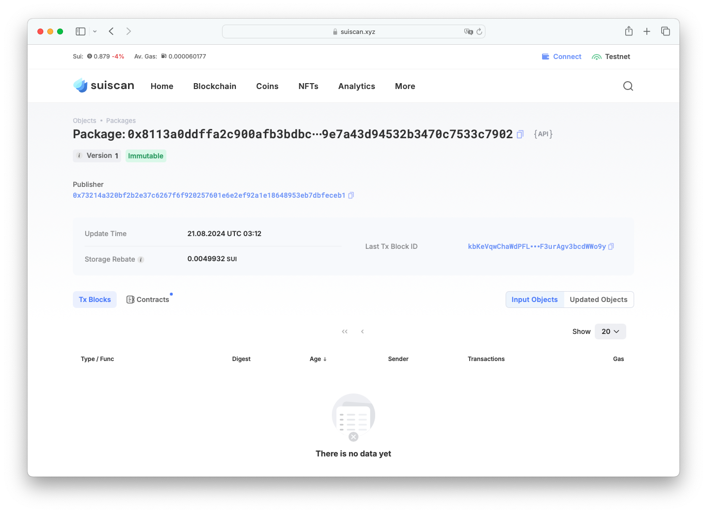
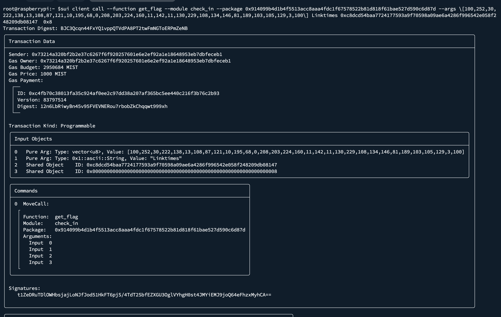

## 基本信息
- Sui钱包地址: `0x73214a320bf2b2e37c6267f6f920257601e6e2ef92a1e18648953eb7dbfeceb1`
> 首次参与需要完成第一个任务注册好钱包地址才被合并，并且后续学习奖励会打入这个地址
- github: `LinkTimes`

## 个人简介
- 工作经验: 0年
- 技术栈: `Java`
> 重要提示 请认真写自己的简介
- 丰富Java EE开发经验，对Move特别感兴趣，想通过Move入门区块链
- 联系方式: tg: `linkTimie` 

## 任务

##   01 hello move   
- [x] Sui cli version:  sui-client 1.31.1-1bf77fe12ab9
- [x] Sui钱包截图: 
- [x] package id: 0x8113a0ddffa2c900afb3bdbccef1912c8bfa19e7a43d94532b3470c7533c7902
- [x] package id 在 scan上的查看截图:

##   02 move coin
- [x] My Coin package id :  0xc805c954af8e35a19e01b755689ae393dfa9ed57c3012f413fc3744b6bfdba21
- [x] Faucet package id : 0xc805c954af8e35a19e01b755689ae393dfa9ed57c3012f413fc3744b6bfdba21
- [x] 转账 `My Coin` hash: 7YPUX9oE8qLzj2pUANuwMvu36PYZyP76pbzCewysDCTH
- [x] `Faucet Coin` address1 mint hash: EcyLYq995Umpc3D8f4mnzuWuZC7yAismzw8y8uCkz57M
- [x] `Faucet Coin` address2 mint hash: 3nv7HckM4DXituxrEYzdThbmkooE3sqdRPnkxAufwqW6

##   03 move NFT
- [] nft package id :
- [] nft object id : 
- [] 转账 nft  hash:
- [] scan上的NFT截图:

##   04 Move Game
- [] game package id :
- [] deposit Coin hash:
- [] withdraw `Coin` hash:
- [] play game hash:

##   05 Move Swap
- [] swap package id :
- [] call swap CoinA-> CoinB  hash :
- [] call swap CoinB-> CoinA  hash :

##   06 Dapp-kit SDK PTB
- [] save hash :

##   07 Move CTF Check In
- [x] CLI call 截图 : 
- [x] flag hash : BJC3Qcqn44FxYQ1vppQTVdPA8PT2twFmNGToERPmZeNB

##   08 Move CTF Lets Move
- [x] proof :  610145a5a9115b8fea68
- [x] flag hash : HLi3TmPhoEhR49VS3S9tuDEBJtELJgwAnAqEBjEPpXfP
