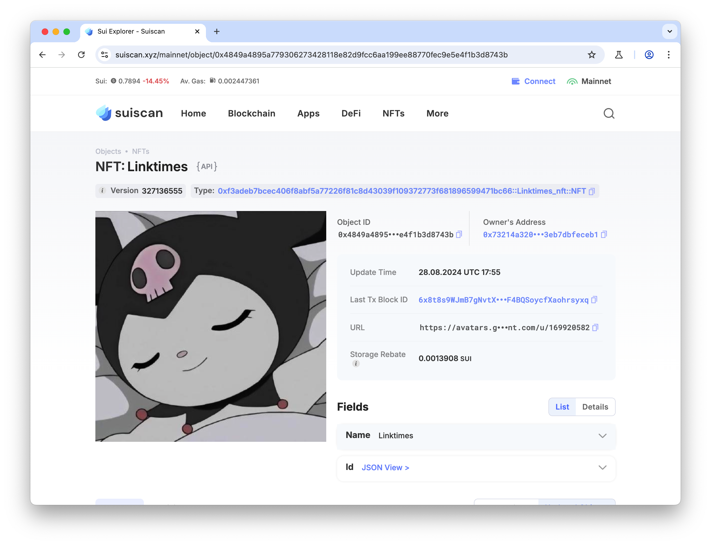

## 基本信息
- Sui钱包地址: `0x73214a320bf2b2e37c6267f6f920257601e6e2ef92a1e18648953eb7dbfeceb1`
> 首次参与需要完成第一个任务注册好钱包地址才被合并，并且后续学习奖励会打入这个地址
- github: `LinkTimes`

## 个人简介
- 工作经验: 0年
- 技术栈: `Java`
> 重要提示 请认真写自己的简介
- 丰富Java EE开发经验，对Move特别感兴趣，想通过Move入门区块链
- 联系方式: tg: `linkTimie` 

## 任务

##   01 hello move   
- [x] Sui cli version:  sui-client 1.31.1-1bf77fe12ab9
- [x] Sui钱包截图: 
- [x] package id: 0x8113a0ddffa2c900afb3bdbccef1912c8bfa19e7a43d94532b3470c7533c7902
- [x] package id 在 scan上的查看截图:

##   02 move coin
- [x] My Coin package id :  0xc805c954af8e35a19e01b755689ae393dfa9ed57c3012f413fc3744b6bfdba21
- [x] Faucet package id : 0xc805c954af8e35a19e01b755689ae393dfa9ed57c3012f413fc3744b6bfdba21
- [x] 转账 `My Coin` hash: 7YPUX9oE8qLzj2pUANuwMvu36PYZyP76pbzCewysDCTH
- [x] `Faucet Coin` address1 mint hash: EcyLYq995Umpc3D8f4mnzuWuZC7yAismzw8y8uCkz57M
- [x] `Faucet Coin` address2 mint hash: HbW2CXQn6C3WYTeypfLuiTV6mkD2z84ju6ViJoddpbGe

##   03 move NFT
- [x] nft package id :0xf3adeb7bcec406f8abf5a77226f81c8d43039f109372773f681896599471bc66
- [x] nft object id :  0x4849a4895a779306273428118e82d9fcc6aa199ee88770fec9e5e4f1b3d8743b
- [x] 转账 nft  hash: 2NxfVtnaJunW98UHjds37u9kS88eVx1onEbvYwM1d1pz
- [x] scan上的NFT截图:

##   04 Move Game
- [x] game package id : 0x3f8d8f877a47ef52545165f65e5f684e5fffa2ffb10cb35d38a4db0f620cd854
- [x] deposit Coin hash: xrdjK5d4JPpfoCyK83mXHLvKp24r3mq2rKDfwTsB1oz
- [x] withdraw `Coin` hash: 3EUp1AXouFXaszKoxtitn26p6vW2mVkJgLAe6LbNExVE
- [x] play game hash: 3yaakdBgY93HExPA77oTDRrD4Tub5qLHMyJGoJ8qfp8R

##   05 Move Swap
- [x] swap package id : 0x677f64ffb2d8e5ce7b6336fe53776c86f98b688cd20645b79129c5eb4b3245f2
- [x] call swap CoinA-> CoinB  hash : 3Xq35nnCafQyQfxc43kQrAvsKmdNjm5mBFLszmbjDWRr
- [x] call swap CoinB-> CoinA  hash : GnA8MULVsu8ApCMcknDnh8HSNcYi6d6AJJ1ym1t4MQK

##   06 Dapp-kit SDK PTB
- [x] save hash :C3sQbTv2mZKypFWUckSKPj7w9wa9uS9tXh5ycWyf7PPW

##   07 Move CTF Check In
- [x] CLI call 截图 : 
- [x] flag hash : BJC3Qcqn44FxYQ1vppQTVdPA8PT2twFmNGToERPmZeNB

##   08 Move CTF Lets Move
- [x] proof :  610145a5a9115b8fea68
- [x] flag hash : HLi3TmPhoEhR49VS3S9tuDEBJtELJgwAnAqEBjEPpXfP
