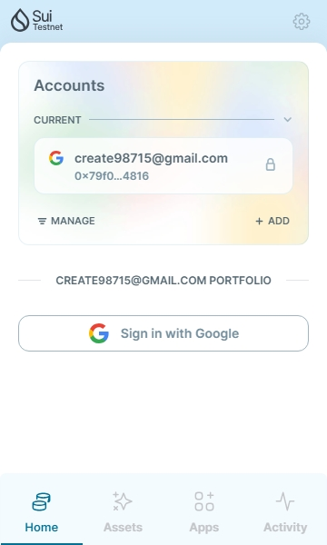
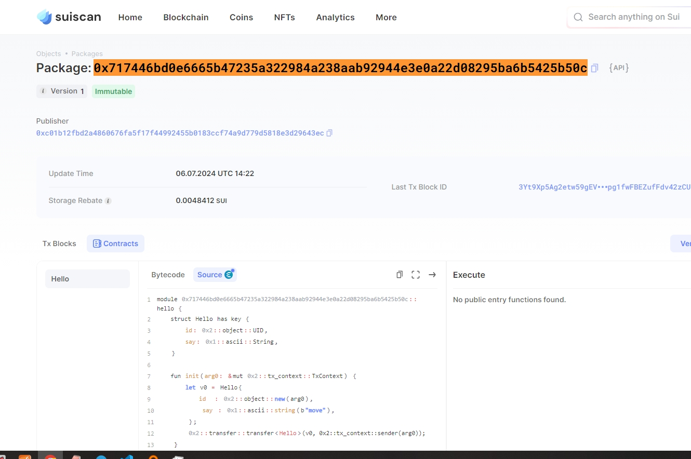
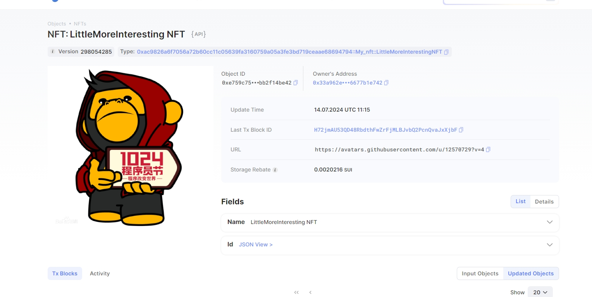
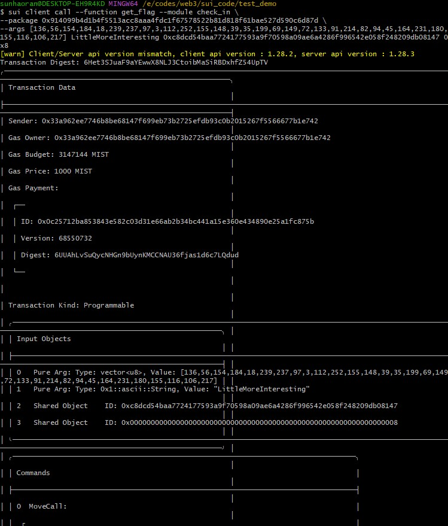

## 基本信息
- Sui钱包地址: `0x79f0faed7e62471026a78669ec642a15cb4322c5e9aa4afc04110eb38af14816`
> 首次参与需要完成第一个任务注册好钱包地址才被合并，并且后续学习奖励会打入这个地址
- github: `LittleMoreInteresting`

## 个人简介
- 工作经验: 8年
- 技术栈: `Golang` `PHP` `solidity` `react`
> 个人简介
- 多年web2后端开发经验，对Move特别感兴趣，想通过Move入门web3开发。
- 联系方式: tg: `horace2024` 

## 任务

##   01 hello move  
- [] Sui cli version:sui 1.28.2-08b50387a184
- [] Sui钱包截图: 
- [] package id: `0x717446bd0e6665b47235a322984a238aab92944e3e0a22d08295ba6b5425b50c`
- [] package id 在 scan上的查看截图:

##   02 move coin
- [] My Coin package id : 0x5f982db287864be6e99eb15e9bd764368116ce5c5ddbc8a9d26ecac1cf6af461
- [] Faucet package id : 0xf8d1b2d2a2cd66d6d12446b648144f30ab0a5cc9e918d4a0f5261a013d161f54
- [] 转账 `My Coin` hash: 4EAq6GM2c5BGf6Rq7GVAXbY9R4qinm2hyMQ9RLjG4Z8r
- [] `Faucet Coin` address1 mint hash: J2kht8JoCHjqHtia9oi4vjhniNr6t7mqqNGkZVA5EUYK
- [] `Faucet Coin` address2 mint hash: Cfb9VrdowmEyHnSB7UFDRAAYzFhVEM5n8zaSVKZiJnJ4

##   03 move NFT
- [] nft package id :0xac9826a6f7056a72b60cc11c05639fa3160759a05a3fe3bd719ceaae68694794
- [] nft object id : 0xe759c75565061f80636290391cb7128e38840e4c41b46369ba3897bb2f14be42
- [] 转账 nft  hash: H72jmAU53QD48RbdthFwZrFjMLBJvbQ2PcnQvaJxXjbF
- [] scan上的NFT截图:

##   04 Move Game
- [] game package id :
- [] deposit Coin hash:
- [] withdraw `Coin` hash:
- [] play game hash:

##   05 Move Swap
- [] swap package id :
- [] call swap CoinA-> CoinB  hash :
- [] call swap CoinB-> CoinA  hash :

##   06 Dapp-kit SDK PTB
- [] save hash :

##   07 Move CTF Check In
- [] CLI call 截图 : 
- [] flag hash : 6Het3SJuaF9aYEwwX8NLJ3CtoibMaSiRBDxhfZ54UpTV

##   08 Move CTF Lets Move
- [] proof : 
- [] flag hash :
