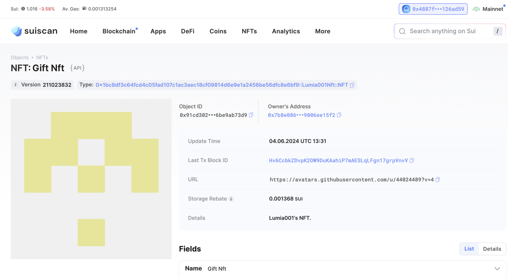

## 基本信息

- Sui钱包地址: `0x4887f3c29909a93ca193609fa28b9c3f35ee01ac352346fc9d56d2d50126ad59`

> 首次参与需要完成第一个任务注册好钱包地址才被合并，并且后续学习奖励会打入这个地址

- github: `Lumia001`

## 个人简介

- 工作经验: 3年
- 技术栈: `Java`

> 重要提示 请认真写自己的简介

- 3年+web2开发经验，对Wen3特别感兴趣，想通过Move入门Web3的开发
- 联系方式: tg: `xxx`

## 任务

## 01 hello move

- [x] Sui cli version: sui 1.26.0-homebrew
- [x] Sui钱包截图: 
- [x] package id: 0xc058ade4e367c72a2f5884fb02a7496e8db2493d72dd17a27d2d6cfd51292ed9
- [x] package id 在 scan上的查看截图:

## 02 move coin

- [x] My Coin package id : 0xeca401e43db776c5a3149e27245c747907858abc38382a672e0f85d28d2ba124
- [x] Faucet package id : 0xeca401e43db776c5a3149e27245c747907858abc38382a672e0f85d28d2ba124
- [x] 转账 `My Coin` hash: CgxjPrr86B2CdM3qcRevt1acGU6HffCRabp7EYrctCRa
- [x] `Faucet Coin` address1 mint hash: 88E6YAC3LiLApMwNvdnyKGDiZ8PcCyVRHSxkUHENiYQo
- [x] `Faucet Coin` address2 mint hash: AfY1nD8RGBhGhkuSFnAwdaFb2NdoPuKM8FyD22G9Nh96

## 03 move NFT

- [x] nft package id : 0x1bc8df3c64fcd4c05fad107c1ac3aec18cf09814d6e9e1a2456be56dfc8e6bf9
- [x] nft object id : 0x21334b3547671c5ffbb8836613207818811458fbc0b94527c02dccae369b6bb1
- [x] 转账 nft hash: 3WAkvwTaVEFn2EQph8mh2vTmx1teGxZdYMiNXQ4aWKz9
- [x] scan上的NFT截图:
## 04 Move Game

- [] game package id :
- [] deposit Coin hash:
- [] withdraw `Coin` hash:
- [] play game hash:

## 05 Move Swap

- [] swap package id :
- [] call swap CoinA-> CoinB hash :
- [] call swap CoinB-> CoinA hash :

## 06 Dapp-kit SDK PTB

- [] save hash :
