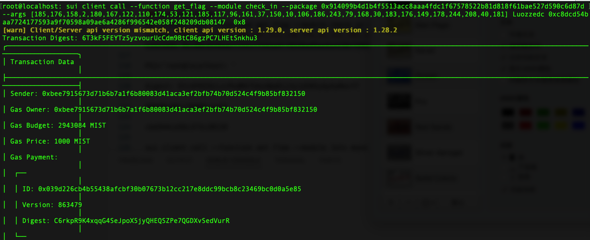

## 基本信息
- Sui钱包地址: `0xbee7915673d71b6b7a1f6b80083d41aca3ef2bfb74b70d524c4f9b85bf832150`
> 首次参与需要完成第一个任务注册好钱包地址才被合并，并且后续学习奖励会打入这个地址
- github: `Luozzedc`

## 个人简介
- 工作经验: 1年
- 技术栈: `Java`
- 一年Java开发经验，对Move感兴趣，想通过Move入门Sui

## 任务

##   01 hello move  
- [x] package id:  `0x617dad4f9c8496a365628dd2e71d62d5cfd426e0384a3544879d5c31c3adba03`

##   02 move coin
- [x] My Coin package id : `0x5bea87825dc868a3d3dd46cf25ed78587a25dbc1f233191207dea49b64fd3ad9`
- [x] Faucet package id : `0x5bea87825dc868a3d3dd46cf25ed78587a25dbc1f233191207dea49b64fd3ad9`
- [x] 转账 `My Coin` hash: `3bYAL7Muebbn8v3qdckYLKYhkirD76X21jUBKsfiwPKQ`

##   03 move NFT
- [x] nft package id : `0x265e609968c54fa0dc0aeb3eebfd2de6e00cb7d8fcd798b384a7cb608c44508e`
- [x] nft object id :  `0xbee54cf251ceabea12cc85f095f48cdd4c71888e1c016fce272cdcd27771f134`
- [x] 转账 nft hash: `FbU4qyxJN5A9MWHdn34VNCGkBUQmzCpFWNVe9XMyZFX1`

##   04 Move Game
- [] game package id :
- [] call game hash:

##   05 Move Swap
- [x] swap package id : `0x46ac55403f6a468f10bcb5e2a5695a92587b7426822f8ae01319be9372b03ddf`
- [x] call swap CoinA-> CoinB  hash : `Ap5MxuVRccFxGijYyAEckjXeJ18rrQzMjjTrcogeMyF`
- [x] call swap CoinB-> CoinA  hash : `EVgmitNvdd3gH6wYetv9uqQ16X4onFoCJLdpfcPBSqGm`

##   06 SDK PTB
- [x] save hash : `6SuDgitkQqoagSKrvJwhV2c1FZy2XKVALuP6gSgJxBhz`

##   07 Move CTF Check In
- [x] CLI call 截图 : 
- [x] flag hash : `6T3kF5FEYTz5yzvourUcCdm9BtCB6gzPC7LHEtSnkhu3`

##   08 Move CTF Lets Move
- [x] proof : `c020c499faf55824b38f`
- [x] flag hash : `8H1iUMtAs5tgR8LnaHXiVmezpcgj1ZjLQdspiAjhe1Dj`