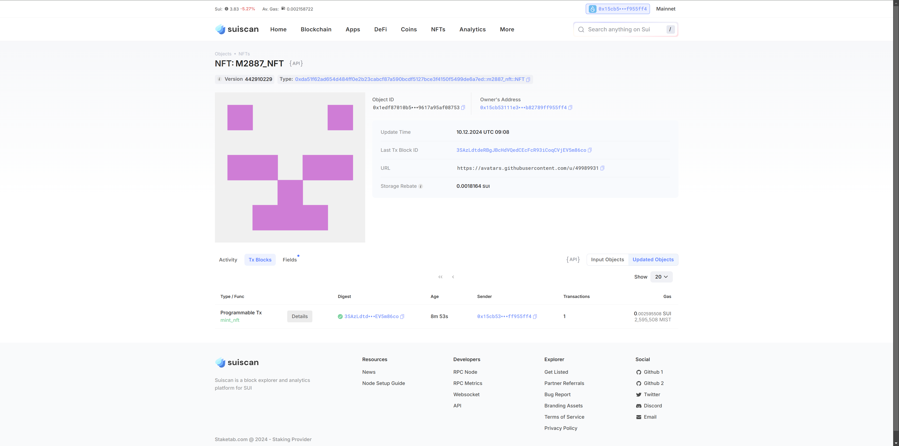

## 基本信息
- Sui钱包地址: `0x15cb53111e329d2f1216b90acf552e3a82dcbc234a672e72cdb82789ff955ff4`
> 首次参与需要完成第一个任务注册好钱包地址才被合并，并且后续学习奖励会打入这个地址
- github: `M2887`

## 个人简介
- 工作经验: 3年
- 技术栈: `Python` 
> 重要提示 请认真写自己的简介
- 运维，对Move特别感兴趣，想通过Move入门区块链
- 联系方式: tg: `https://t.me/Cxk074113` 

## 任务

##   01 hello move  
- [x] Sui cli version: `sui 1.30.1-a4185da5659d`
- [x] Sui钱包截图: 
- [x] package id: `0xa204eb01017201ad502b283b60f582eb405914760c79513f35bd0edd89803210`
- [x] package id 在 scan上的查看截图:

##   02 move coin
- [x] My Coin package id : 0x5a3a556c1b4cb0d9e20595fc0819bef617de4a6b16c258e58f49e7d1c27d4cf9
- [x] Faucet package id :  0x8526f8f3d7e23ca6e2c68c67855357745f03a9097d93a3dd3274a44290fc3faa
- [x] 转账 `My Coin` hash: E7n184sQfv9zPwZ5MZV2AAQoQPPnafXi1mTMqDwc8Uzp
- [x] `Faucet Coin` address1 mint hash: 447AsExCJqbPaYqo1wgZnXvNmDoToua5X33qARR1WHsq
- [x] `Faucet Coin` address2 mint hash: 97y7zWpdvJHN1u8bx1rn1QxhdhbM3UB8qfJ1sc2nCgAn

##   03 move NFT
- [x] nft package id : 0xda51f62ad654d484ff0e2b23cabcf87a590bcdf5127bce3f4150f5499de6a7ed
- [x] nft object id : 0x1edf87010b50139993e3dc1a625eabdec1e2fa318c1c25c77b9617a95af08753
- [x] 转账 nft  hash: CshAsuCoSHVB7P4i886froQfU9qCSWLsGHmJeE82e1sv
- [x] scan上的NFT截图:

##   04 Move Game
- [x] game package id : 0x7e1792a1a41a30206da3198784b9285dfa1e66bf227d834eb5d2ac9495554a64
- [x] deposit Coin hash: 4zpRNznvDxaERdm2vqoqADWHQ4zzHMkR2Vo1thegUWW1
- [x] withdraw `Coin` hash: DR23o9NKayA6GKe55oPcxeiEBJLs1saNsF5qPGb2yLqp
- [x] play game hash: GqrkVNG9KY3Rd6JeWEZMP59j4QAgBnU9CRBUhj5A44xR

##   05 Move Swap
- [x] swap package id : 0x1789eb26b84f8b1c645888a738f3a869bfccee0b62ef227a8d5a3e7c05cc7be3
- [x] call swap CoinA-> CoinB  hash : Cn4ZFruTtYisva7gNcqtweo9gtyLPA5p3212L4exmbke
- [x] call swap CoinB-> CoinA  hash : 5bevDEEeUMs1TxeRNMdncAt77uhAngaquBbRfpViNhDq

##   06 Dapp-kit SDK PTB
- [] save hash :

##   07 Move CTF Check In
- [] CLI call 截图 : 
- [] flag hash :

##   08 Move CTF Lets Move
- [] proof : 
- [] flag hash :
