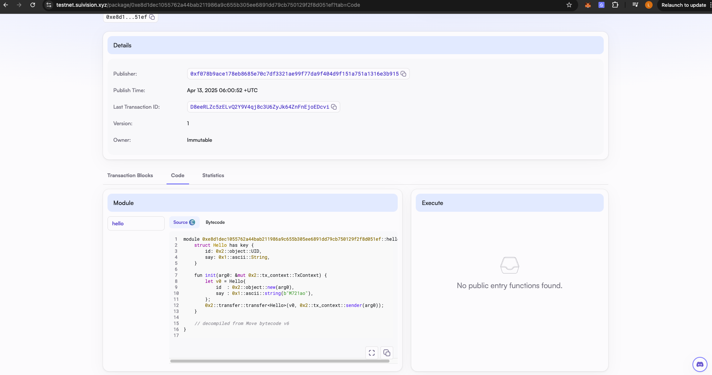

## 基本信息
- Sui钱包地址: `0x00c8d97aa2e2ef641f41fac24b1eb6e88e3d78eb50987da64cd1973b655b69ba`
> 首次参与需要完成第一个任务注册好钱包地址才被合并，并且后续学习奖励会打入这个地址
- github: `M721ao`

## 个人简介
- 工作经验: 2年
- 技术栈: `React`
> 重要提示 请认真写自己的简介
- 前端开发，对Move特别感兴趣，想通过Move入门区块链
- 联系方式: tg: `xxx` 

## 任务

##   01 hello move  
- [] Sui cli version: sui 1.46.2-homebrew
- [] Sui钱包截图: 
- [] package id:  0xe8d1dec1055762a44bab211986a9c655b305ee6891dd79cb750129f2f8d051ef
- [] package id 在 scan上的查看截图:

##   02 move coin
- [] My Coin package id : 
- [] Faucet package id : 
- [] 转账 `My Coin` hash:
- [] `Faucet Coin` address1 mint hash:
- [] `Faucet Coin` address2 mint hash:

##   03 move NFT
- [] nft package id :
- [] nft object id : 
- [] 转账 nft  hash:
- [] scan上的NFT截图:

##   04 Move Game
- [] game package id :
- [] deposit Coin hash:
- [] withdraw `Coin` hash:
- [] play game hash:

##   05 Move Swap
- [] swap package id :
- [] call swap CoinA-> CoinB  hash :
- [] call swap CoinB-> CoinA  hash :

##   06 Dapp-kit SDK PTB
- [] save hash :

##   07 Move CTF Check In
- [] CLI call 截图 : 
- [] flag hash :

##   08 Move CTF Lets Move
- [] proof : 
- [] flag hash :

