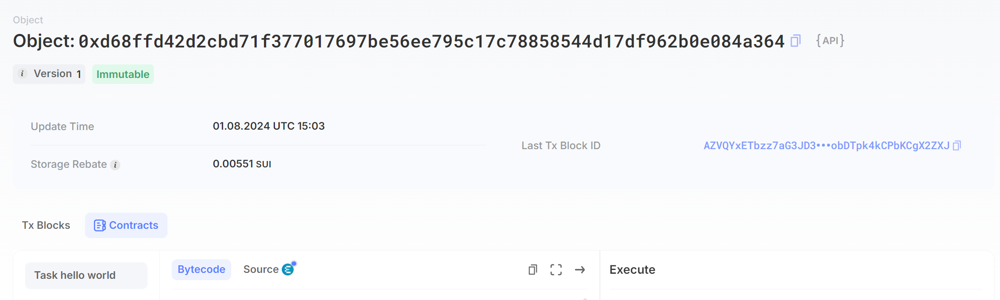

## 基本信息
- Sui钱包地址: `0x3108d5feb7f6eb96ce5eb28fb6ab126a4f100972025558d4e3ef72894c91d49c`
> 首次参与需要完成第一个任务注册好钱包地址才被合并，并且后续学习奖励会打入这个地址
- github: `MakiSonomura`

## 个人简介
- 工作经验: 1年 
- 技术栈: `Rust` `C++` `CUDA`
> 重要提示 请认真写自己的简介
- 多年web2开发经验，对Move特别感兴趣，想通过Move入门区块链
<!-- - 联系方式: tg: `xxx`  -->

## 任务

##   01 hello move  
- [×] Sui cli version: `sui 1.30.1-a4185da5659d`
- [×] Sui钱包截图: 
- [×] package id:  `0xd68ffd42d2cbd71f377017697be56ee795c17c78858544d17df962b0e084a364`
- [×] package id 在 scan上的查看截图:
- [×] Object Id: `0x85d2b30e74f79dc4808b06c19cdb492cb00dad778fa2a2141fc91f4255e8ea83`

##   02 move coin
- [×] My Coin package id: `0xe6b5e74ed30a1b6bfd6856b8f790dc8b07c5e4f9e3a51ef715c94127cb0fd22c` 
- [×] Faucet package id : `0xc6d68b9fc79a8f100cac34f5cb75b952371d6787afdfe811cbc9ed78889b2a74`
- [×] 转账 `My Coin` hash: `99j4FsauBaPCZH3tLKRPKm4TEk1FCP68gmn5PZ8T7Dyf`
- [×] `Faucet Coin` address1 mint hash: `5kdENFq26fbGgecYDghRRAFfuAAJcbyfRxcgpHb6bSec`
- [×] `Faucet Coin` address2 mint hash: `ETMEbtd36VrHLRyFVu2qGEDAncGTK5Rod8pZXuA5UHaN`

##   03 move NFT
- [×] nft package id : `0xd369b4407b1157bf43df6dd8b707cd6bc05d799aab8c1b8a7807c49f378ad98f`
- [×] nft object id : `0x696dff00cca7bf1c3c9fb48900d843e941de749d7feb63c198ba7280e04f704b`
- [×] 转账 nft  hash: `E8n5badcgHipXTTjFQr1p4Yh1ek4C6t81FSbShUQjDhv`
- [×] scan上的NFT截图:

##   04 Move Game
- [] game package id :
- [] deposit Coin hash:
- [] withdraw `Coin` hash:
- [] play game hash:

##   05 Move Swap
- [] swap package id :
- [] call swap CoinA-> CoinB  hash :
- [] call swap CoinB-> CoinA  hash :

##   06 Dapp-kit SDK PTB
- [] save hash :

##   07 Move CTF Check In
- [] CLI call 截图 : 
- [] flag hash :

##   08 Move CTF Lets Move
- [] proof : 
- [] flag hash :
