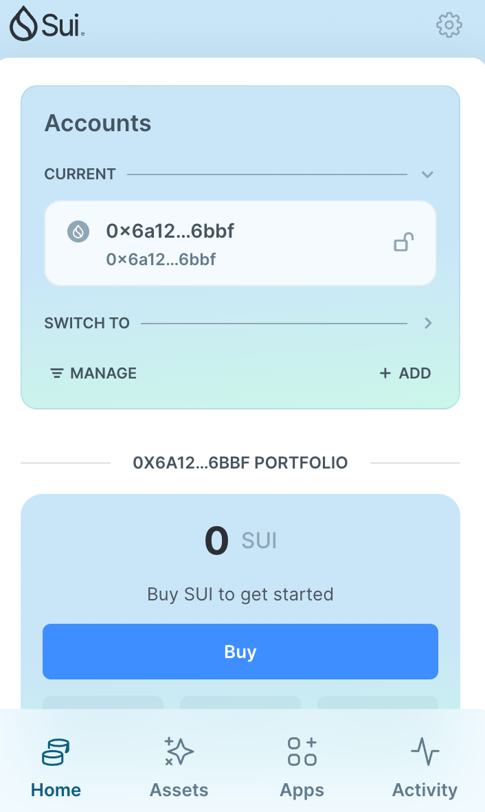
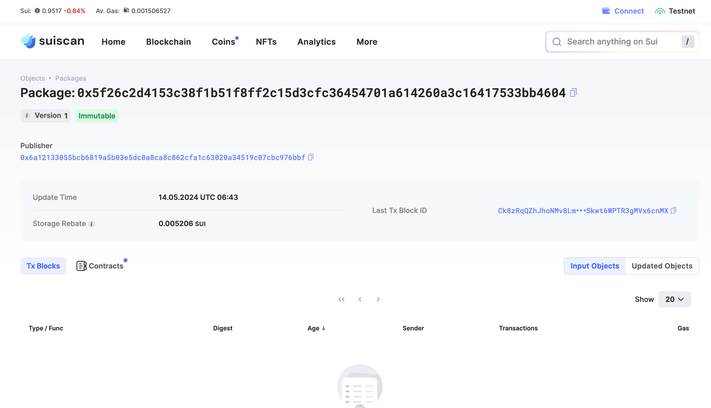

## 基本信息
- Sui钱包地址: `0x6a12133055bcb6819a5b03e5dc0a8ca8c862cfa1c63020a34519c07cbc976bbf`
> 首次参与需要完成第一个任务注册好钱包地址才被合并，并且后续学习奖励会打入这个地址
- github: `Maqihao01`

## 个人简介
- 工作经验: 1年
- 技术栈: `C++`
> 重要提示 请认真写自己的简介
- 学习Move语言，进入Web3的世界
- 联系方式: tg: `Manju0087` 

## 任务

##   01 hello move  
- [x] Sui cli version:sui-client 1.24.1-d63ccc6
- [x] Sui钱包截图: 
- [x] package id:  0x5f26c2d4153c38f1b51f8ff2c15d3cfc36454701a614260a3c16417533bb4604
- [x] package id 在 scan上的查看截图:

##   02 move coin
- [] My Coin package id : 
- [] Faucet package id : 
- [] 转账 `My Coin` hash:
- [] `Faucet Coin` address1 mint hash:
- [] `Faucet Coin` address2 mint hash:

##   03 move NFT
- [] nft package id :
- [] nft object id : 
- [] 转账 nft  hash:
- [] scan上的NFT截图:

##   04 Move Game
- [] game package id :
- [] deposit Coin hash:
- [] withdraw `Coin` hash:
- [] play game hash:

##   05 Move Swap
- [] swap package id :
- [] call swap CoinA-> CoinB  hash :
- [] call swap CoinB-> CoinA  hash :

##   06 SDK PTB
- [] save hash :
