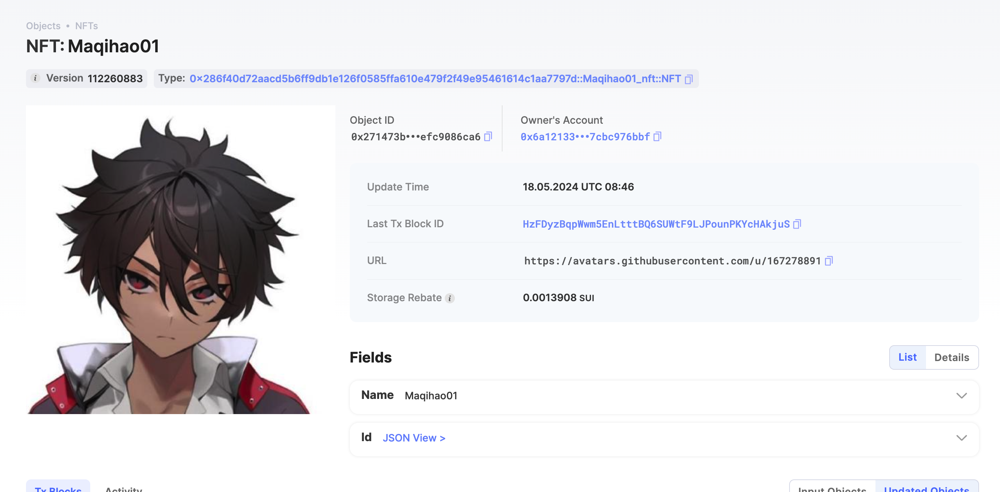
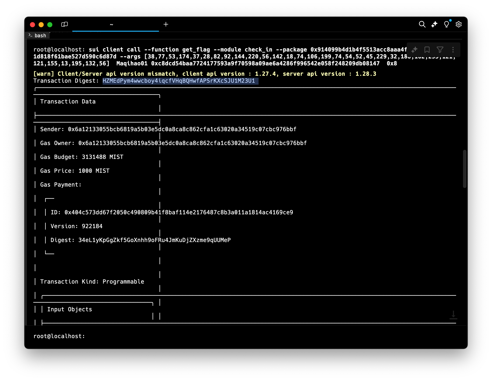

## 基本信息
- Sui钱包地址: `0x6a12133055bcb6819a5b03e5dc0a8ca8c862cfa1c63020a34519c07cbc976bbf`
> 首次参与需要完成第一个任务注册好钱包地址才被合并，并且后续学习奖励会打入这个地址
- github: `Maqihao01`

## 个人简介
- 工作经验: 1年
- 技术栈: `C++`
> 重要提示 请认真写自己的简介
- 学习Move语言，进入Web3的世界
- 联系方式: tg: `Manju0087` 

## 任务

##   01 hello move  
- [x] Sui cli version:sui-client 1.24.1-d63ccc6
- [x] Sui钱包截图: 
- [x] package id:  0x5f26c2d4153c38f1b51f8ff2c15d3cfc36454701a614260a3c16417533bb4604
- [x] package id 在 scan上的查看截图:

##   02 move coin
- [x] My Coin package id :  0x1ca368d08ea0c4faff0ddb54e8bfab95a69c4c74b64c2ca405a13e2536c0145b
- [x] Faucet package id : 0x1ca368d08ea0c4faff0ddb54e8bfab95a69c4c74b64c2ca405a13e2536c0145b
- [x] 转账 `My Coin` hash: FVCbP4hCHN82vjW5teKW1E7d5hjcxMTypirYKPya8Df7
- [x] `Faucet Coin` address1 mint hash: GuSdJm1x7gzEXwjdw1RiMsP2xHTJKggif2SEmqhTTWMP
- [x] `Faucet Coin` address2 mint hash:  8WM3MYtMLX2HddghqiiAb9mZRi42DzYCS8EY8LxkHxvU

##   03 move NFT
- [x] nft package id : 0x286f40d72aacd5b6ff9db1e126f0585ffa610e479f2f49e95461614c1aa7797d
- [x] nft object id : 0x271473b05579d0aa1f6c93129026c0d1903e2b9ae785b7992a5eccefc9086ca6 
- [x] 转账 nft hash:  HMmLRQdRhrrgffSKDeiKXSv1nAkQQ1EivTQfQayHeM7S
- [x] scan上的NFT截图:

##   04 Move Game
- [x] game package id : 0x0dd09a296ae728ca4660f5b0c24a7e5ba71377150d8f8ab1cd00f883cb41c817 
- [x] deposit Coin hash: C6xtMYvQ95ejmQJKiBKYChaQ5ArdUPzvHUoyFxQgcDQR
- [x] withdraw `Coin` hash: gxNRnVf7X45Qpw8E9czvVjRc8kwGvkWkVWwD33LVDnT
- [x] play game hash:  EYMj9BU8ExcCXxugJYpAHbnhNGxMtNaVFvCgFcg1BhzZ

##   05 Move Swap
- [x] swap package id : 0xeca373a6da0d118d323720871276e0b6b8c217167397b8bce009ddf604702922   
- [x] call swap CoinA-> CoinB  hash : 6UEyk8y53FEtpcJDySSztAUR57rvQaV5kwbpM4Y67Gh
- [x] call swap CoinB-> CoinA  hash : 5jP4LfHiXkqaXf9i3M6zADrEH8hnruSeGtg5fEh8hAQw

##   06 SDK PTB
- [x] save hash : [J3RTijmy42AudV1Af784jaoCUCSRJCxCVxqq3Zee9jNV](https://suivision.xyz/txblock/J3RTijmy42AudV1Af784jaoCUCSRJCxCVxqq3Zee9jNV)

##   07 Move CTF Check In
- [x] CLI call 截图 : 
- [x] flag hash : HZMEdPym4wwcboy4iqcfVHqBQHwfAPSrKXcSJU1M23U1

##   08 Move CTF Lets Move
- [x] proof : f5a78d2ae884ff1fd630
- [x] flag hash : 4M4U6RVPj5rzgwkuPPykZ8DrCQm5V6CuRvFfkEnvvYUd