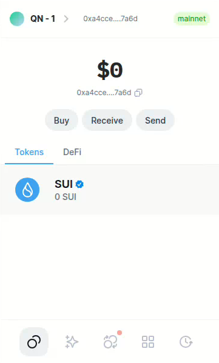
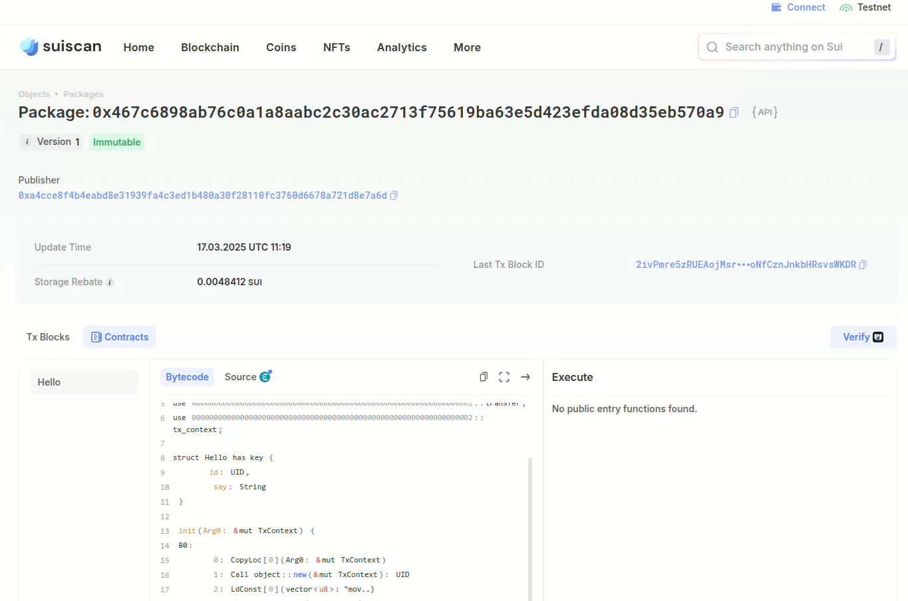

## 基本信息
- Sui钱包地址: `0xa4cce8f4b4eabd8e31939fa4c3ed1b480a30f28110fc3760d6678a721d8e7a6d`
> 首次参与需要完成第一个任务注册好钱包地址才被合并，并且后续学习奖励会打入这个地址
- github: `MeditationLand`

## 个人简介
- 工作经验: 3年
- 技术栈: `Java` `Solidity` `Linux`
> 重要提示 请认真写自己的简介
- 3年Java后端开发经验，有Web3经验，目前主要方向为智能合约开发，但其他方面也会玩玩。想了解Sui和Move并参加Sui Overflow 2025 Hackathon，欢迎组队。
- 联系方式: tg: `@qianneng_99` wechat: `CheneyQN`

## 任务

##   01 hello move  
- [√] Sui cli version: `sui 1.44.3-615516edb0ed`
- [√] Sui钱包截图: 
- [√] package id: 0x467c6898ab76c0a1a8aabc2c30ac2713f75619ba63e5d423efda08d35eb570a9
- [√] package id 在 scan上的查看截图:

##   02 move coin
- [] My Coin package id : 
- [] Faucet package id : 
- [] 转账 `My Coin` hash:
- [] `Faucet Coin` address1 mint hash:
- [] `Faucet Coin` address2 mint hash:

##   03 move NFT
- [] nft package id :
- [] nft object id : 
- [] 转账 nft  hash:
- [] scan上的NFT截图:

##   04 Move Game
- [] game package id :
- [] deposit Coin hash:
- [] withdraw `Coin` hash:
- [] play game hash:

##   05 Move Swap
- [] swap package id :
- [] call swap CoinA-> CoinB  hash :
- [] call swap CoinB-> CoinA  hash :

##   06 Dapp-kit SDK PTB
- [] save hash :

##   07 Move CTF Check In
- [] CLI call 截图 : 
- [] flag hash :

##   08 Move CTF Lets Move
- [] proof : 
- [] flag hash :

