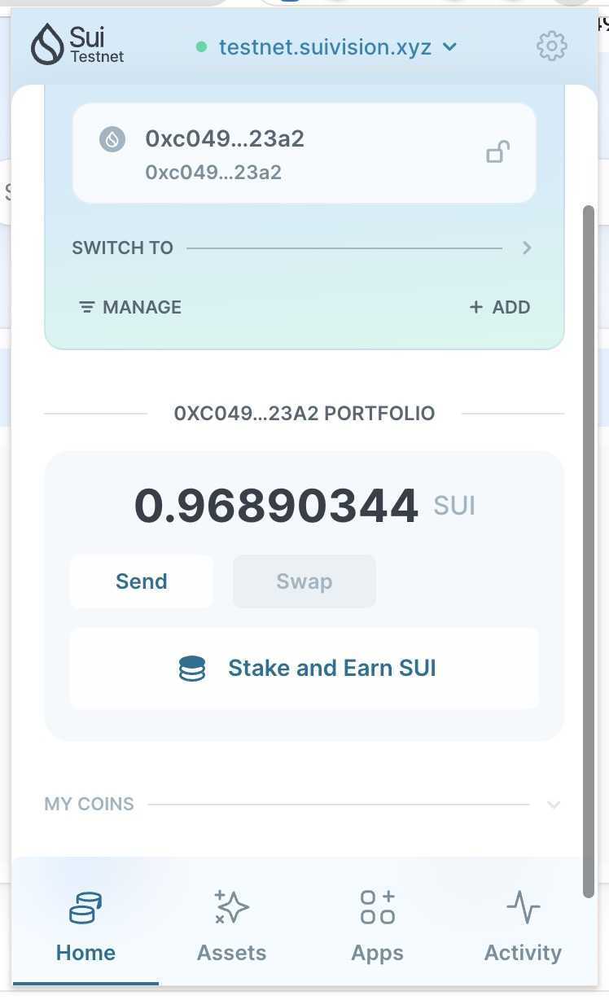

## 基本信息
- Sui钱包地址: `0xc049640f1aea3db536360303c720e4475b315bac72eae0406745df73201d23a2`
> 首次参与需要完成第一个任务注册好钱包地址才被合并，并且后续学习奖励会打入这个地址
- github: `MeepoTu`

## 个人简介
- 工作经验: 5年
- 技术栈: `JavaScript` `Objective-C` `Swift`
> 重要提示 请认真写自己的简介
- 多年web2开发经验， 主要 focus 在移动端， 兼职前端开发。 对Move特别感兴趣，想通过Move入门区块链
- 联系方式: tg: `MeepoTu` 

## 任务

##   01 hello move  
- [✔] Sui cli version: `sui 1.37.1-homebrew`
- [✔] Sui钱包截图: 
- [✔] package id: 0x29507f3e1a9b893c3b021ef2b6594ff4d4ac70df5613fe0ebe47f27299dea4db
- [✔] package id 在 scan上的查看截图:

##   02 move coin
- [] My Coin package id : 
- [] Faucet package id : 
- [] 转账 `My Coin` hash:
- [] `Faucet Coin` address1 mint hash:
- [] `Faucet Coin` address2 mint hash:

##   03 move NFT
- [] nft package id :
- [] nft object id : 
- [] 转账 nft  hash:
- [] scan上的NFT截图:

##   04 Move Game
- [] game package id :
- [] deposit Coin hash:
- [] withdraw `Coin` hash:
- [] play game hash:

##   05 Move Swap
- [] swap package id :
- [] call swap CoinA-> CoinB  hash :
- [] call swap CoinB-> CoinA  hash :

##   06 Dapp-kit SDK PTB
- [✔] save hash : 8xFdRn9yh5UYEEYsH5zkugAGueDrBmK9kTYzRX5Ar7vT

##   07 Move CTF Check In
- [] CLI call 截图 : 
- [] flag hash :

##   08 Move CTF Lets Move
- [] proof : 
- [] flag hash :

