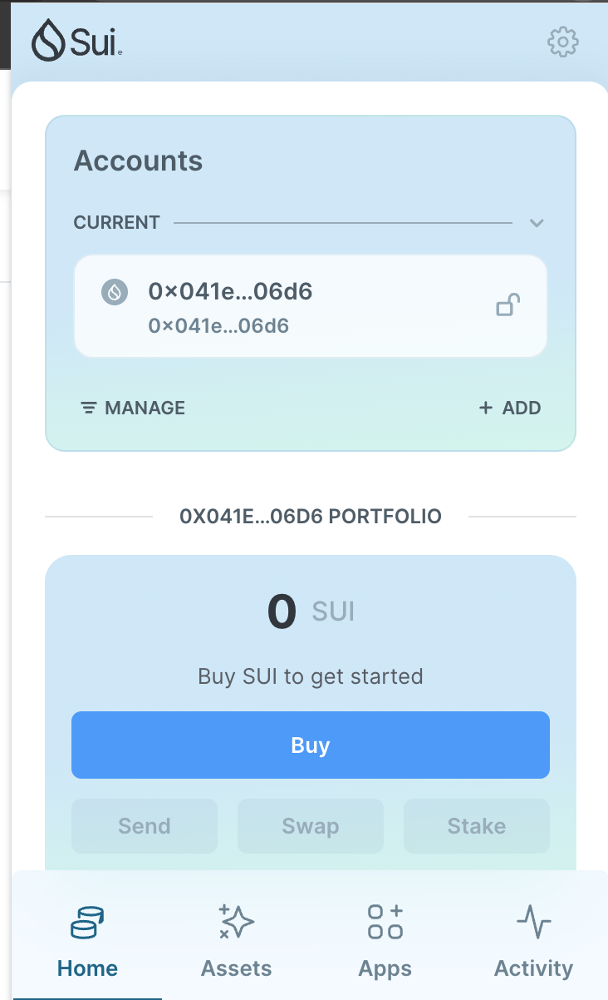
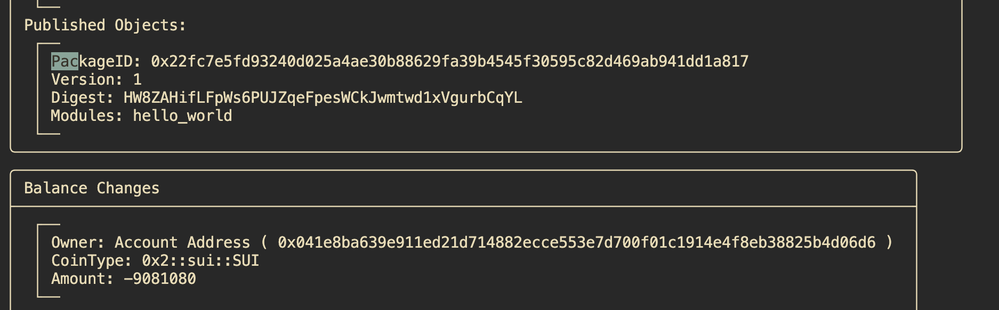
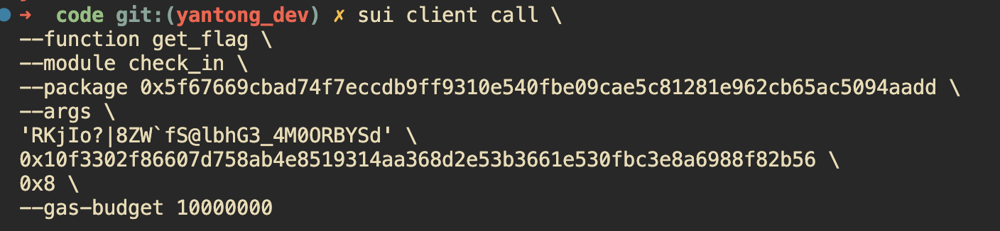

## 基本信息
- Sui钱包地址: `0x041e8ba639e911ed21d714882ecce553e7d700f01c1914e4f8eb38825b4d06d6`
> 首次参与需要完成第一个任务注册好钱包地址才被合并，并且后续学习奖励会打入这个地址
- github: `Mengyantong`

## 个人简介
- 工作经验: 3.5年
- 技术栈: `C++` `Golang` `Python`
- Traffic engineering, 对合约开发感兴趣, 想多了解
- 联系方式: wechat: `SimpleMiant`

## 任务

##   01 hello move  
- [x] Sui cli version: 1.27.1
- [x] Sui钱包截图: 
- [x] package id: 0x22fc7e5fd93240d025a4ae30b88629fa39b4545f30595c82d469ab941dd1a817
- [x] package id 在 scan上的查看截图:

##   02 move coin
- [] My Coin package id : 
- [] Faucet package id : 
- [] 转账 `My Coin` hash:
- [] `Faucet Coin` address1 mint hash:
- [] `Faucet Coin` address2 mint hash:

##   03 move NFT
- [] nft package id :
- [] nft object id : 
- [] 转账 nft  hash:
- [] scan上的NFT截图:

##   04 Move Game
- [] game package id :
- [] deposit Coin hash:
- [] withdraw `Coin` hash:
- [] play game hash:

##   05 Move Swap
- [] swap package id :
- [] call swap CoinA-> CoinB  hash :
- [] call swap CoinB-> CoinA  hash :

##   06 Dapp-kit SDK PTB
- [] save hash :

##   07 Move CTF Check In
- [x] CLI call 截图 : 
- [x] flag hash : 24v8TVbQJd55zbx8VK9uqWpjhvK8kGBoBaGfqFV7EkBF

##   08 Move CTF Lets Move
- [] proof : 
- [] flag hash :
