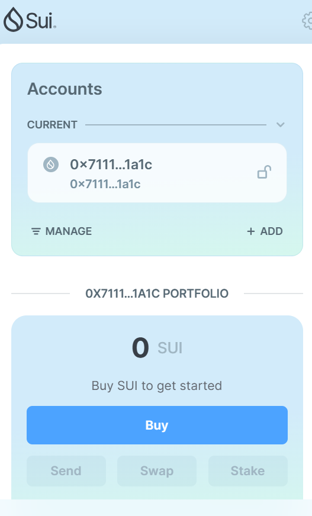
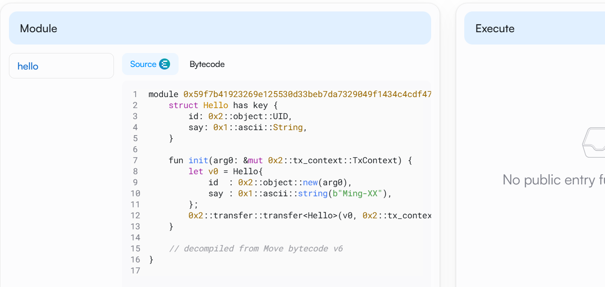
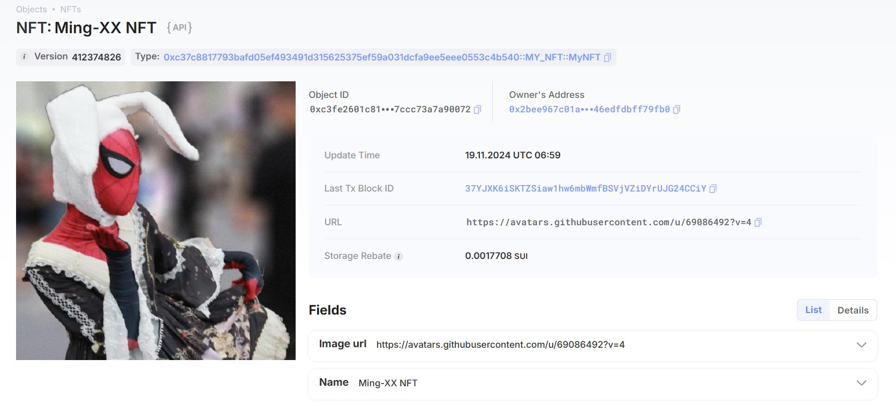
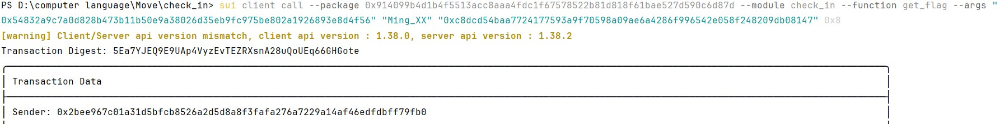

## 基本信息
- Sui钱包地址: `0x711104a1a3183f0f1a35d548ce26a363c2f8dbb7a80543cc823e08807b831a1c`
> 首次参与需要完成第一个任务注册好钱包地址才被合并，并且后续学习奖励会打入这个地址
- github: `Ming-XX`

## 个人简介
- 工作经验: 3年
- 技术栈: `C` `Rust`
> 重要提示 请认真写自己的简介
- STM32嵌入式开发，自学了Rust，想要了解Move与Rust的区别，并通过Move入门区块链
- 联系方式: tg: `https://t.me/Mina_xx` 

## 任务

##   01 hello move  
- [✓] Sui cli version: sui 1.37.1-7839b9501066
- [✓] Sui钱包截图: 
- [✓] package id: 0x59f7b41923269e125530d33beb7da7329049f1434c4cdf478a5fd1c691f565ee
- [✓] package id 在 scan上的查看截图:

##   02 move coin
- [✓] My Coin package id :0xfd1150b4d050beba03dcac1ac986189fc89e84f961a1b8ec2233e8d06423dca2
- [✓] Faucet package id : 0xdb8e8fc891265b2274b4895f5242af9e94208857756de64150efc46603b2a135
- [✓] 转账 `My Coin` hash:CwM8dfPT63SbDARuWsswUAgnrhTpbmr68Mbp79Pt5vTj
- [✓] `Faucet Coin` address1 mint hash:9VrgruonWKkmzY9ESDRFy93WVKoKPNPsmTeG7Yn8y1e4
- [✓] `Faucet Coin` address2 mint hash:EHHLSJVVoLWjYiW8Vc99ebMNwYduzh8UnR5SizAsotCJ

##   03 move NFT
- [✓] nft package id :0xc37c8817793bafd05ef493491d315625375ef59a031dcfa9ee5eee0553c4b540
- [✓] nft object id : 0xc3fe2601c815f6737226b240bf9e452679c13f28d34dcbed0d7ccc73a7a90072
- [✓] 转账 nft  hash:37YJXK6iSKTZSiaw1hw6mbWmfBSVjVZiDYrUJG24CCiY
- [✓] scan上的NFT截图:

##   04 Move Game
- [✓]  game package id :0xc1157171a3c69d7fc44233c5df1a91b95eef4dcf1ff0c01a95aee83ae398df86
- [✓]  deposit Coin hash:D6Lk3Xe9G2C6YRnHTUPnPqYH33ZQnkPRz139QN9PyZ3s
- [✓]  withdraw `Coin` hash:6Sgxwo519NPZvvyCXuzpGwgLanm7wZk9XEN75Wy894dB
- [✓]  play game hash:FqrxjL6wz2rY8UrvX2WU4ihgUW9HvbJEwuz85rLMxma9

##   05 Move Swap
- [✓]  swap package id :0x97bd347ac2fa70f0bb11bf19e6ae442c6ea1ae98c1d5ac8b6471ebdb655dc829
- [✓]  call swap CoinA-> CoinB  hash :x7Pt6JzPvE7Lz59KAqbdTEF69anfNBgiYckG6sEfqgy
- [✓]  call swap CoinB-> CoinA  hash :4tZdG2gVm5zxCF8mJ4bKjVzFE4BWoUkR3F9HMQqKe7rC

##   06 Dapp-kit SDK PTB
- [] save hash :

##   07 Move CTF Check In
- [✓] CLI call 截图 : 
- [✓]  flag hash :5Ea7YJEQ9E9UAp4VyzEvTEZRXsnA28uQoUEq66GHGote

##   08 Move CTF Lets Move
- [✓] proof : 0x0000000001ba4714
- [✓] flag hash :9cXdUEQm8cFXaLN8JRrnwte8od2Wco8kCNd2nDziNytS
