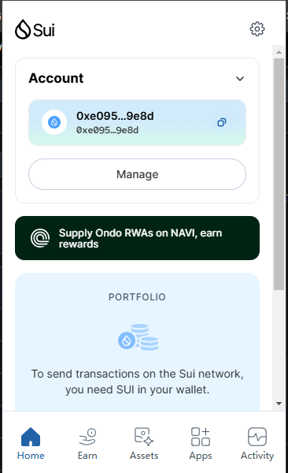
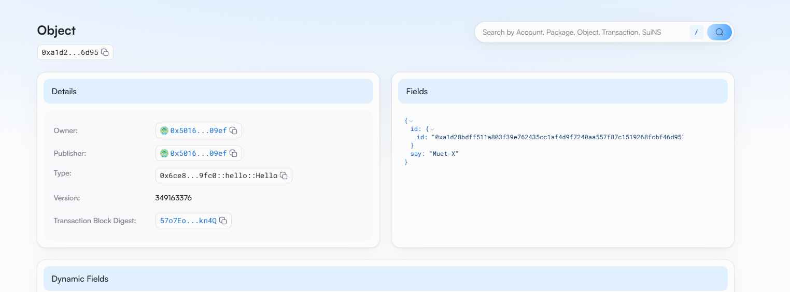
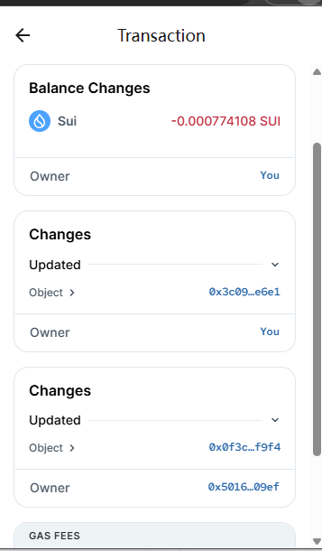

## 基本信息
- Sui钱包地址: `0xe095104b370edfdf9f70df9f407d3d7fcc582c570a58227dd88854176a4e9e8d`
> 首次参与需要完成第一个任务注册好钱包地址才被合并，并且后续学习奖励会打入这个地址
- github: `Muet-X`

## 个人简介
- 工作经验: 0年
- 技术栈: `Rust` `C++`
> 重要提示 请认真写自己的简介
- 对Move特别感兴趣，想通过Move入门区块链
- 联系方式: tg: `3170007325@qq.com` 

## 任务

##   01 hello move  
- [x] Sui cli version:sui 1.43.1-b3766e5fed72
- [x] Sui钱包截图: 
- [x] package id: 0xa1d28bdff511a803f39e762435cc1af4d9f7240aa557f87c1519268fcbf46d95
- [x] package id 在 scan上的查看截图:

##   02 move coin
- [x] My Coin package id : 0x80ff473826080491b48701ddd5a780a5182efc4bf1b4c3db4b91a3f33daaf14a
- [x] Faucet package id :  0x0f57fc1e5f91f2e362495b5fd79cf4444523307eb69ff7f555eec4b46cd45a7f
- [x] 转账 `My Coin` hash:BpspRTHKwqafisUE2a75V6v4k48Cxv5M3CaVQcaiaoEa
- [x] `Faucet Coin` address1 mint hash:dvXL5XDsgR67hUFDVhBYK35cagsrNtnEDz1XE28sADP
- [x] `Faucet Coin` address2 mint hash:9q1HnkXQapsVhxETj8RTLGJJv96W4JymJEaouZmsK5sV

##   03 move NFT
- [x] nft package id :0x0f3c6c113221a4f947685032db0e6cb7e8780ddb5db2642f5a238521925df9f4
- [x] nft object id : 0x6825b8358b211921a408d77d44d783f59704ac2122aae66554c49a482209e3b0
- [x] 转账 nft  hash:EqspVNKMtvATXSYrr1p5MKfUznNBH344sAvk8aBKurtr
- [x] scan上的NFT截图:

##   04 Move Game
- [] game package id :
- [] deposit Coin hash:
- [] withdraw `Coin` hash:
- [] play game hash:

##   05 Move Swap
- [] swap package id :
- [] call swap CoinA-> CoinB  hash :
- [] call swap CoinB-> CoinA  hash :

##   06 Dapp-kit SDK PTB
- [] save hash :

##   07 Move CTF Check In
- [] CLI call 截图 : 
- [] flag hash :

##   08 Move CTF Lets Move
- [] proof : 
- [] flag hash :

