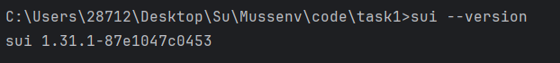
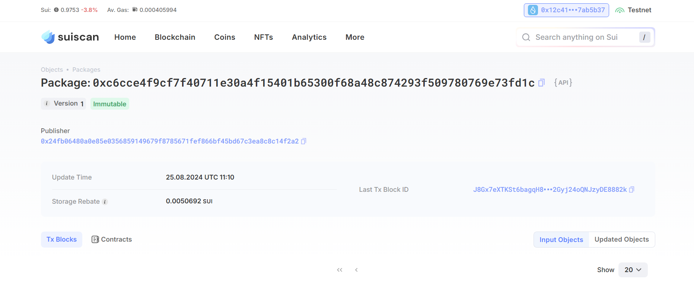
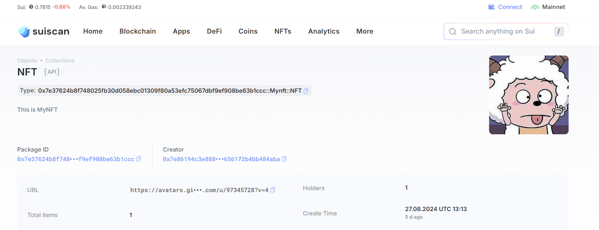

## 基本信息
- Sui钱包地址: `0x923db57d62c9993ec8c389c7227ce02675921f7e4540c7ecaea3d95688b941f3`
> 首次参与需要完成第一个任务注册好钱包地址才被合并，并且后续学习奖励会打入这个地址
- github: `MuyeC`

## 个人简介
- 工作经验: 半年
- 技术栈: `Java` `JavaScript` `Vue`
- 应届生Java前端开发，前后端都涉及，侧重于前端，对Move特别感兴趣，想向区块链方向发展。
- 联系方式: tg: `@Mussenv` 

## 任务

##   01 hello move  
- [] Sui cli version:
- [] Sui钱包截图: 
- [] package id: 0xc6cce4f9cf7f40711e30a4f15401b65300f68a48c874293f509780769e73fd1c
- [] package id 在 scan上的查看截图:

##   02 move coin
- [] My Coin package id :0x98764657bbe6fdd381390719d23f8db336f1f5e27dc95c7788f7d68b30e4a214 
- [] Faucet package id :0xbe658db5ea4e83171182e59c6bb6852f27b53fe346945d9e21e8b5e480ea09a3 
- [] 转账 `My Coin` hash:F2BwoUQadwfgDoZxoc4SshWSwbKG9TmmjNxzfSJ4pRcU
- [] `Faucet Coin` address1 mint hash:ER7cUFzF582qqxqr1Dixw9eC7z5iEjx1UtzJQr1Ym8if
- [] `Faucet Coin` address2 mint hash:GnPN2o9uHQUMWKri8nJ6Z65T8XJ71BJzU4wJ9t8TkgFs

##   03 move NFT
- [] nft package id :0x7e37624b8f748025fb30d058ebc01309f80a53efc75067dbf9ef908be63b1ccc
- [] nft object id :0xdfd92dec73a34fd972cb2e1ef0e34892faff28b07888a18c058c405bd7b2d630
- [] 转账 nft  hash:FYAaFUdZWaEZx3XW1aL4tZjWS9FUd31g21uZc3HceBfz
- [] scan上的NFT截图:

##   04 Move Game
- [] game package id :
- [] deposit Coin hash:
- [] withdraw `Coin` hash:
- [] play game hash:

##   05 Move Swap
- [] swap package id :0x849624658265f290237bb1c7bf8d369f29127f5b2d797c28c3940dc9207a9cef
- [] call swap CoinA-> CoinB  hash :5GnpZ98HxQnz9btFvPjiHuh37Co326rsmjyBUqksYx9V
- [] call swap CoinB-> CoinA  hash :2ZLEwMFjMF2RmXFEbS2wGXZFMo9YMKinSwd6BEGGREJM

##   06 Dapp-kit SDK PTB
- [] save hash :

##   07 Move CTF Check In
- [] CLI call 截图 : 
- [] flag hash :

##   08 Move CTF Lets Move
- [] proof : 
- [] flag hash :
