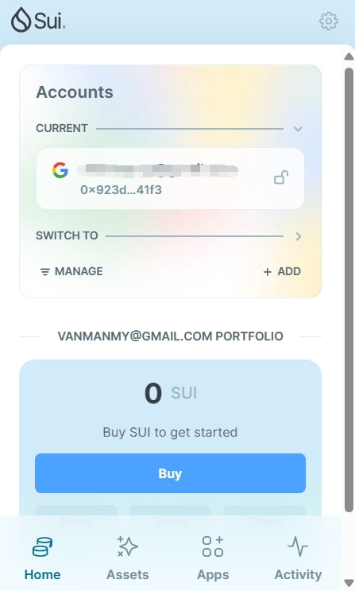

## 基本信息
- Sui钱包地址: `0x923db57d62c9993ec8c389c7227ce02675921f7e4540c7ecaea3d95688b941f3`
> 首次参与需要完成第一个任务注册好钱包地址才被合并，并且后续学习奖励会打入这个地址
- github: `MuyeC`

## 个人简介
- 工作经验: 半年
- 技术栈: `Java` `JavaScript` `Vue`
- web3新人，lol钻石选手，彩虹六号3k小时青铜。
- 联系方式: tg: `@Mussenv` 

## 任务

##   01 hello move  
- [x] Sui cli version:
- [x] Sui钱包截图: 
- [x] package id: 0xc6cce4f9cf7f40711e30a4f15401b65300f68a48c874293f509780769e73fd1c
- [x] package id 在 scan上的查看截图:

##   02 move coin
- [x] My Coin package id :0x98764657bbe6fdd381390719d23f8db336f1f5e27dc95c7788f7d68b30e4a214 
- [x] Faucet package id :0xbe658db5ea4e83171182e59c6bb6852f27b53fe346945d9e21e8b5e480ea09a3 
- [x] 转账 `My Coin` hash:F2BwoUQadwfgDoZxoc4SshWSwbKG9TmmjNxzfSJ4pRcU
- [x] `Faucet Coin` address1 mint hash:ER7cUFzF582qqxqr1Dixw9eC7z5iEjx1UtzJQr1Ym8if
- [x] `Faucet Coin` address2 mint hash:GnPN2o9uHQUMWKri8nJ6Z65T8XJ71BJzU4wJ9t8TkgFs

##   03 move NFT
- [x] nft package id :0x7e37624b8f748025fb30d058ebc01309f80a53efc75067dbf9ef908be63b1ccc
- [x] nft object id :0xdfd92dec73a34fd972cb2e1ef0e34892faff28b07888a18c058c405bd7b2d630
- [x] 转账 nft  hash:FYAaFUdZWaEZx3XW1aL4tZjWS9FUd31g21uZc3HceBfz
- [x] scan上的NFT截图:

##   04 Move Game
- [x] game package id :0x11a56eecfccc7b99da61314baa6b8a98d58c038438f167b0c79f7999e3807bc0
- [x] deposit Coin hash:DQbA5sm3H7mUpzT3KDrTX2euKKL1sFxyXu8VuKxuxeKh
- [x] withdraw `Coin` hash:CsNaizBSeXcpFdk3256y8cJETnDywwj1gXSvNe43o6co
- [x] play game hash:HUKXFAozYvnLxestmWWcqRmpyZBwAz4jMjUkh53ZTHF1

##   05 Move Swap
- [x] swap package id :0x849624658265f290237bb1c7bf8d369f29127f5b2d797c28c3940dc9207a9cef
- [x] call swap CoinA-> CoinB  hash :5GnpZ98HxQnz9btFvPjiHuh37Co326rsmjyBUqksYx9V
- [x] call swap CoinB-> CoinA  hash :2ZLEwMFjMF2RmXFEbS2wGXZFMo9YMKinSwd6BEGGREJM

##   06 Dapp-kit SDK PTB
- [x] save hash :6FvJxkX2avYVwzt6y9aYBKjDAs7giti2JBEb91ATZdE2

##   07 Move CTF Check In
- [x] CLI call 截图 : 
- [x] flag hash :BQTpmJBSjmQqTiSwysA3ooSqJwmAzfDMnUqRA5Ynkvxb

##   08 Move CTF Lets Move
- [x] proof : [135,84,124,185,180,192,134,86]
- [x] flag hash :Aq9N56LEwERHd6JVohP1wxQNXTK3mgWqCY4AhACtYuJw
