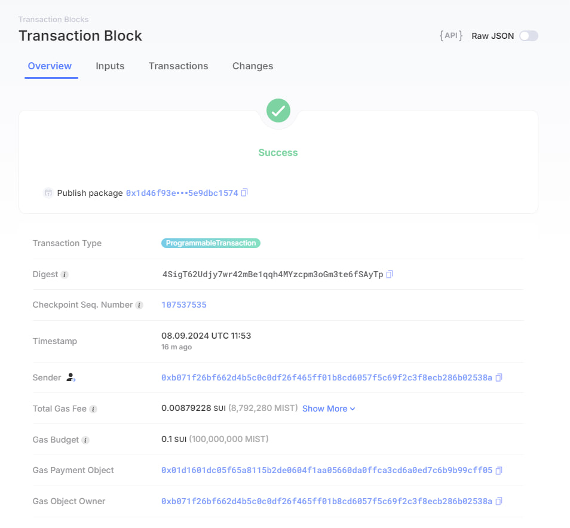

<!--
 * @Author: mzkless 1143170434@qq.com
 * @Date: 2024-09-05 18:54:14
 * @LastEditors: mzkless 1143170434@qq.com
 * @LastEditTime: 2024-09-08 20:10:12
 * @FilePath: \undefinedc:\Users\11431\Desktop\001\readme.md
 * @Description: 
 * 
 * Copyright (c) 2024 by ${git_name_email}, All Rights Reserved. 
-->
## 基本信息
- Sui钱包地址: `0xb071f26bf662d4b5c0c0df26f465ff01b8cd6057f5c69f2c3f8ecb286b02538a`
> 首次参与需要完成第一个任务注册好钱包地址才被合并，并且后续学习奖励会打入这个地址
- github: `Mzkless`

## 个人简介
- 工作经验: 1年
- 技术栈: `solidity` `nodejs`
> 重要提示 请认真写自己的简介
- 区块链专业学生，会dapp开发以及智能合约编写，对Move特别感兴趣，想通过Move入门区块链
- 联系方式: tg: `https://t.me/Mzk_less` 

## 任务

##   01 hello move  
- [] Sui cli version: sui 1.32.3
- [] Sui钱包截图: 
- [] package id: 0x1d46f93e344ff8a4551a7156583da61c280823c1aebba283ff4de05e9dbc1574
- [] package id 在 scan上的查看截图:

##   02 move coin
- [] My Coin package id : 
- [] Faucet package id : 
- [] 转账 `My Coin` hash:
- [] `Faucet Coin` address1 mint hash:
- [] `Faucet Coin` address2 mint hash:

##   03 move NFT
- [] nft package id :
- [] nft object id : 
- [] 转账 nft  hash:
- [] scan上的NFT截图:

##   04 Move Game
- [] game package id :
- [] deposit Coin hash:
- [] withdraw `Coin` hash:
- [] play game hash:

##   05 Move Swap
- [] swap package id :
- [] call swap CoinA-> CoinB  hash :
- [] call swap CoinB-> CoinA  hash :

##   06 Dapp-kit SDK PTB
- [] save hash :

##   07 Move CTF Check In
- [] CLI call 截图 : 
- [] flag hash :

##   08 Move CTF Lets Move
- [] proof : 
- [] flag hash :
