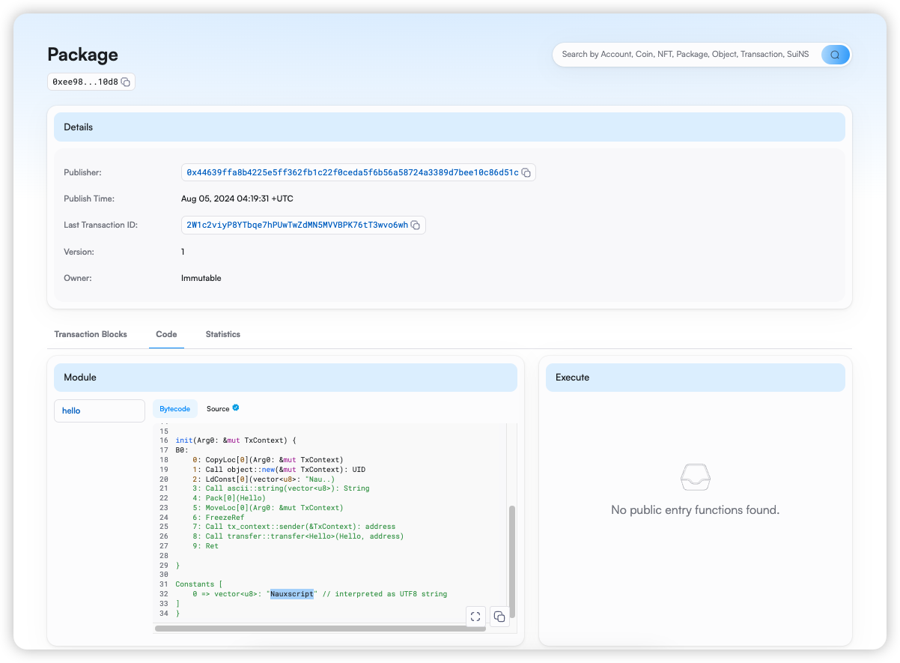

## 基本信息
- Sui钱包地址: `0x8000b3a29764ddbdc04a183577b4714f0190a7c93684b6cc7edd9e9fd7f7badf`
> 首次参与需要完成第一个任务注册好钱包地址才被合并，并且后续学习奖励会打入这个地址
- github: `Nauxscript`

## 个人简介
- 工作经验: 6 年
- 技术栈: `VueJS` `ReactJS` `NestJS` 
- 6年 web2 开发经验，Web3 新手，简单学习了 `Solidity` `Rust` 的合约开发，目前参与了几个 Web3 的项目，主要是比特币链和以太坊的项目，也有尝试自己参与一些小黑客松积累经验
- 目前工作状态 open，并将努力保持一直这样的状态
- 联系方式: Twitter (X) / Telegram / Discord /: `Nauxscript`

## 任务

##   01 hello move  
- [x] Sui cli version: sui 1.30.1-a4185da5659d
- [x] Sui钱包截图: 
- [x] package id: 0xee98087521beb55a7d9744e3d64c9293d694e246388a76446b21cc2c696e10d8 
- [x] package id 在 scan上的查看截图:

##   02 move coin
- [x] My Coin package id : 0x979b6bf2e42393a37955591c9bf0d34b1923311397dd06244cd0a82275ab91a6
- [x] Faucet package id : 0x979b6bf2e42393a37955591c9bf0d34b1923311397dd06244cd0a82275ab91a6
- [x] 转账 `My Coin` hash: AKFAweQmgMVthALPrn1NbTvfopjLRMmcCyfTxNFHodqS
- [x] `Faucet Coin` address1 mint hash: 0x8000b3a29764ddbdc04a183577b4714f0190a7c93684b6cc7edd9e9fd7f7badf
- [x] `Faucet Coin` address2 mint hash: 0x44639ffa8b4225e5ff362fb1c22f0ceda5f6b56a58724a3389d7bee10c86d51c

##   03 move NFT
- [x] nft package id : 0x9598ab9b38017f9235621053b648dc47647d8aeb4b29a32ec40afc6e32be0f4e
- [x] nft object id : 0x1438afd038c04457d61fa4b9a78c47505cd05e568c1f51f21f16c2cbfaa14fb9
- [x] 转账 nft  hash: 552582osb8nSoHfeusZ6cAXYEoKfDLQ8dc8pwVCwm1oK
- [x] scan上的NFT截图:

##   04 Move Game
- [] game package id :
- [] deposit Coin hash:
- [] withdraw `Coin` hash:
- [] play game hash:

##   05 Move Swap
- [] swap package id :
- [] call swap CoinA-> CoinB  hash :
- [] call swap CoinB-> CoinA  hash :

##   06 Dapp-kit SDK PTB
- [] save hash :

##   07 Move CTF Check In
- [] CLI call 截图 : 
- [] flag hash :

##   08 Move CTF Lets Move
- [] proof : 
- [] flag hash :