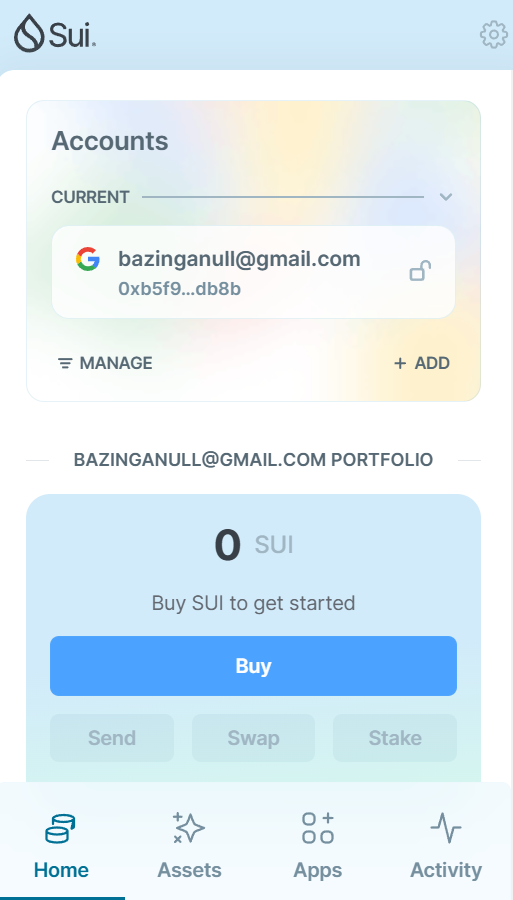
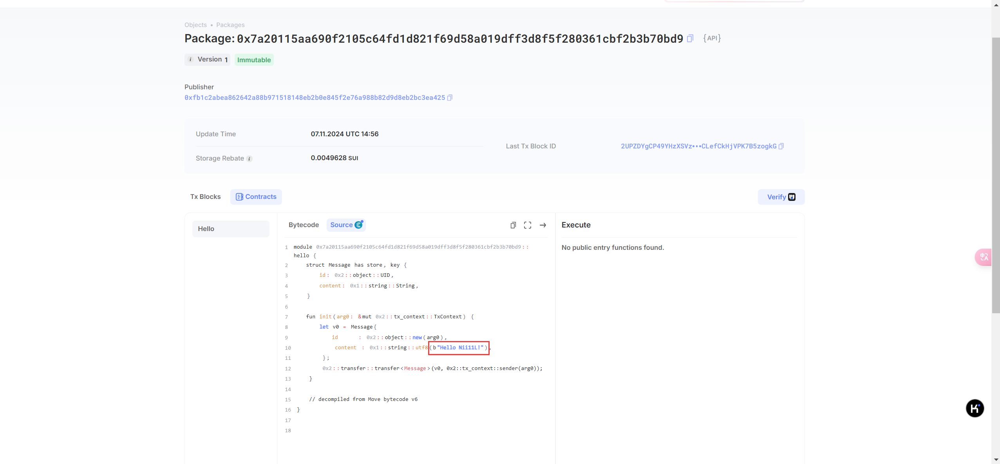

## 基本信息
- Sui钱包地址: `0xb5f902a8235774e0eaf75d47e4e25d4dc51ab063b4b00f0e85c334af7e54db8b`
> 首次参与需要完成第一个任务注册好钱包地址才被合并，并且后续学习奖励会打入这个地址
- github: `Nii11L`

## 个人简介
- 工作经验: 5年
- 技术栈: `Rust` `C++` `Solidity` `Go` `Java`
> 重要提示 请认真写自己的简介
- 多年web2开发经验，对Move特别感兴趣，想通过Move入门区块链
- 联系方式: tg: `Ni1L` 

## 任务

##   01 hello move  
- [x] Sui cli version:sui 1.37.1-homebrew
- [x] Sui钱包截图: 
- [x] package id: 0x7a20115aa690f2105c64fd1d821f69d58a019dff3d8f5f280361cbf2b3b70bd9
- [x] package id 在 scan上的查看截图:

##   02 move coin
- [x] My Coin package id : 0xf04859a1e5ddceaa04fd8e60e2dae7aafd44a71b51feb003d9c792ea79f53dfd
- [x] Faucet package id : 0x4abe0b4eb04ff1b7bf75070cd0201e451e72418d4ada14819dc129d8b86f51e7
- [x] 转账 `My Coin` hash: 6XCwzjJYDkdHZTWA2djMMeC1RhWsrjwABVRHc5iZse2w
- [x] `Faucet Coin` address1 mint hash: CyL3Q4bVKjaQntepvVopUSnoFoVm1XYoFhPLUduX1JTy
- [x] `Faucet Coin` address2 mint hash: 5AkEKoaBpJ289xoX3FVaUTPdATLu2T8HEt86bXp1w4Ep

##   03 move NFT
- [] nft package id :
- [] nft object id : 
- [] 转账 nft  hash:
- [] scan上的NFT截图:

##   04 Move Game
- [] game package id :
- [] deposit Coin hash:
- [] withdraw `Coin` hash:
- [] play game hash:

##   05 Move Swap
- [] swap package id :
- [] call swap CoinA-> CoinB  hash :
- [] call swap CoinB-> CoinA  hash :

##   06 Dapp-kit SDK PTB
- [] save hash :

##   07 Move CTF Check In
- [] CLI call 截图 : 
- [] flag hash :

##   08 Move CTF Lets Move
- [] proof : 
- [] flag hash :
