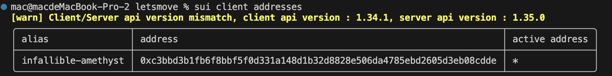
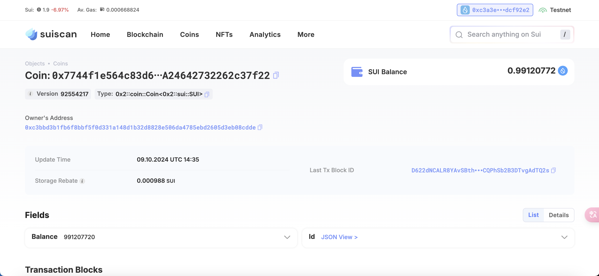

## 基本信息
- Sui钱包地址: `0xc3bbd3b1fb6f8bbf5f0d331a148d1b32d8828e506da4785ebd2605d3eb08cdde`
> 首次参与需要完成第一个任务注册好钱包地址才被合并，并且后续学习奖励会打入这个地址
- github: `Nina_2333`

## 个人简介
- 工作经验: 0.5年
- 技术栈: `solidity、go、nodejs`
> 重要提示 请认真写自己的简介
- 对web3很感兴趣，有撰写过solidity的活页式教程，https://www.thinkingsolidity.com/ ，现在想学习一下Move语言，时间允许的话可以帮忙写教程
- 联系方式: tg: `Echo_2333` 

## 任务

##   01 hello move  
- [x] Sui cli version: sui 1.34.1-homebrew
- [x] Sui钱包截图: 
- [x] package id: 0x7744f1e564c83d6074879c3df46a07b4562f43576f9537a24642732262c37f22
- [x] package id 在 scan上的查看截图:

##   02 move coin
- [] My Coin package id : 
- [] Faucet package id : 
- [] 转账 `My Coin` hash:
- [] `Faucet Coin` address1 mint hash:
- [] `Faucet Coin` address2 mint hash:

##   03 move NFT
- [] nft package id :
- [] nft object id : 
- [] 转账 nft  hash:
- [] scan上的NFT截图:

##   04 Move Game
- [] game package id :
- [] deposit Coin hash:
- [] withdraw `Coin` hash:
- [] play game hash:

##   05 Move Swap
- [] swap package id :
- [] call swap CoinA-> CoinB  hash :
- [] call swap CoinB-> CoinA  hash :

##   06 Dapp-kit SDK PTB
- [] save hash :

##   07 Move CTF Check In
- [] CLI call 截图 : 
- [] flag hash :

##   08 Move CTF Lets Move
- [] proof : 
- [] flag hash :
