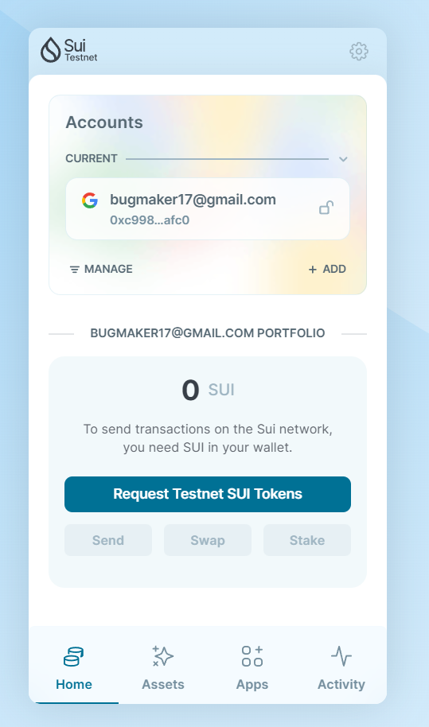
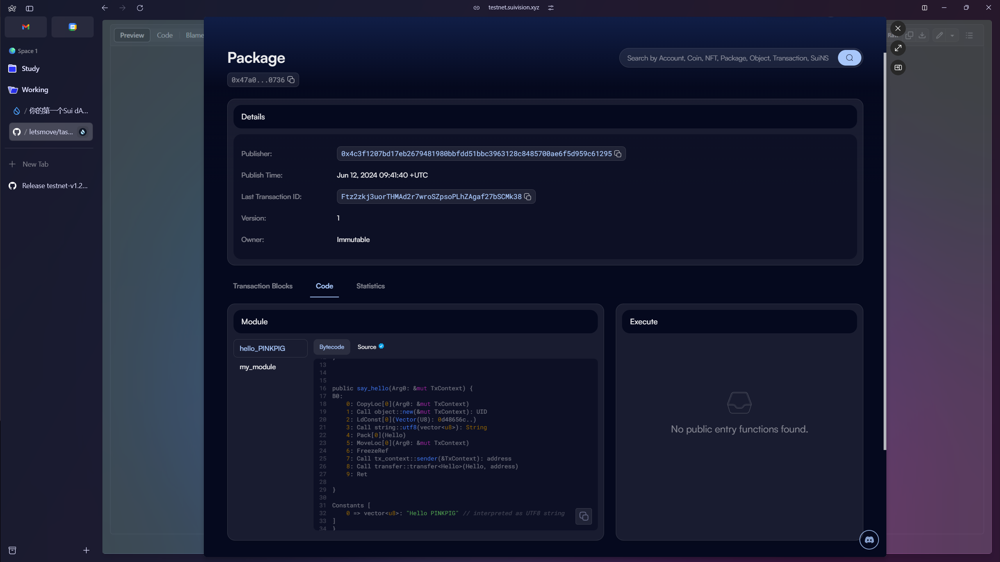

## 基本信息
- Sui钱包地址: `0xc9984d356bcf6455491993ebf6b875ed76d527acf44c4e413b1e7cef37dfafc0`
> 首次参与需要完成第一个任务注册好钱包地址才被合并，并且后续学习奖励会打入这个地址
- github: `PINKPIG`

## 个人简介
- 工作经验: 1年
- 技术栈: `Go` `Solidity`
> 重要提示 请认真写自己的简介
- 学习move智能合约开发，对Move特别感兴趣，想通过Move入门区块链
- 联系方式: x :`@bugmaker04` 

## 任务

##   01 hello move  

- [√] Sui cli version:sui 1.27.0-e5f080922d56-dirty
- [√] Sui钱包截图: 
- [√] package id: 0x47a03fd4bd836f3aec1472c76bdcbcb833f379b9dafc3ffddf1fff233efd0736
- [√] package id 在 scan上的查看截图:

##   02 move coin
- [√] My Coin package id : 0xb442ae8744afa0e9fef017a5a94cb49a88d4dc05ef3c43c9c1e93ef0318831b6
- [√] Faucet package id : 0x20964ba3a00a578827b642f40d9e3a8a133fc49732e8c9c67517811d1de548ef
- [√] 转账 `My Coin` hash: FH8UFfLX481do43S5tCLAQJv7PBLJGiQehpg3HCQVfvy
- [√] `Faucet Coin` address1 mint hash:EuPvB7y8CSt5T8mfEDyyqP82hv6ULYgoXDcKNZPuQDAq
- [√] `Faucet Coin` address2 mint hash:Bsu4WTC3NziS6dGxqc7ASqN1hrFA2qg6etLXX7oMMfuQ

##   03 move NFT
- [] nft package id :
- [] nft object id : 
- [] 转账 nft  hash:
- [] scan上的NFT截图:

##   04 Move Game
- [] game package id :
- [] deposit Coin hash:
- [] withdraw `Coin` hash:
- [] play game hash:

##   05 Move Swap
- [] swap package id :
- [] call swap CoinA-> CoinB  hash :
- [] call swap CoinB-> CoinA  hash :

##   06 Dapp-kit SDK PTB
- [] save hash :

##   07 Move CTF Check In
- [] CLI call 截图 : 
- [] flag hash :

##   08 Move CTF Lets Move
- [] proof : 
- [] flag hash :
