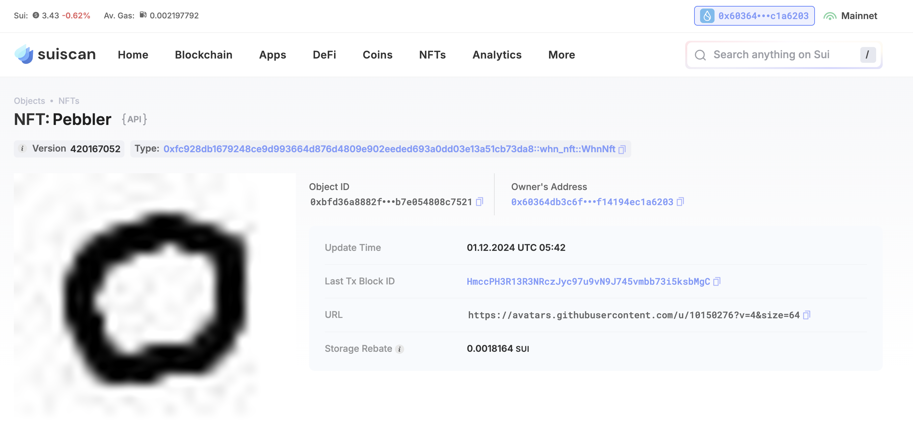

## 基本信息
- Sui钱包地址: `0x60364db3c6fa7128433ad62ce4e32649443a999ab6b54bdcbaf14194ec1a6203`
> 首次参与需要完成第一个任务注册好钱包地址才被合并，并且后续学习奖励会打入这个地址
- github: `PebblerWon`

## 个人简介
- 工作经验: 8年
- 技术栈: `javascript` `python`
> 重要提示 请认真写自己的简介
- 多年前端开发经验，想学一门web3开发语言
- 联系方式: wx: `pebble_smiling` 

## 任务

##   01 hello move  
- [✓] Sui cli version: sui 1.37.1-homebrew
- [✓] Sui钱包截图: 
- [✓] package id: 0xae2f70ef478fb8faf344909c2b655968b05df9ab3638545fd1dcf91fe831b8cb
- [✓] package id 在 scan上的查看截图:

##   02 move coin
- [✓] My Coin package id : 0xd12d0dbe5c01f8ec8aff8b62d440b3b5c7ef9330e55878c3ee30381694ba57ef 
- [✓] Faucet package id : 0x498edfc9e864d78d244315e514569ae842cb26c14cea75acb55224f74e933bbd
- [✓] 转账 `My Coin` hash: FoEoSt4dtCYFYVfHR9ZSj8UFmEs4UTBceG18f7nLbbTt
- [✓] `Faucet Coin` address1 mint hash: CiXfwEXo7crRb8hAuww6TRuYEA2gLJA4GR3iiEuYSwMV
- [✓] `Faucet Coin` address2 mint hash: HmWYnxuuKozdtWgtdBDiSSLMCSxQo5yVvG1jfMFmcaUs

##   03 move NFT
- [✓] nft package id : 0xfc928db1679248ce9d993664d876d4809e902eeded693a0dd03e13a51cb73da8
- [✓] nft object id : 0xbfd36a8882ff9c8c49515fbc00b321ad61c31309ed4239b91fb7e054808c7521
- [✓] 转账 nft  hash: HiWXV8MNVijWa9ECT7r3j4tAZYVYnGkX2Fv8icpyxJFP
- [✓] scan上的NFT截图:

##   04 Move Game
- [✓] game package id :0xdb45e9cd2fcf4f816736a9f6d50ca428653bf1a45885568d37b91e7b93ea1ab2
- [✓] deposit Coin hash: BE6CUsVXm3ygccVkojsyn7uCV1RaRX2T9dfxTUaW8iB6
- [✓] withdraw `Coin` hash: DPme4ptDfqrN8Bf1TK2kFukFfYvo1dTSkjGUYADWWMSr
- [✓] play game hash: 3P4qvRqmuQp1i62aae1b7nWoq4v9XvUfuvc9NR3eihDg

##   05 Move Swap
- [✓] swap package id : 0x5e0ac630c0bba8295b9de9a7acb7f0a9cd4b476c3ea3f246678e5c46606e1296
- [✓] call swap CoinA-> CoinB  hash : AJxP2HgDoMtXMkVQBwnzHP25BQbEA1wGmpxhS6MXKhdx
- [✓] call swap CoinB-> CoinA  hash : 5QRYxBrquAA7qc4PnFnRLmrpdAVAVJfeGkFcDBpwMhkG

##   06 Dapp-kit SDK PTB
- [✓] save hash :FYcp5pUC66EJwr4z2TLN2GwStQRJTaSiew7vv9srAKEm

##   07 Move CTF Check In
- [✓] flag hash :2aEqnMCD3MRP8qWkupSUTv98QiPEZ2hjuQcx8ShHGZSu

##   08 Move CTF Lets Move
- [] proof : 
- [] flag hash :
