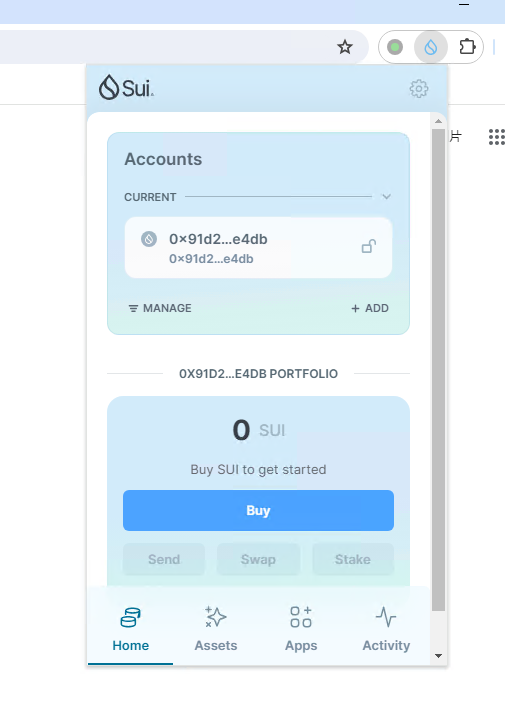
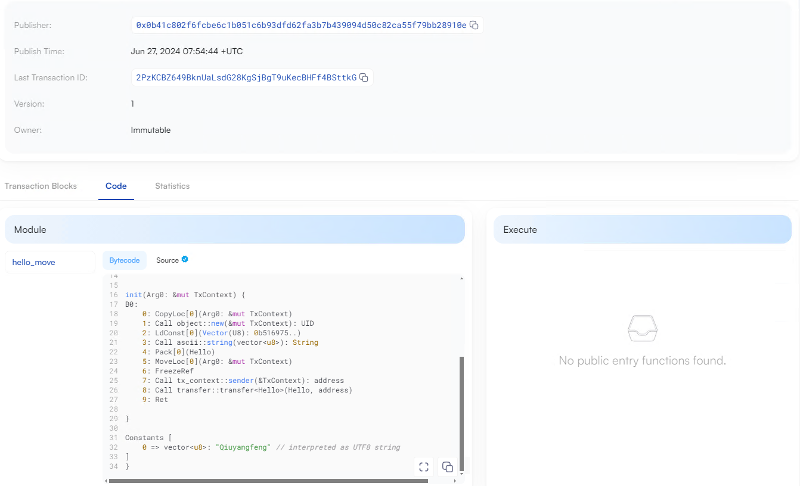
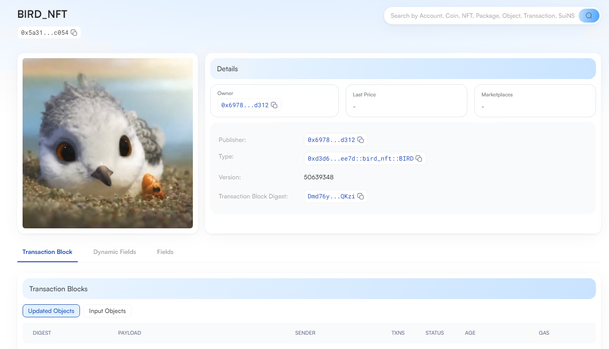
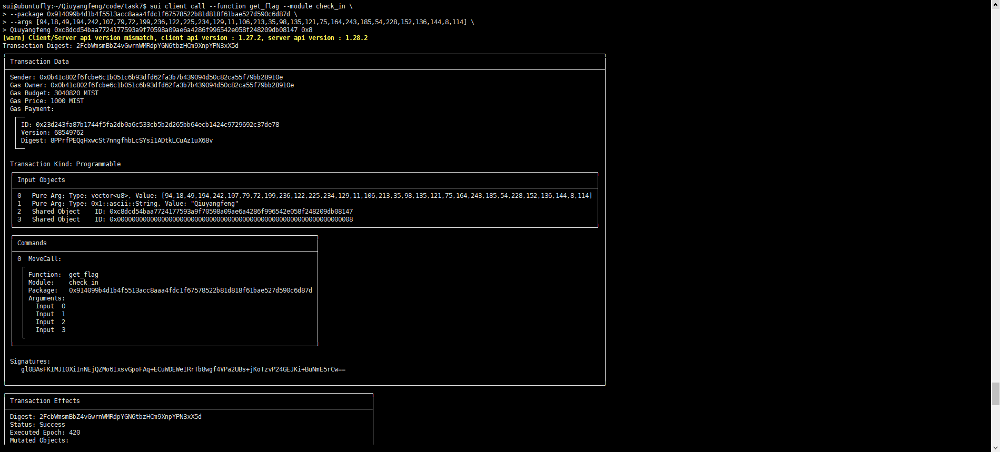

## 基本信息
- Sui钱包地址: `0x91d24c7cb44b22d0bab6f0084de7436b218b03afe16037daa6e65b9eef9ae4db`
> 首次参与需要完成第一个任务注册好钱包地址才被合并，并且后续学习奖励会打入这个地址
- github: `Qiuyangfeng`

## 个人简介
- 工作经验: 4年
- 技术栈: `Liunux` `Kubernetes` `Docker` `Python` `Shell`
> 重要提示 请认真写自己的简介
- 多年老运维，闲暇时接触到web3，玩sol和evm比较多，希望通过完成这个task来更好的认识sui
- 联系方式: tg: `@Flybird1970` 

## 任务

##   01 hello move  
- [] Sui cli version: 1.27.2-9e2be6ad4185
- [] Sui钱包截图: 
- [] package id: 0x75cb0293cd8b9914ff30c185c266acec3a57069daaa419c13db49ff3515f5bc0
- [] package id 在 scan上的查看截图:

##   02 move coin
- [] My Coin package id : 0x47e96c5b5043ce5f0852251bed1b923178919c66717ad5dd2666e6d416975b1b
- [] Faucet package id : 0x47e96c5b5043ce5f0852251bed1b923178919c66717ad5dd2666e6d416975b1b
- [] 转账 `My Coin` hash: FRToUksKcJYXBU4NNb23MPNLAoo4XeLEkMxcb5noPaKU
- [] `Faucet Coin` address1 mint hash: 8xY61QaUpu7Z6ZCVLYyLCZ66DgYjZvrbaRit6Tu6wUvH
- [] `Faucet Coin` address2 mint hash: 6kHt82eHvjrvRXZn7tt8ooerfLuaoyvvMruH3MseTWQo

##   03 move NFT
- [] nft package id : 0xd3d6595e73bf7307d6a97e098936af54c62e3a3f7cc4c6f07bcb553f9396ee7d
- [] nft object id : 0x5a31860aa3b715c212d962dd669014422186fcb16c9e8698597722b0f62bc054
- [] 转账 nft  hash: 89SHNUifottSZC8sD9FyNk9mf7XGNEQSCrMAr15KxSjt
- [] scan上的NFT截图:

##   04 Move Game
- [] game package id : 0x98edba8a40bb3f4b0f1fcd2a55f56e22b3b7021f43d1c6bea57161a2a8669859
- [] deposit Coin hash: FhT5EaD1FPcf8SLwCqAe3CFHEkMyLtTNiBGcYj3yqrjX
- [] withdraw `Coin` hash: Z6TGJi4ESuA4BM3GkpcEy9ovdBSoweyp4uC8J2vcyQq
- [] play game hash: 5AmUET9M7KbF3gvNB3WxerLscEj5js4oHJk5VBQtmZEm

##   05 Move Swap
- [] swap package id : 0x5d6177c7fe73c10cb50e3cefabc9dbbf1f126715ad2b0df7cae46de9138b2d2d
- [] call swap CoinA-> CoinB  hash : 5TtCSxp4mejMDsg7rrfuGUPBGZYUqhcqNb26mc8yMK7Z
- [] call swap CoinB-> CoinA  hash : EaeiWWMo9sN8zhn3cTXDpSygzwUnPMqeCfSRbCm18V6N

##   06 Dapp-kit SDK PTB
- [] save hash : 9mukr9yxpRudhkXTVv8rNisPQvCeE7nCjE6NJRZAGR4m

##   07 Move CTF Check In
- [] CLI call 截图 : 
- [] flag hash : 2FcbWmsmBbZ4vGwrnWMRdpYGN6tbzHCm9XnpYPN3xX5d

##   08 Move CTF Lets Move
- [] proof : [69, 140, 39]
- [] flag hash : 5VjXJpFNSyvmAMDNrk5uW4B5fYaAe954gTDmNdGKXSNH
