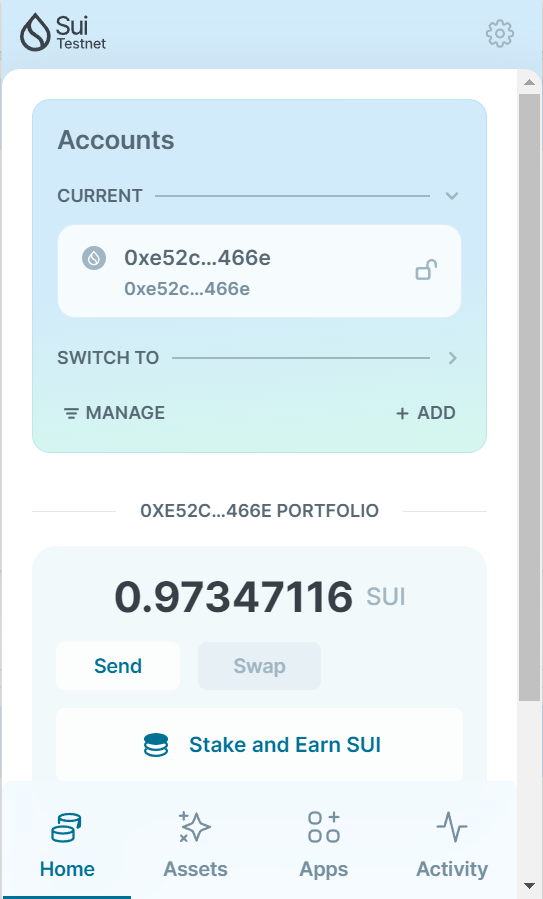
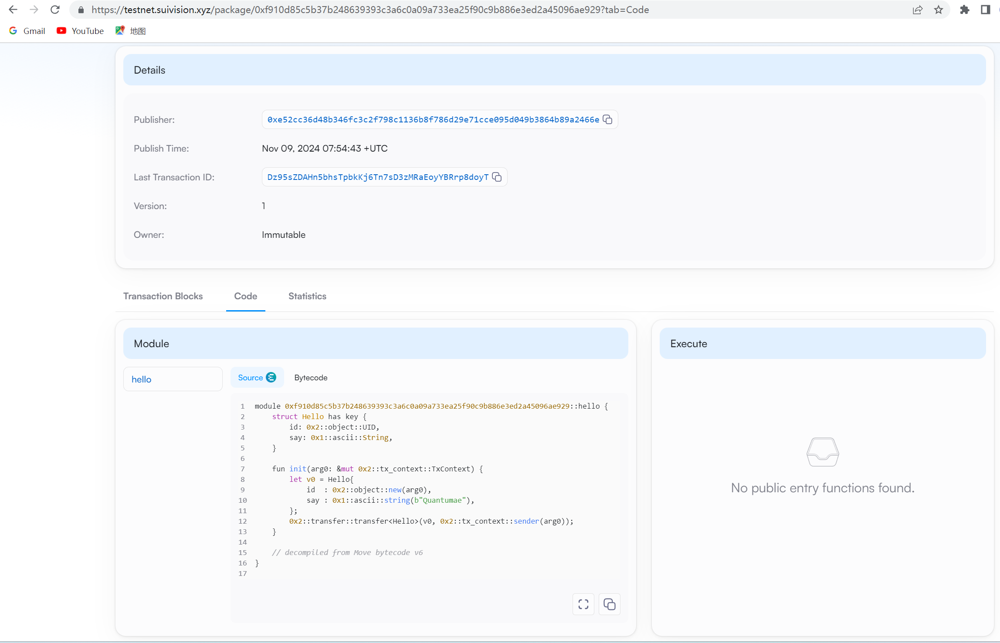

## 基本信息
- Sui钱包地址: `0xe52cc36d48b346fc3c2f798c1136b8f786d29e71cce095d049b3864b89a2466e`
> 首次参与需要完成第一个任务注册好钱包地址才被合并，并且后续学习奖励会打入这个地址
- github: `Quantumae`

## 个人简介
- 工作经验: 0年
- 技术栈: `C++` `python`
> 重要提示 请认真写自己的简介
- 想学一门web3开发语言
- 联系方式: qq: `1152349857` 

## 任务

##   01 hello move  
- [✓] Sui cli version: sui 1.37.1-7839b9501066
- [✓] Sui钱包截图: 
- [✓] package id: 0xf910d85c5b37b248639393c3a6c0a09a733ea25f90c9b886e3ed2a45096ae929
- [✓] package id 在 scan上的查看截图:

##   02 move coin
- [✓] My Coin package id : 0x2453f3aa1cd138f5a4d2fa3d8cb5ddc9ddf6a6355443e00de8ea4d6ebce518bb
- [✓] Faucet package id : 0xb45a1ed73ccd5813dc696b0ec555909f91f17058132b85b927bcc831887a1e27
- [✓] 转账 `My Coin` hash:x8k79UFr1AC3QwLJ8eK5z3iXhCBtJi1YGHSEgYv2i2n
- [✓] `Faucet Coin` address1 mint hash:AnRdgcA7xGdX3Va5S4WUtrspZujjH2WF951yupXLhRMh
- [✓] `Faucet Coin` address2 mint hash:FiDtYoakpPCxDAPQC1HYKpf7LuygSYQXtVVYoWwgX4xX

##   03 move NFT
- [] nft package id :
- [] nft object id : 
- [] 转账 nft  hash:
- [] scan上的NFT截图:

##   04 Move Game
- [] game package id :
- [] deposit Coin hash:
- [] withdraw `Coin` hash:
- [] play game hash:

##   05 Move Swap
- [] swap package id :
- [] call swap CoinA-> CoinB  hash :
- [] call swap CoinB-> CoinA  hash :

##   06 Dapp-kit SDK PTB
- [] save hash :

##   07 Move CTF Check In
- [] CLI call 截图 : 
- [] flag hash :

##   08 Move CTF Lets Move
- [] proof : 
- [] flag hash :
