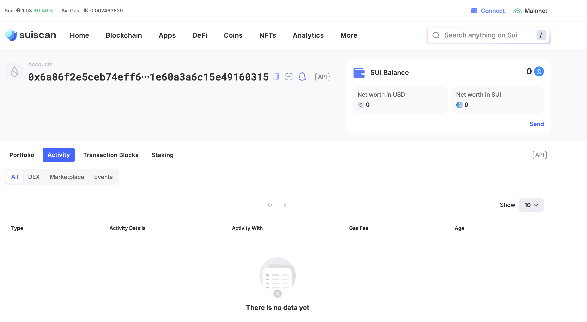
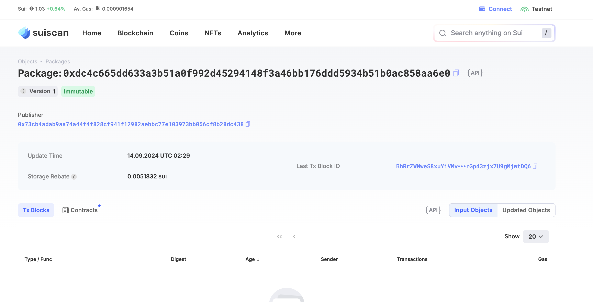
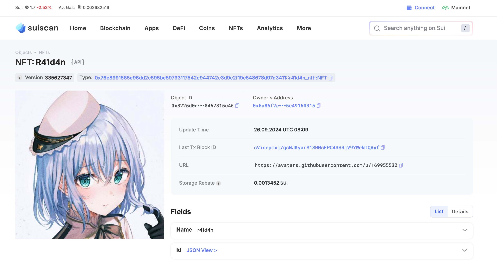
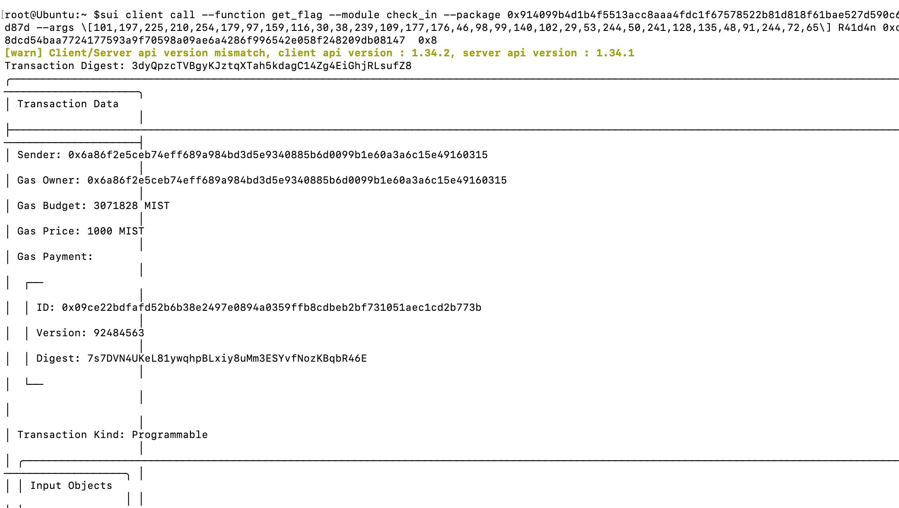

## 基本信息
- Sui钱包地址: `0x6a86f2e5ceb74eff689a984bd3d5e9340885b6d0099b1e60a3a6c15e49160315`
> 首次参与需要完成第一个任务注册好钱包地址才被合并，并且后续学习奖励会打入这个地址
- github: `R41d4n`

## 个人简介
- 工作经验: 1年
- 技术栈: `Python`
> 重要提示 请认真写自己的简介
- 多年web2开发经验，对Move特别感兴趣，想通过Move入门区块链
- 联系方式: tg: `r41d4n` 

## 任务

##   01 hello move  
- [x] Sui cli version: 1.32.2
- [x] Sui钱包截图: 
- [x] package id: 0xdc4c665dd633a3b51a0f992d45294148f3a46bb176ddd5934b51b0ac858aa6e0
- [x] package id 在 scan上的查看截图:

##   02 move coin
- [x] My Coin package id :  0x87ea34d4960271e62241b1c83bc0f679dcaffae515018ed056d65527f48a45c3
- [x] Faucet package id :  0x87ea34d4960271e62241b1c83bc0f679dcaffae515018ed056d65527f48a45c3
- [x] 转账 `My Coin` hash: 52hPc3YasXmdURXDghii9WVXzCCRxeDMHgY96PEWp4JW
- [x] `Faucet Coin` address1 mint hash: 3e1hSpJAdrDcsHXUCTbYHrD56s5g661bUqZExcvYfZAJ
- [x] `Faucet Coin` address2 mint hash: H83c4WtiDE5qBpx4aoCPjv5Ysbq53UbTcFDRdLgfyGqG

##   03 move NFT
- [x] nft package id : 0x76e8991565e96dd2c595be59793117542e944742c3d9c2f19e548678d97d3411
- [x] nft object id :  0x8225d0da4bb9a97f7e9d5f588af5bcd9be858598868d3c15feb9790467315c46
- [x] 转账 nft  hash: 3Vjyr6MwaoBeQ3HzF3vSX4RebSQ5LKx6Z7aGpUHKzG9b
- [x] scan上的NFT截图:

##   04 Move Game
- [x] game package id : 0x1fea56e4daa15322f678ce0bb1498fa5eb0c4d36c3076e8bb58b595a4d3889c5
- [x] deposit Coin hash: 5m5DsgNmG9AUmzPQccBu7cDC9Kdftb1PBS4fKxeYdiZk
- [x] withdraw `Coin` hash: BPoYvMnsevx1iNrJR2mBgKagZKpX8nJCztX3qDDexDf6
- [x] play game hash: 4Ss2Kz98bWYJBTcbuQAstuq2yT5bFVzP7ARBnM5hvuRe

##   05 Move Swap
- [x] swap package id : 0xc4b1e52244c6fcc8621f17060e0d3bea20dad0a05b9584b7c099a2e69919bb93
- [x] call swap CoinA-> CoinB  hash :  BLPMuwdCAkZSCyFnpizGYyhfNCmL3t8YvzLfhpAVeiwT
- [x] call swap CoinB-> CoinA  hash : 8cbRQuRjEzQBsrkznzxtqqV8qyTvrgWFSHFXJEGohkXE

##   06 Dapp-kit SDK PTB
- [x] save hash : 2r1MBihX4Rf4d7cdued4fsYRtPFXAeCYWQ8bYJY3yi3a

##   07 Move CTF Check In
- [x] CLI call 截图 : 
- [x] flag hash : 3dyQpzcTVBgyKJztqXTah5kdagC14Zg4EiGhjRLsufZ8

##   08 Move CTF Lets Move
- [x] proof :  615947f1911419f09c10
- [x] flag hash : 8nXUmW1iN6Rjqtt9e8uhW3Ey3dfPn1aUKjvWkQd4oaPU
