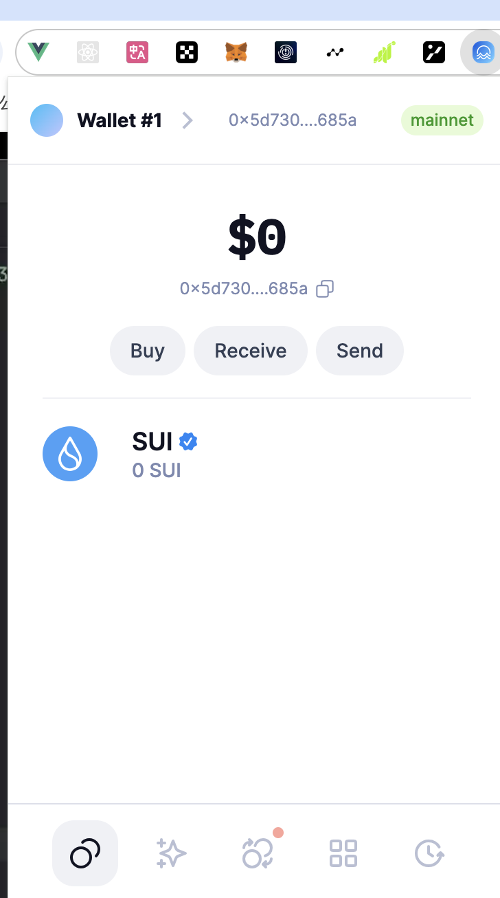
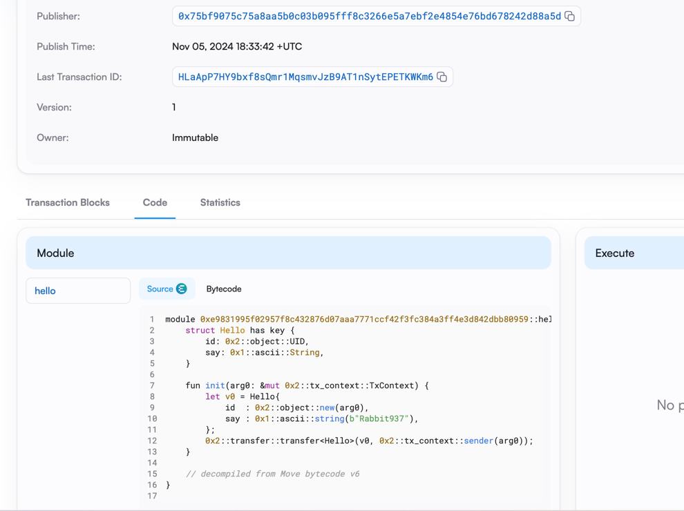

 ## 基本信息
- Sui钱包地址: `0x5d730aa8a52f612c1d66ce138529f076ed0f200b0a4fded9bab67d83e245685a`
> 首次参与需要完成第一个任务注册好钱包地址才被合并，并且后续学习奖励会打入这个地址
- github: `Rabbit937`

## 个人简介
- 工作经验: 5年
- 技术栈: `javascript` `python` `go`
> 重要提示 请认真写自己的简介  
- 多年web2前端开发经验，对Move特别感兴趣，想通过Move入门区块链。寻求转型web3，觉得sui是一个很有潜力的公链。
- 联系方式: tg: `Rabbit937888` 

## 任务

##   01 hello move  
- [x] Sui cli version: sui 1.37.1-homebrew
- [x] Sui钱包截图: 
- [x] package id: 0xe9831995f02957f8c432876d07aaa7771ccf42f3fc384a3ff4e3d842dbb80959
- [x] package id 在 scan上的查看截图:

##   02 move coin
- [] My Coin package id : 
- [] Faucet package id : 
- [] 转账 `My Coin` hash:
- [] `Faucet Coin` address1 mint hash:
- [] `Faucet Coin` address2 mint hash:

##   03 move NFT
- [] nft package id :
- [] nft object id : 
- [] 转账 nft  hash:
- [] scan上的NFT截图:

##   04 Move Game
- [] game package id :
- [] deposit Coin hash:
- [] withdraw `Coin` hash:
- [] play game hash:

##   05 Move Swap
- [] swap package id :
- [] call swap CoinA-> CoinB  hash :
- [] call swap CoinB-> CoinA  hash :

##   06 Dapp-kit SDK PTB
- [] save hash :

##   07 Move CTF Check In
- [] CLI call 截图 : 
- [] flag hash :

##   08 Move CTF Lets Move
- [] proof : 
- [] flag hash :
