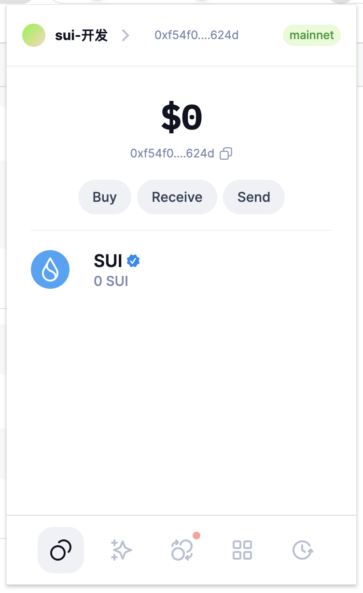
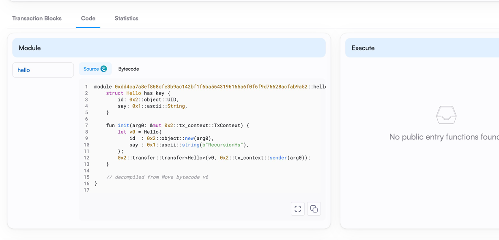
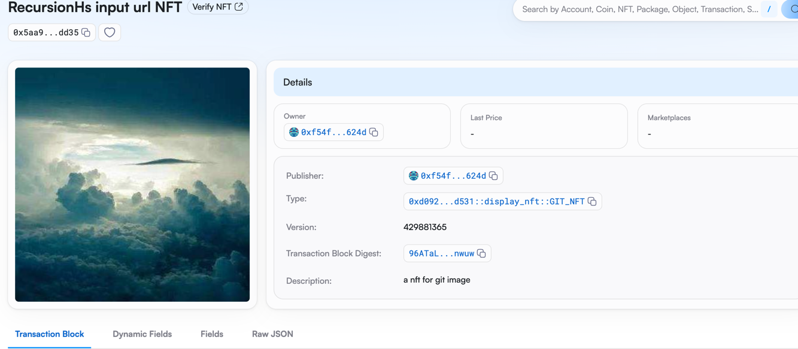

## 基本信息
- Sui钱包地址: `0xf54f02036244432d8462f5122fe8d7141efce900accfe987187caff17130624d`
> 首次参与需要完成第一个任务注册好钱包地址才被合并，并且后续学习奖励会打入这个地址
- github: `RecursionHs`

## 个人简介
- 工作经验: 10年
- 技术栈: `java` `python`
> 重要提示 请认真写自己的简介
- 多年web2开发经验，想学一门web3开发语言
- 联系方式: tg: `https://t.me/recursionSk`

## 任务

##   01 hello move
- [✓] Sui cli version: sui 1.37.1-homebrew
- [✓] Sui钱包截图: 
- [✓] package id: 0xf54f02036244432d8462f5122fe8d7141efce900accfe987187caff17130624d
- [✓] package id 在 scan上的查看截图:

##   02 move coin
- [✓] My Coin package id : 0xae70120916911a93f2295b54f65de9c94349606df617d6e7a9884822bc67ecfd
- [✓] Faucet package id : 0xf4027e1f9bb1364ba2b06ccc295905b7262b877cca86966946e36d6066581cce
- [✓] 转账 `My Coin` hash: 68VmUMNqjopH6DJc7SwN5RKMTkpNhUar5chRXWkXhReq
- [✓] `Faucet Coin` address1 mint hash: 0xf54f02036244432d8462f5122fe8d7141efce900accfe987187caff17130624d
- [✓] `Faucet Coin` address2 mint hash: 0x3f82342aaa77f7147b26f3ee269a302ac4568aca98df643f535835823f2b0b84

##   03 move NFT
- [✓] nft package id : 0xd092b6a785ba47f7c158b8f22e62c733227646e05350e604437a304f8059d531
- [✓] nft object id : 0x5aa9f3db4e227af179b187839ad01723c9a9a472df4afc4091ca5f9fec52dd35
- [✓] 转账 nft  hash: GjrVc2hGDfPJjndr8cxqkHZxBLdkTEu6Spao7muWTxF2
- [✓] scan上的NFT截图:

##   04 Move Game
- [] game package id :
- [] deposit Coin hash:
- [] withdraw `Coin` hash:
- [] play game hash:

##   05 Move Swap
- [] swap package id :
- [] call swap CoinA-> CoinB  hash :
- [] call swap CoinB-> CoinA  hash :

##   06 Dapp-kit SDK PTB
- [] save hash :

##   07 Move CTF Check In
- [] CLI call 截图 : 
- [] flag hash :

##   08 Move CTF Lets Move
- [] proof :
- [] flag hash :
