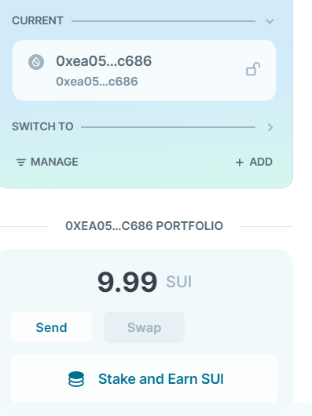
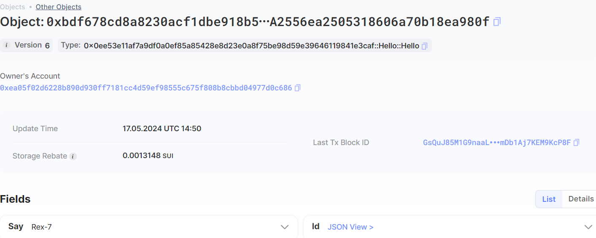

## 基本信息
- Sui钱包地址: `0xea05f02d6228b890d930ff7181cc4d59ef98555c675f808b8cbbd04977d0c686`
> 首次参与需要完成第一个任务注册好钱包地址才被合并，并且后续学习奖励会打入这个地址
- github: `Rex-7`

## 个人简介
- 工作经验: 本科在读
- 技术栈: `python` `C++`
- 本科生，对区块链感兴趣，想通过Move入门区块链
- 联系方式: gmail: `rrrex0726@gmail.com` 

## 任务

##   01 hello move  
- [] Sui cli version:1.25.0
- [] Sui钱包截图: 
- [] （devnet）package id: 0x0ee53e11af7a9df0a0ef85a85428e8d23e0a8f75be98d59e39646119841e3caf
- [] package id 在 scan上的查看截图:

##   02 move coin
- [] My Coin package id : 
- [] Faucet package id : 
- [] 转账 `My Coin` hash:
- [] `Faucet Coin` address1 mint hash:
- [] `Faucet Coin` address2 mint hash:

##   03 move NFT
- [] nft package id :
- [] nft object id : 
- [] 转账 nft  hash:
- [] scan上的NFT截图:

##   04 Move Game
- [] game package id :
- [] deposit Coin hash:
- [] withdraw `Coin` hash:
- [] play game hash:

##   05 Move Swap
- [] swap package id :
- [] call swap CoinA-> CoinB  hash :
- [] call swap CoinB-> CoinA  hash :

##   06 Dapp-kit SDK PTB
- [] save hash :
