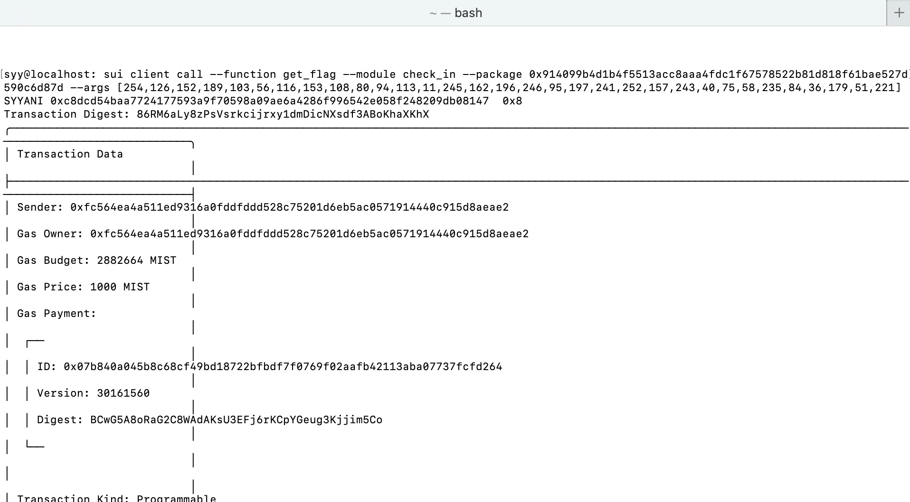

## 基本信息
- Sui钱包地址: `0xfc564ea4a511ed9316a0fddfddd528c75201d6eb5ac0571914440c915d8aeae2`
> 换了一个钱包
> 首次参与需要完成第一个任务注册好钱包地址才被合并，并且后续学习奖励会打入这个地址
- github: `SYYANI`

## 个人简介
- 学习经验: 5年
- 技术栈: `C++` `Rust` `JavaScript`
- 对Move、Sui感兴趣，想通过Move了解、入门区块链

## 任务

##   01 hello move  
- [x] package id: `0x66b450a9f687bcaebce29512871a7e78a58d61c15e55473f322021296e5e77ed`

##   02 move coin
- [x] My Coin package id : `0xcc39bf2742ec5cbbfbea8ba995e3e194a5a1a37dccd7a44b33e88aca4458d02b`
- [x] Faucet package id : `0xcc39bf2742ec5cbbfbea8ba995e3e194a5a1a37dccd7a44b33e88aca4458d02b`
- [x] 转账 `My Coin(SYYANI Coin)` hash : `EvkL2BjVyw6TBqtkp8FGEbhP2PdCJciRmKDF4ZXMcDjC`

##   03 move NFT
- [x] nft package id : `0xbd09206b93b55087e8c690fac2271018d50e5d814f113beb1289929ad25ddb11`
- [x] nft object id : `0xeb42a20b024cd20700e1c1612ba99f4fbfc5de5355a38a83bd5d271b5d9fd56b`
- [x] 转账 nft hash : `HLvsMcMRMoV8ARq1V1XQyBNMdWi54KqrwVbFW1Lyn6V8`

##   04 Move Game
- [x] game package id : `0x33812c5da6adb88ea576342fad119d9162165794508c67d3067286418893dc3c`
- [x] call game hash : `5JDZUAMWZUQ3G8vrzMmGb2dJHwAYTEjPWntwBNjNNkKU`

##   05 Move Swap
- [x] swap package id : `0x755c2a42d8035ff2a759fe702af111ac17e827044def8f8a17e22aea868b1b6f`
- [x] call swap hash : `BHcfEs1tq1gvxkP8xtjWcjSBL7pDe6MVBZAwJj7ANGCP`

##   06 SDK PTB
- [x] save hash : `EyCLpnNisbD5Tp6UgDfwCTVczuipRjebsDMYTXNmU5PW`

##   07 Move CTF Check In
- [x] CLI call 截图 : 
- [x] flag hash : `86RM6aLy8zPsVsrkcijrxy1dmDicNXsdf3ABoKhaXKhX`

##   08 Move CTF Lets Move
- [x] proof : `f74404cb6f44b9f975c4`
- [x] flag hash : `4yhq2CnuVe613k6vPm88whBLEzkbAxnDWwbLbDZ3MWW8`