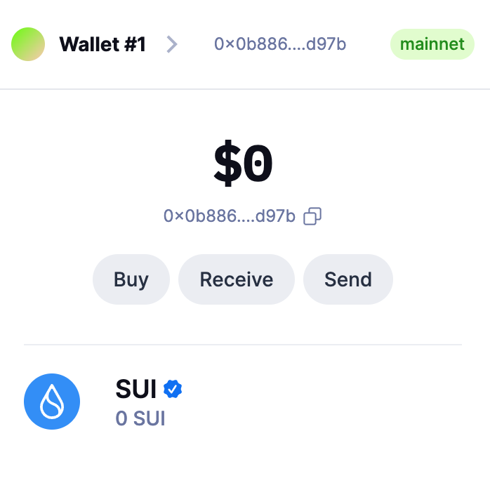
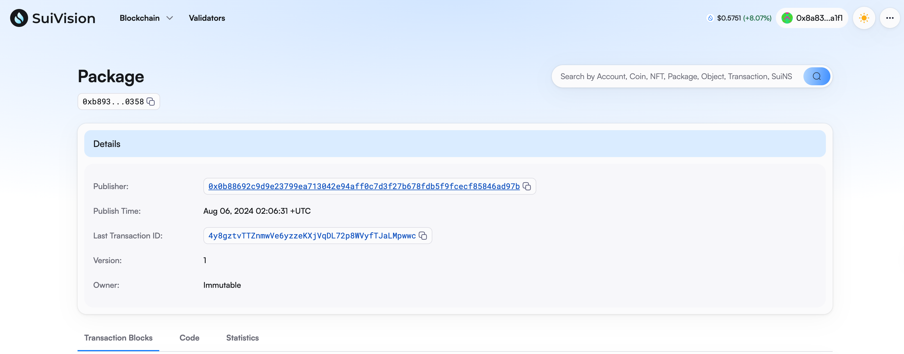
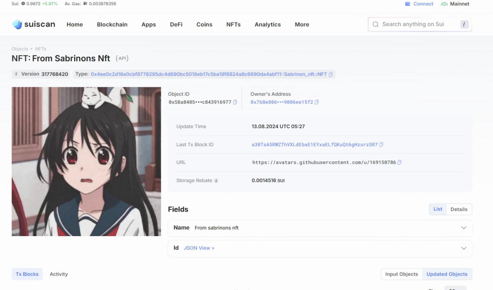
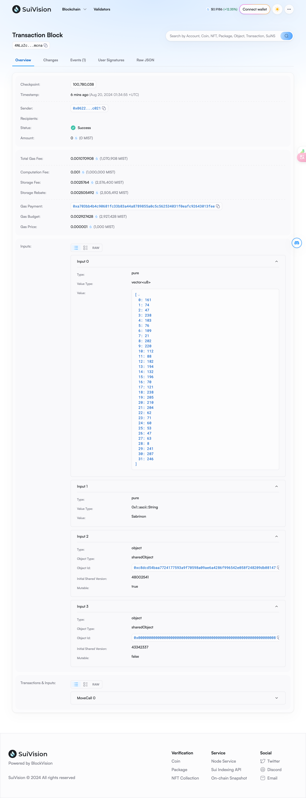

## 基本信息
- Sui钱包地址: `0x0b88692c9d9e23799ea713042e94aff0c7d3f27b678fdb5f9fcecf85846ad97b`
> 首次参与需要完成第一个任务注册好钱包地址才被合并，并且后续学习奖励会打入这个地址
- github: `Sabrinon`

## 个人简介
- 工作经验: 1年
- 技术栈: `Go`
> 重要提示 请认真写自己的简介
- 企业后管开发，对Move感兴趣，想通过Move入门Web3
- 联系方式: tg: `Submarine` 

## 任务

##   01 hello move  
- [x] Sui cli version: 1.30.1
- [x] Sui钱包截图: 
- [x] package id: 0xb89395a879641239e6170ff3599fa450ac6de5ad603e4be7b184d2e52ca00358
- [x] package id 在 scan上的查看截图:

##   02 move coin
- [x] My Coin package id : 0x22358fbbbd5dc9e0b0cfd5cb8704b6df92941d0b22740cada3fad8c01c11fcd4
- [x] Faucet package id :  0x073d44418d5025083359d8df01c75356dd45f542a0e4125465a981c7591f5948
- [x] 转账 `My Coin` hash: AUBnWVDD1JaCuaeVX4RRD94Ez9sM6uySgueuoYmUPzzB
- [x] `Faucet Coin` address1 mint hash: 82sFaBW5HgsEeFsgG2XPBMD2vGEpDVvjF4Kdi8jD1do5
- [x] `Faucet Coin` address2 mint hash: 2Jbvy6DVQFXPLkzHv9zYUHNtRr27JGoPoc4GbGpSteHj

##   03 move NFT
- [x] nft package id : 0x4ee0c2d18e0cbf8778295dc4d690bc5019eb17c5ba19f8824a9c6690da4abf11
- [x] nft object id :  0xe81671d00e4ddc0db620affca1b9cdd6de75a887899b06d588fe9f11ff2b2543
- [x] 转账 nft  hash: a38TsA5RWZThVXLdEbaE1EYxaELfQKuQt6gHzsrzSR7
- [x] scan上的NFT截图:

##   04 Move Game
- [x] game package id :0xa3588df71c8ba1419e1ca0df9bfe512095ff08ee8eb87addc5589df5d1c9e605
- [x] deposit Coin hash: BQFm3smWDzmF5VY98mgmyEr4j5hDLy1viAC5kwChrGef
- [x] withdraw `Coin` hash: CnLm2FzqSSgsUxjB67d9hP9uPiJcrq3aafYtN9aqcBRd
- [x] play game hash: 5Gbe4zKMDXwPa5TiS35nuKq37ggbhbW4rUk7dzpGsGoh

##   05 Move Swap
- [x] swap package id :  0xbafa6b66e08d2563c01fecfecdf2afd2e92bcc98b05be9485242e12f69995fd8
- [x] call swap CoinA-> CoinB  hash : 4TMsJqY3prqsJVd6jur7DBZgsJSLqFDkVfkStJ6hGcvc
- [x] call swap CoinB-> CoinA  hash : GvynKXLxPyGBP6ZhRyMz9XNsSPGqoHR5LYVp5uQVYSdN

##   06 Dapp-kit SDK PTB
- [x] save hash : DNLKPT8BvMuQpcyHE2gAQCcEqfU6aGXG23Sw7s2FFdhL

##   07 Move CTF Check In
- [x] CLI call 截图 : 
- [x] flag hash : 4NLzZcKVBbMND9x4sye8ypgcj7UAR9DHBJfeBDfumcna

##   08 Move CTF Lets Move
- [x] proof :  fc7206df6757030dc53c
- [x] flag hash : 4KNKHPAyNmjdKXSfD4D2cDyyZRx59a92JWcZJNJTEqdc
