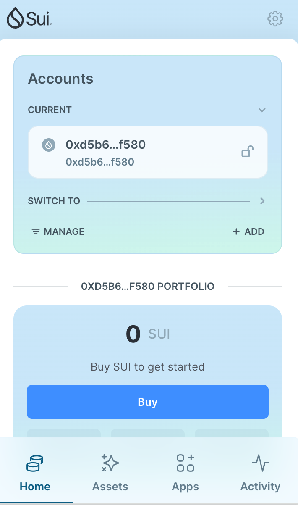
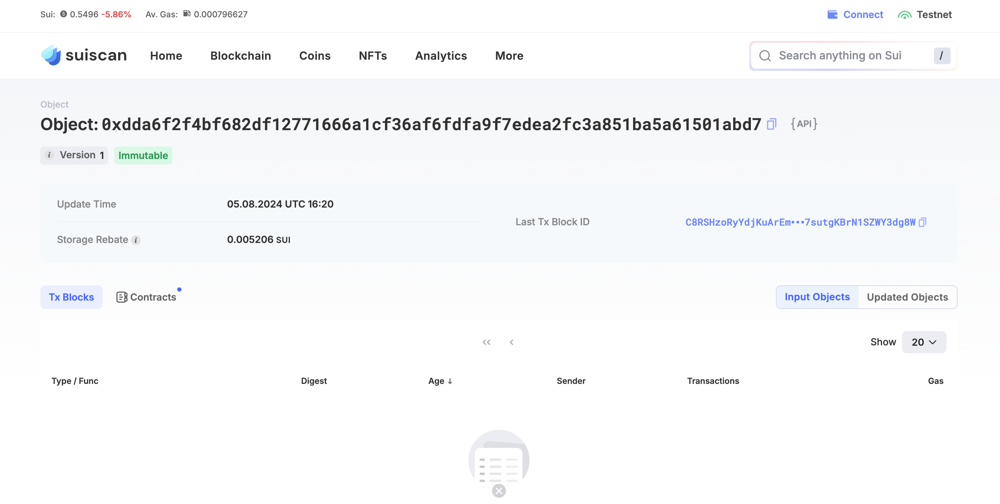
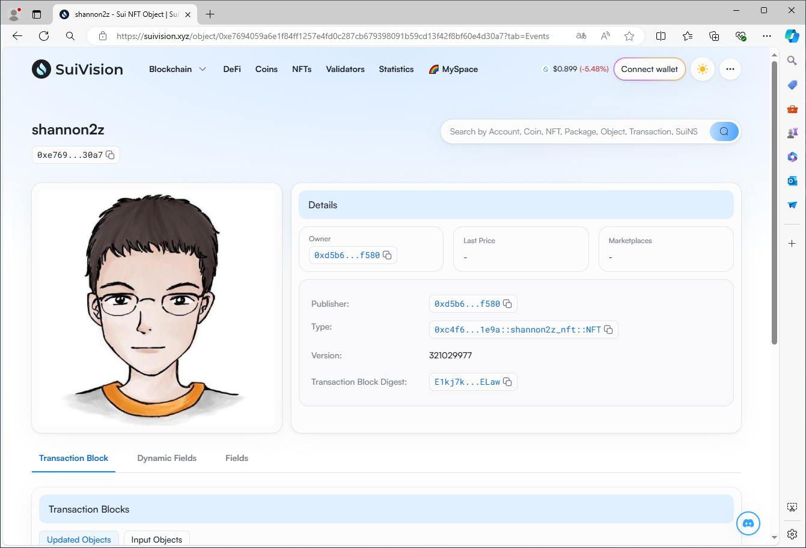
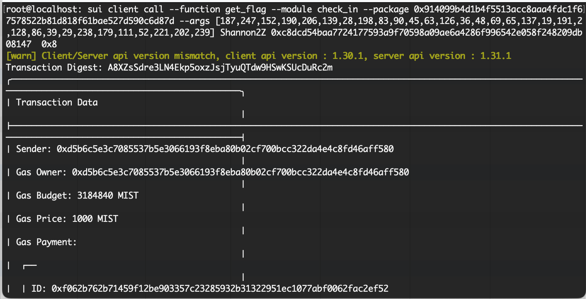

## 基本信息
- Sui钱包地址: `0xd5b6c5e3c7085537b5e3066193f8eba80b02cf700bcc322da4e4c8fd46aff580`
> 首次参与需要完成第一个任务注册好钱包地址才被合并，并且后续学习奖励会打入这个地址
- github: `Shannon2Z`

## 个人简介
- 工作经验: 3年
- 技术栈: `C#`
> 重要提示 请认真写自己的简介
- .Net开发经验，对Move感兴趣，想通过Move入门区块链
- 联系方式: tg: `shannonZZZ1`

## 任务

##   01 hello move  
- [x] Sui cli version: sui-client 1.30.1-a4185da5659d
- [x] Sui钱包截图: 
- [x] package id: 0xdda6f2f4bf682df12771666a1cf36af6fdfa9f7edea2fc3a851ba5a61501abd7
- [x] package id 在 scan上的查看截图:

##   02 move coin
- [x] My Coin package id : 0x97a0ca74fc9e75c9ce94fcdb8aa1ed9e1f6ec81e7ea993ae2b4a96aab7b209ee
- [x] Faucet package id :  0x97a0ca74fc9e75c9ce94fcdb8aa1ed9e1f6ec81e7ea993ae2b4a96aab7b209ee
- [x] 转账 `My Coin` hash: Htg3V2XzXqwMvxeXsahGtU1aRjmx19c6ZA57JPWwyfhc
- [x] `Faucet Coin` address1 mint hash: F6EN9N7LyKNX4GZsjdAqXueWtf1W58pamb9K1k1eqvFn
- [x] `Faucet Coin` address2 mint hash: 7svHnEmbbPp5W7v686eJRc6WwuqCvKro8UoRUJTKqdx7

##   03 move NFT
- [x] nft package id : 0xc4f6a19bf9faac58a7e05b38393fb1be40be648584172cf6f56e2d27e1741e9a
- [x] nft object id : 0xe7694059a6e1f84ff1257e4fd0c287cb679398091b59cd13f42f8bf60e4d30a7
- [x] 转账 nft  hash:  Cyd5Mz1GU2TWaUkELGT6FHBRgKMUwEsig6YHawm28ok8
- [x] scan上的NFT截图:

##   04 Move Game
- [x] game package id : 0x3345f8240765128cb1d6376bf20514284a392d8e1dacd58d807f2684f8ce4bf8
- [x] deposit Coin hash: 6XrRFAUGRc6AGXtKrQ8FH7dKarcPy2Wpgte9NApXUs3D
- [x] withdraw `Coin` hash: ADWNds2mnrpTQBjYWKg2cQWLfvaqTifGTf4VKycaRz4D
- [x] play game hash:  2oSJzZ5r5UHAHLRZry5AgLpMbWuFCZBBewQFCQzBGwmB

##   05 Move Swap
- [x] swap package id : 0x1a542e88abef96cf6f19c415748b91172985d679b105f6ea33331a2c1e1357ef
- [x] call swap CoinA-> CoinB  hash : EKW3FtTwc4hY5ZDjAj6hycAiAGtBgGY1CZk2X97qrDES
- [x] call swap CoinB-> CoinA  hash : GmrcDLsmunofuAJDDnmCfTdmBUFbqrRbWz5yScm4KWDb

##   06 Dapp-kit SDK PTB
- [x] save hash : 3QZP2yT8TktAZ7HzYf5oL4gvWZXQav4LV9rnQiHXJ8Mb

##   07 Move CTF Check In
- [x] CLI call 截图 : 
- [x] flag hash : A8XZsSdre3LN4Ekp5oxzJsjTyuQTdw9HSwKSUcDuRc2m

##   08 Move CTF Lets Move
- [x] proof :  ae1fa4e256866de2bff4
- [x] flag hash : iwXJWPpT6oFtySVFdga7okEzv3hBnTffrSQtP7v9tm1

