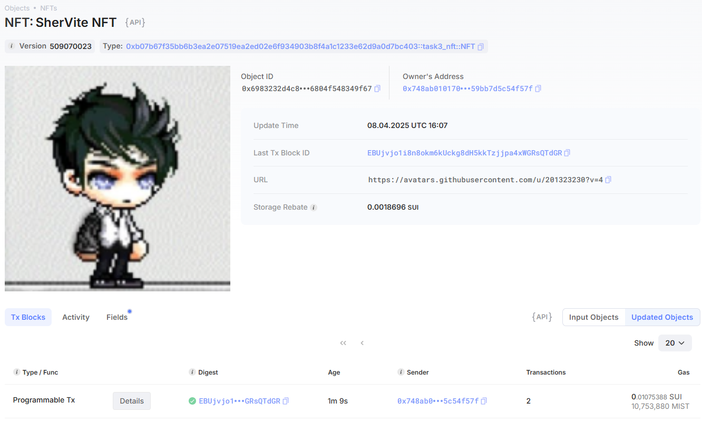
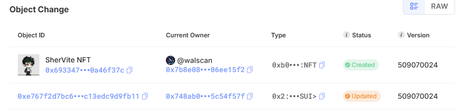
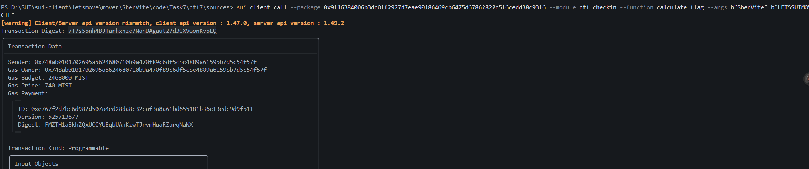
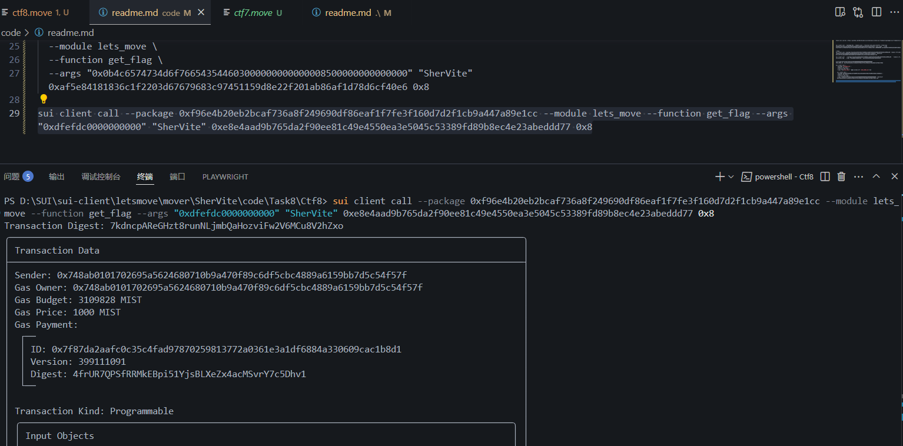

## 基本信息
- Sui钱包地址: `0x748ab0101702695a5624680710b9a470f89c6df5cbc4889a6159bb7d5c54f57f`
> 首次参与需要完成第一个任务注册好钱包地址才被合并，并且后续学习奖励会打入这个地址
- github: `SherVite`

## 个人简介
- 工作经验: 9年 航空技术人员，非专业计算机
- 技术栈: `Python 基础，DMIS工业测量设备语言`
> 重要提示 请认真写自己的简介
- 对SUI生态和构建的系统很感兴趣，想通过学习MOVE语言，进一步了解整个底层搭建的逻辑，应用，了解Web3上SUI的公链发展，对Move特别感兴趣，想通过Move入门区块链
- 联系方式: E-mail ：275468685@qq.com 

## 任务

##   01 hello move  
- [x] Sui cli version:sui 1.43.1-2690038022ed
- [x] Sui钱包截图: 
- [x] package id:0x748ab0101702695a5624680710b9a470f89c6df5cbc4889a6159bb7d5c54f57f 
- [x] package id 在 scan上的查看截图:

##   02 move coin
- [x] My Coin package id : 0x3813627c96983c3881ff1974228a2a76cf69626770aa356e992eddf9aed4d15d  //publish in Mainnet
- [x] My Coin package id : 0x6aa34e8a862ad6f17b604da93390f9ffe18f4576f020997507613ef2c46d0801    //publish in testnet
- [x] Faucet package id : 0x6aa34e8a862ad6f17b604da93390f9ffe18f4576f020997507613ef2c46d0801      //publish in testnet, beacause of NO SUI TO Publish in MAINNET  >_< !!!
- [x] 转账 `My Coin` hash:5rfjznCQY3EE9My6NNc4B3qKUwLar8swmZkqSMNh79re  //in Mainnet
- [x] 转账 `My Coin` hash:6jeofMcVX1FwFNVysuvbZf2f4NArKwy4JQUh6nhvdrke  //in testnet
- [x] `Faucet Coin` address1 mint hash:9Tatro4azdELRM5je9cJWhLCzXuGL6cywZWCaN1Bya2   //publish in testnet
- [x] `Faucet Coin` address2 mint hash:8RYcdU8MmZEpEZfVnRgMqpp1xM73CBKHJBf48Ucv7CMm   //publish in testnet

##   03 move NFT
- [x] nft package id :0xb07b67f35bb6b3ea2e07519ea2ed02e6f934903b8f4a1c1233e62d9a0d7bc403
- [x] nft object id : 0x6983232d4c8e89ae71489704010c028552a1b94498b1e55af96804f548349f67
- [x] 转账 nft  hash: EBUjvjo1i8n8okm6kUckg8dH5kkTzjjpa4xWGRsQTdGR
- [x] scan上的NFT截图:
- [x] 转给指定地址的NFT截图:

##   04 Move Game
- [x] game package id : 0x7f270447642d061b4787170f87bfb17e09c1ce6f278e4cf4d098de7e266cff7a
- [x] deposit Coin hash: C1ZAFNs5Xe3AUnGYtiU3iJgCQetzgj16sagnL9SgiCCz
- [x] withdraw `Coin` hash:BcE2GtCBn52k4wMGpHUB1doR8WZUsF3VDU7hFdFvAdvW
- [x] play game hash:B6syvHZA92rSdBZmD3H3sntWLpuqbxSMRgTH27Hzv4kG

##   05 Move Swap
- [] swap package id :
- [] call swap CoinA-> CoinB  hash :
- [] call swap CoinB-> CoinA  hash :

##   06 Dapp-kit SDK PTB
- [x] save hash :0xd7d90639406652bbb06ed89613636712f8260370b02185b8e346910d0abf7c5c

##   07 Move CTF Check In
- [x] CLI call 截图 : 
- [x] flag hash :76ZNj8z3cBmUS7S6scB7xeVc73sKr9QPpyCzSArqbrXN

##   08 Move CTF Lets Move
- [x] proof : 0xdfefdc0000000000  
- [x] flag hash :7kdncpAReGHzt8runNLjmbQaHozviFw2V6MCu8V2hZxo
- [x] 截图 : 

