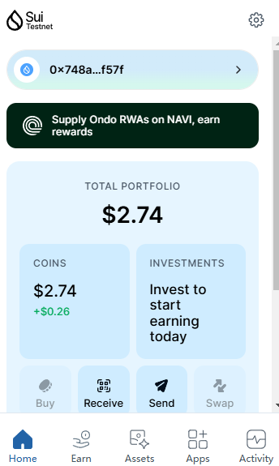
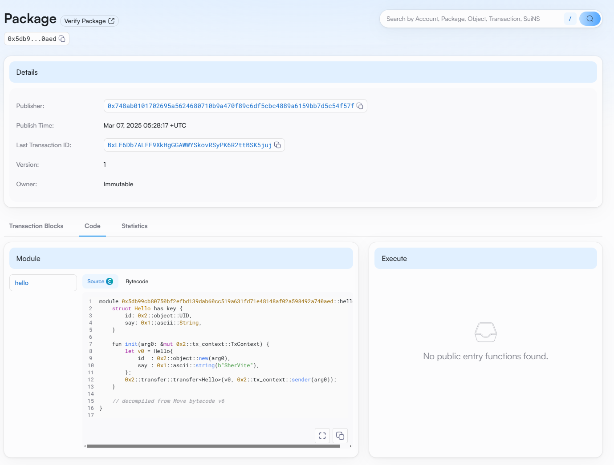

## 基本信息
- Sui钱包地址: `0x748ab0101702695a5624680710b9a470f89c6df5cbc4889a6159bb7d5c54f57f`
> 首次参与需要完成第一个任务注册好钱包地址才被合并，并且后续学习奖励会打入这个地址
- github: `SherVite`

## 个人简介
- 工作经验: 9年 航空技术人员，非专业计算机
- 技术栈: `Python 基础，DMIS工业测量设备语言`
> 重要提示 请认真写自己的简介
- 对SUI生态和构建的系统很感兴趣，想通过学习MOVE语言，进一步了解整个底层搭建的逻辑，应用，了解Web3上SUI的公链发展，对Move特别感兴趣，想通过Move入门区块链
- 联系方式: E-mail ：275468685@qq.com 

## 任务

##   01 hello move  
- [x] Sui cli version:sui 1.43.1-2690038022ed
- [x] Sui钱包截图: 
- [x] package id:0x748ab0101702695a5624680710b9a470f89c6df5cbc4889a6159bb7d5c54f57f 
- [x] package id 在 scan上的查看截图:

##   02 move coin
- [] My Coin package id : 
- [] Faucet package id : 
- [] 转账 `My Coin` hash:
- [] `Faucet Coin` address1 mint hash:
- [] `Faucet Coin` address2 mint hash:

##   03 move NFT
- [] nft package id :
- [] nft object id : 
- [] 转账 nft  hash:
- [] scan上的NFT截图:

##   04 Move Game
- [] game package id :
- [] deposit Coin hash:
- [] withdraw `Coin` hash:
- [] play game hash:

##   05 Move Swap
- [] swap package id :
- [] call swap CoinA-> CoinB  hash :
- [] call swap CoinB-> CoinA  hash :

##   06 Dapp-kit SDK PTB
- [] save hash :

##   07 Move CTF Check In
- [] CLI call 截图 : 
- [] flag hash :

##   08 Move CTF Lets Move
- [] proof : 
- [] flag hash :

