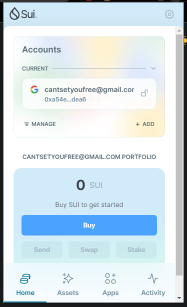
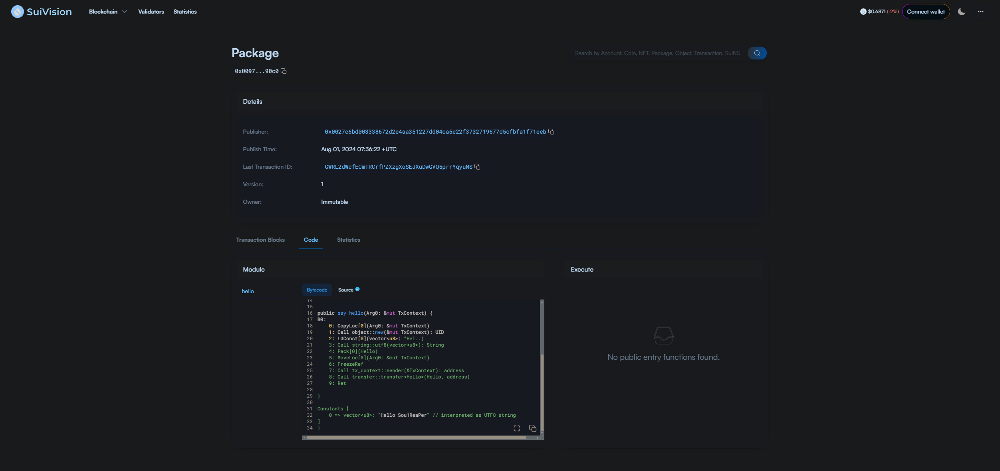
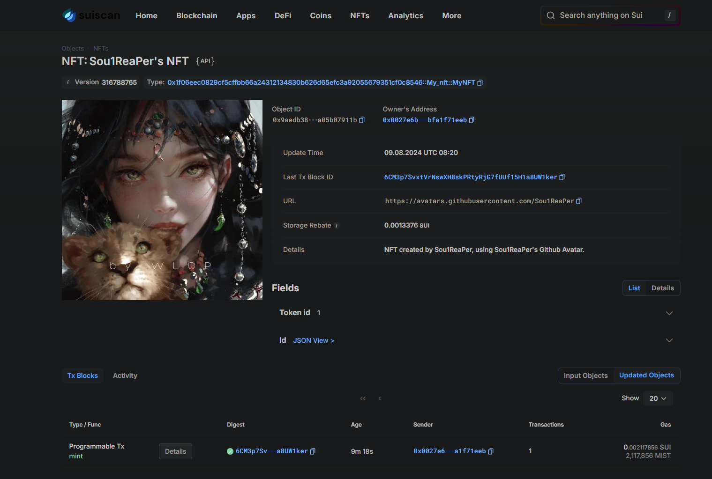

## 基本信息
- Sui钱包地址: `0xa54ef089c6397ad9765f221ea3ead8c3a88298abe55486fd6e8dddefc7b5dea6`
> 首次参与需要完成第一个任务注册好钱包地址才被合并，并且后续学习奖励会打入这个地址
- github: `Sou1ReaPer`

## 个人简介
- 工作经验: 3年
- 技术栈: `C++, C#, Lua, TypeScript` 
> 重要提示 请认真写自己的简介
- 游戏开发，对Web3很感兴趣，想通过Move学习入门Web3开发
- 联系方式: tg: `https://t.me/Xiao_Chuan` 

## 任务

##   01 hello move  
- [√] Sui cli version: `sui 1.30.1-a4185da5659d`
- [√] Sui钱包截图: 
- [√] package id: `0x00976ba2875fe740ad9b50f4834c8d10478d462e467d45613072cea9924990c0`
- [√] package id 在 scan上的查看截图:

##   02 move coin
- [√] My Coin package id : 0x0bd3915ad14f89be917e77d3c6357609ea1666e251e92fabaced59b1236ed199
- [√] Faucet package id : 0xdc3337666417ef41687cdda5e4cfc9b5b07eb91b1452b5ebf34fc9d1234c84de
- [√] 转账 `My Coin` hash: 8CztLCD6grbeLQS6s2ZYfZRJj5dMCKgEj629XZaYoqBk
- [√] `Faucet Coin` address1 mint hash: 75fd6AhAhGuif4pu9un76xYG2NUxKhpM7svfZZ5GSAvd
- [√] `Faucet Coin` address2 mint hash: gsh8dSgEwT7kSA8ySJ8nQuNGRSg5awy9xT7QbgnAsEz

##   03 move NFT
- [√] nft package id : 0x1f06eec0829cf5cffbb66a24312134830b626d65efc3a92055679351cf0c8546
- [√] nft object id : 0xf9d00c84559e27d556641d2ba1c1cde7a93255a2499eaa3719d71c047d511e1b
- [√] 转账 nft  hash: 3bsVDwUy2ciL6xAZV1Hg45UhJwRCtr7X6wJsYPrvKkR7
- [√] scan上的NFT截图:

##   04 Move Game
- [] game package id :
- [] deposit Coin hash:
- [] withdraw `Coin` hash:
- [] play game hash:

##   05 Move Swap
- [] swap package id :
- [] call swap CoinA-> CoinB  hash :
- [] call swap CoinB-> CoinA  hash :

##   06 Dapp-kit SDK PTB
- [] save hash :

##   07 Move CTF Check In
- [] CLI call 截图 : 
- [] flag hash :

##   08 Move CTF Lets Move
- [] proof : 
- [] flag hash :
