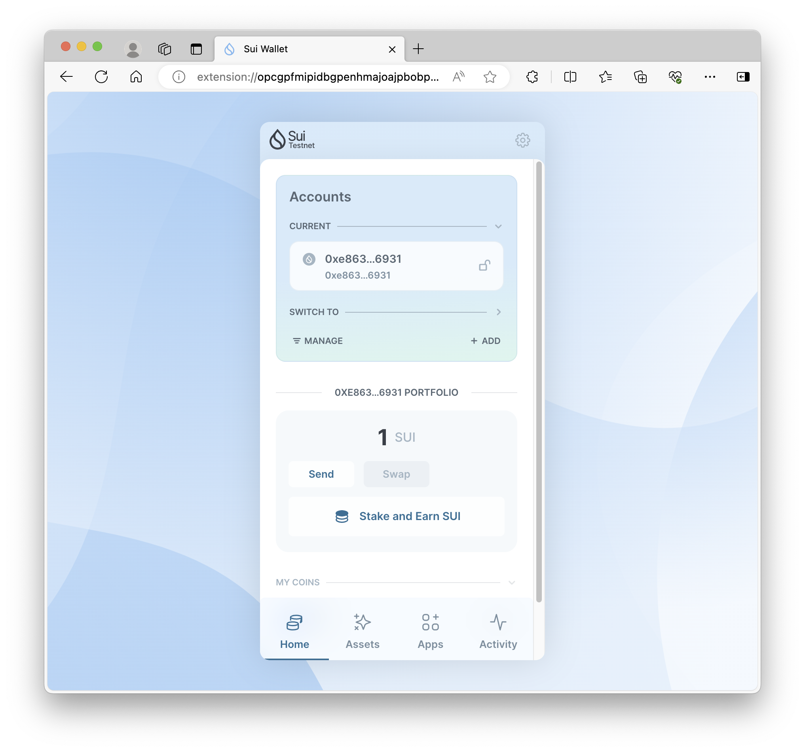

## 基本信息
- Sui钱包地址: `0xe8631db2c36ef36b6c50a8f7b91e169ee787618635d6ec537d1bd6f9d0c96931`
> 首次参与需要完成第一个任务注册好钱包地址才被合并，并且后续学习奖励会打入这个地址
- github: `自己的githubid`

## 个人简介
- 工作经验: 0年
- 技术栈: `C++` `Rust` 底层（操作系统内核） `Go` 后端语言 
> 重要提示 请认真写自己的简介
- 在校大学生 一年半算法竞赛经验 已有区域赛铜牌  
- 联系方式: QQ: `2825007345` 

## 任务

##   01 hello move  
- [x] Sui cli version:sui 1.26.1-homebrew
- [x] Sui钱包截图: 
- [x] package id: 0x1e58d3261a22f6aa88eb106106ff5ac4dc55e92d0b9c2648da47a35c57402a96
- [x] package id 在 scan上的查看截图:

##   02 move coin
- [x] My Coin package id : 0xf6e22602fe37649686324409c32b55f20e95607e7d4cdb2a7e4917d3bd161969 
- [x] Faucet package id : 0x5085f3f4de6730e46f19c779c6118321f4fb171503d4c2dcf9c59a13d1cc994c 
- [x] 转账 `My Coin` hash: GJ9LLvfnXkbZ144Zpm7q7itFVGEDLB64epTqKn9ngS9T 
- [x] `Faucet Coin` address1 mint hash: 81RKbT999Benr2CLUVdUTsxuNgtn8KEDgSgWxj5ZysBT 
- [x] `Faucet Coin` address2 mint hash: 7DVJCEmgM3SG6h5uVnVmEb28zDbKgTx6ZVYTVuJ57mjV 

##   03 move NFT
- [] nft package id :
- [] nft object id : 
- [] 转账 nft  hash:
- [] scan上的NFT截图:

##   04 Move Game
- [] game package id :
- [] deposit Coin hash:
- [] withdraw `Coin` hash:
- [] play game hash:

##   05 Move Swap
- [] swap package id :
- [] call swap CoinA-> CoinB  hash :
- [] call swap CoinB-> CoinA  hash :

##   06 Dapp-kit SDK PTB
- [] save hash :

##   07 Move CTF Check In
- [] CLI call 截图 : 
- [] flag hash :

##   08 Move CTF Lets Move
- [] proof : 
- [] flag hash :
