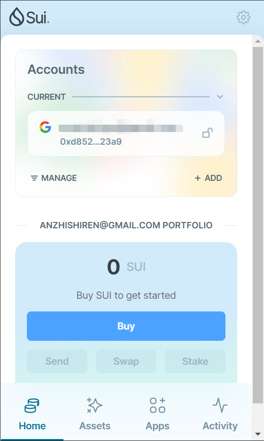
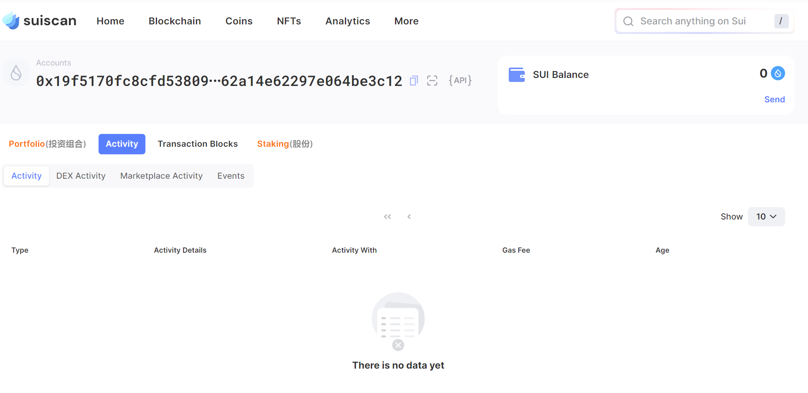
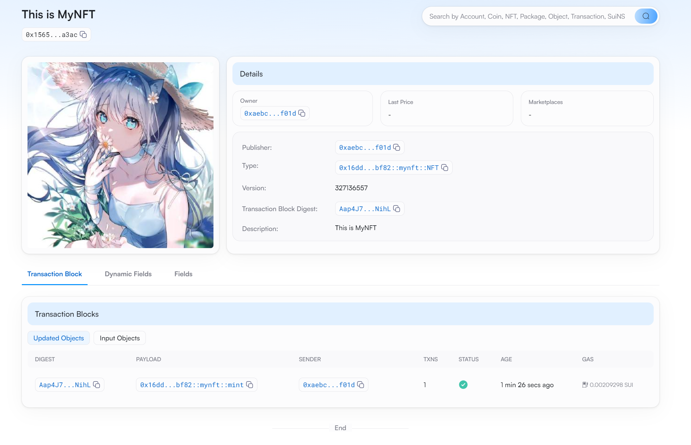

## 基本信息
- Sui钱包地址: `0xd852497c7732b882ffc3406a1186900bcdf9bcdbd82d54ab6652ea41bb1523a9`
> 首次参与需要完成第一个任务注册好钱包地址才被合并，并且后续学习奖励会打入这个地址
- github: `StarryDeserts`

## 个人简介
- 工作经验: 半年
- 技术栈: `Java` `JavaScript` `Rust`
- 应届生Java后端开发，前后端都学过一点，主要是后端，rust出于兴趣学过，最近才开始了解web3领域和move，产生了浓厚的兴趣
- 联系方式: tg: `@StarryDeserts` 

## 任务

##   01 hello move  
- [] Sui cli version:
- [] Sui钱包截图: 
- [] package id: 0x19f5170fc8cfd53809eea8fd14258bfcc217b18a32162a14e62297e064be3c12
- [] package id 在 scan上的查看截图:

##   02 move coin
- [] My Coin package id : 0x051eccfc37b5975b547785e523920f445b92e63dc5b5c7cf1bcce2e7b7bb3e75
- [] Faucet package id : 0xfd74e2083e46f259cf235abf16ad0437a350742b3dce64b183894a0415f80496
- [] 转账 `My Coin` hash: FjidNUSiE5W26c8MoJEsmu2NMMd3SAaXQFXunYDJGfXY
- [] `Faucet Coin` address1 mint hash: FS3a4v3YeFQkQvJMYhxR57LmiEQ74SHpK8Rm8n1BJDCZ
- [] `Faucet Coin` address2 mint hash: 8DtQs4KeP2fHoNgyQKArDMqwHv6d25CsWWhcBc83Pd8B

##   03 move NFT
- [] nft package id : 0x16ddf0671a7c0aebd5a68279c56c87239ce454569c60db3baa6baae57375bf82
- [] nft object id : 0xdd6461cabd1431bd7b3186454de438b63c78ea6580ae01557a26c14420586a25
- [] 转账 nft  hash: FiKmqTBjy7sRvy3DaTeLSrFfAQ9fLGwLGiEKguEwAYjc
- [] scan上的NFT截图:

##   04 Move Game
- [] game package id : 0x464d4bcc84d9652c5850b3a67876ba39b161c9aa5815bdef8884a31d120c6dd9
- [] deposit Coin hash: B8Q9EBjT845oJkRo5tUrP8nXsNJgAxA8mWL3ppFg3nwG
- [] withdraw `Coin` hash: 2BLhYLxsA882Wa2pSbq1r2cCGi2Lt8Jn5bKRoEBhkP4b
- [] play game hash: bR65ALqZUG212gJVQiKRtsWYbHq2nJGuHmYxcDsS3LM

##   05 Move Swap
- [] swap package id :
- [] call swap CoinA-> CoinB  hash :
- [] call swap CoinB-> CoinA  hash :

##   06 Dapp-kit SDK PTB
- [] save hash :

##   07 Move CTF Check In
- [] CLI call 截图 : 
- [] flag hash :

##   08 Move CTF Lets Move
- [] proof : 
- [] flag hash :
