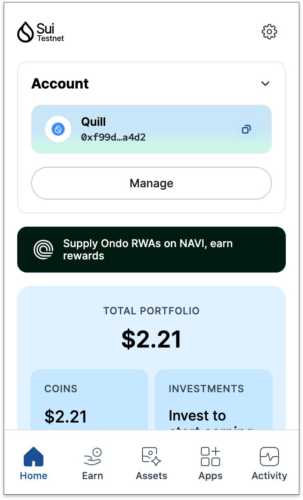
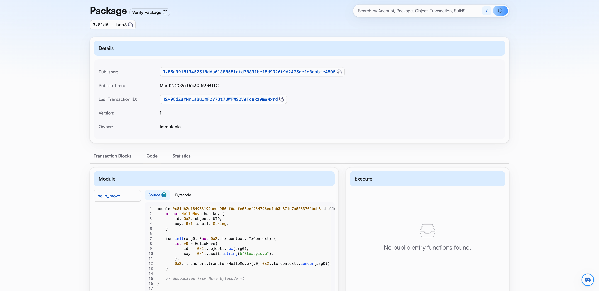

## 基本信息

- Sui钱包地址: `0xf99d26c9b65eb74d04835d62cc37747c2ff7d029da6e2aed803f0c23c688a4d2`

> 首次参与需要完成第一个任务注册好钱包地址才被合并，并且后续学习奖励会打入这个地址
- github: `Steadylove`

## 个人简介
- 工作经验: 3年
- 技术栈: `TS` `React` ``
> 重要提示 请认真写自己的简介
- 头部大厂前端工程师，一直从事AI相关业务的开发，主打react生态，web3初学者
- 联系方式: tg: `Quill Lue` Email:`steadlove@163.com`

## 任务

##   01 hello move

- [✔️] Sui cli version: 1.44.2-homebrew
- [✔️] Sui钱包截图: 
- [✔️] package id: 0x81d62d184953199aeca956ef6adfe05eef934796eafab3b871c7a5263761bcb8
- [✔️] package id 在 scan上的查看截图:

##   02 move coin
- [] My Coin package id :
- [] Faucet package id :
- [] 转账 `My Coin` hash:
- [] `Faucet Coin` address1 mint hash:
- [] `Faucet Coin` address2 mint hash:

##   03 move NFT
- [] nft package id :
- [] nft object id :
- [] 转账 nft  hash:
- [] scan上的NFT截图:

##   04 Move Game
- [] game package id :
- [] deposit Coin hash:
- [] withdraw `Coin` hash:
- [] play game hash:

##   05 Move Swap
- [] swap package id :
- [] call swap CoinA-> CoinB  hash :
- [] call swap CoinB-> CoinA  hash :

##   06 Dapp-kit SDK PTB
- [] save hash :

##   07 Move CTF Check In
- [] CLI call 截图 : 
- [] flag hash :

##   08 Move CTF Lets Move
- [] proof : 
- [] flag hash :

