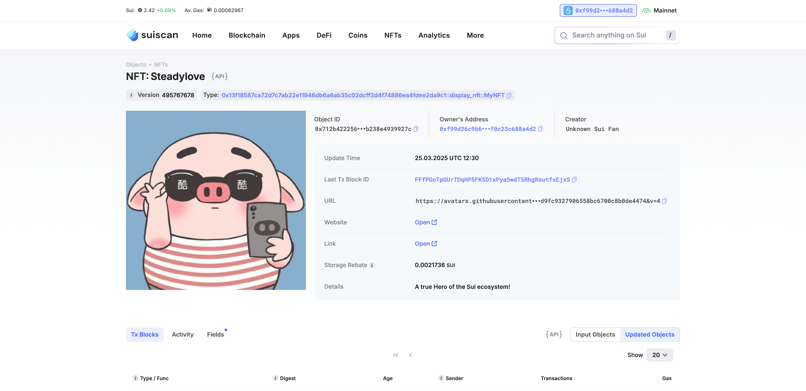

## 基本信息

- Sui 钱包地址: `0xf99d26c9b65eb74d04835d62cc37747c2ff7d029da6e2aed803f0c23c688a4d2`

> 首次参与需要完成第一个任务注册好钱包地址才被合并，并且后续学习奖励会打入这个地址

- github: `Steadylove`

## 个人简介

- 工作经验: 3 年
- 技术栈: `TS` `React` ``

> 重要提示 请认真写自己的简介

- 头部大厂前端工程师，一直从事 AI 相关业务的开发，主打 react 生态，web3 初学者
- 联系方式: tg: `Quill Lue` Email:`steadlove@163.com`

## 任务

## 01 hello move

- [✔️] Sui cli version: 1.44.2-homebrew
- [✔️] Sui 钱包截图: 
- [✔️] package id: 0x81d62d184953199aeca956ef6adfe05eef934796eafab3b871c7a5263761bcb8
- [✔️] package id 在 scan 上的查看截图:

## 02 move coin

- [✔️] My Coin package id : 0x881c115b811d7867f4d88b003abe574d682314b385f7b809b2a8d95924050bb1
- [✔️] Faucet package id : 0x9287f087d38b4d5d11748580c2d98aae04ea80a9fe75c6836721a36eb360b461
- [✔️] 转账 `My Coin` hash: 8HPhvqDzUmZcAUMHQ4yir1b1r1e3XnYJVEoU6ZPASHMa
- [✔️] `Faucet Coin` address1 mint hash: 8mnoaWWV6RcoWTJenztMBA2H6PCorMhR8pT7E2mmVES
- [✔️] `Faucet Coin` address2 mint hash: JBPqRpVHu8X9Jpzws3NXRJ9s3Ug8gM9xqvKd7JqbzkBw

## 03 move NFT

- [✔️] nft package id :FFfPGoTpGUrTDqHP5FK5D1xPya5wdT5RhgRsutfxEjxS
- [✔️] nft object id :0x712b422256d55c17bdcecf33ecb2a9feae3cad670f034ff9ee3b238e4939927c
- [✔️] 转账 nft hash: ErE5nrgj4JnYdTjQ7J3o1oXY8f5nLTig2jKPpczrrxXF
- [✔️] scan 上的 NFT 截图:

## 04 Move Game

- [] game package id :
- [] deposit Coin hash:
- [] withdraw `Coin` hash:
- [] play game hash:

## 05 Move Swap

- [] swap package id :
- [] call swap CoinA-> CoinB hash :
- [] call swap CoinB-> CoinA hash :

## 06 Dapp-kit SDK PTB

- [] save hash :

## 07 Move CTF Check In

- [] CLI call 截图 : 
- [] flag hash :

## 08 Move CTF Lets Move

- [] proof :
- [] flag hash :
