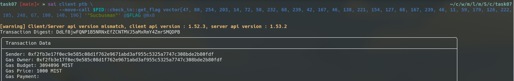

## 基本信息
- Sui钱包地址: `0x9b45b2c6a3869f0b4c6128847b421fafc1325538e42741ce10291df8bf997b72`
> 首次参与需要完成第一个任务注册好钱包地址才被合并，并且后续学习奖励会打入这个地址
- github: `Sucbusman`

## 个人简介
- 工作经验: 5年
- 技术栈: `C++` `Python` `Haskell` `Javascript`
- Web2全栈开发，网络安全研究员，希望通过学习move和sui进入Web3社群和行业。
- 联系方式: tg: [@Ph4ng0t](https://t.me/Ph4ng0t)

## 任务

##   01 hello move  
- [x] Sui cli version: sui 1.52.3-cd58464d654d
- [x] Sui钱包截图: 
- [x] package id: 0xa27054aa7b4b9abb23a19cd90ec54fd0b25623e877213228e4ffa106c451866d
- [x] package id 在 scan上的查看截图:

##   02 move coin
- [x] My Coin package id : 0x59a1d86e148649d9cc99e7b051c2b2a75d4c38c72091608d4f9c4a751ce4f327
- [x] Faucet package id : 0x92c4d6224e9638b7aeae3077c4a253a157635cacc7a22db8ab67ea7e727c71c3
- [x] 转账 `My Coin` hash: 6XvM2dWgqbKUCwaSF1LmEUGtGiT4u4RdpyTEcE7WxJqd
- [x] `Faucet Coin` address1 mint hash: HHWJuhHN2WiFXy3qYQn381FAHUeBKqdHTwZVfKr9VheC
- [x] `Faucet Coin` address2 mint hash: CfsiRNpEWr2rXCcurApuGA5kMd3nEepGufGm9Tp9piU8

##   03 move NFT
- [x] nft package id : 0xe847bdadab781e87f566ecffae050c26772f6ceb1976f4dbdc6020c2351e1ea7
- [x] nft object id : 0x2ca48395a29a3dab8486d0f21b37b56776cafd639cddbf1d310ff86ecb48e0eb
- [x] 转账 nft  hash: 3vm5H4kJcCvXwUZV5Br1LGF3MrTB5eqwH5WdKXWNxUmC
- [x] scan上的NFT截图:

##   04 Move Game
- [] game package id :
- [] deposit Coin hash:
- [] withdraw `Coin` hash:
- [] play game hash:

##   05 Move Swap
- [] swap package id :
- [] call swap CoinA-> CoinB  hash :
- [] call swap CoinB-> CoinA  hash :

##   06 Dapp-kit SDK PTB
- [] save hash :

##   07 Move CTF Check In
- [x] CLI call 截图 : 
- [x] flag hash : DdLf8jwFQNP1B5NRNxEfZCNTMVJ5aMxRmY4ZmrSMQDPB

##   08 Move CTF Lets Move
- [x] proof : vector[86, 69, 44]
- [x] flag hash :F8ohBajhcthBGRR1fHMnwfKnDxXu3W1x5VKxFqjfZczW

